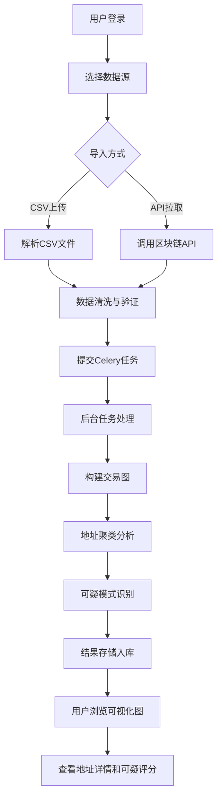

## 1. 产品概述

比特币区块链交易图分析系统，用于解析、建模和可视化比特币交易网络，识别可疑交易模式并进行地址聚类分析。目标用户为区块链分析师、合规调查人员和金融安全研究者。

- 核心价值：将复杂的区块链交易数据转化为直观的图网络可视化，自动化识别洗钱、混币等可疑交易模式
- 市场定位：专业级区块链取证和交易分析工具

## 2. 核心功能

### 2.1 用户角色

| 角色 | 登录方式 | 核心权限 |
|------|----------|----------|
| 分析师 | 账号密码登录 | 数据导入、图浏览、地址聚类、可疑模式识别、导出报告 |
| 管理员 | 账号密码登录 | 用户管理、系统配置、任务监控、数据备份 |

### 2.2 功能模块

1. **仪表盘页面**：数据统计概览、可疑交易警报、最近任务状态
2. **交易图浏览**：ECharts关系图可视化、缩放平移、金额过滤、时间筛选
3. **地址详情页**：地址画像、交易历史、关联地址网络、可疑评分
4. **数据导入页**：CSV文件上传、Blockchain API拉取配置、导入进度监控
5. **任务管理页**：Celery任务队列状态、任务历史、重试管理
6. **聚类分析页**：地址聚类结果展示、共同输入集群、找零地址识别

### 2.3 页面详情

| 页面名称 | 模块名称 | 功能描述 |
|----------|----------|----------|
| 仪表盘 | 统计概览 | 总交易数、总地址数、活跃地址TOP10、可疑交易趋势图 |
| 仪表盘 | 警报面板 | 高风险交易实时提醒、可疑模式自动标记 |
| 交易图浏览 | 关系图组件 | 节点拖拽、缩放、悬停详情、点击高亮关联 |
| 交易图浏览 | 过滤工具栏 | 金额阈值过滤、时间范围选择、节点类型筛选 |
| 交易图浏览 | 布局切换 | 力导向布局、环形布局、层次布局切换 |
| 地址详情 | 基本信息 | 地址余额、首末次交易时间、交易次数统计 |
| 地址详情 | 关联子图 | 以该地址为中心的交易网络图、可疑评分展示 |
| 数据导入 | CSV导入 | 支持标准区块链CSV格式、字段映射、数据校验 |
| 数据导入 | API配置 | Blockchain.com / Blockstream API配置、区块范围选择 |
| 任务管理 | 任务列表 | 显示Celery任务状态、进度条、错误信息 |
| 聚类分析 | 聚类结果 | 地址集群列表、共同输入识别、找零地址模式检测 |

## 3. 核心流程

## 4. 用户界面设计

### 4.1 设计风格
- 主色调：深色科技风格，以 `#0f172a` 为背景，`#3b82f6` 为主色调，`#10b981` 为成功色，`#ef4444` 为警报色
- 按钮风格：圆角设计，悬浮发光效果，渐变边框
- 字体：标题使用 Space Grotesk 粗体，正文使用 JetBrains Mono 等宽字体提升代码感
- 布局：左侧导航栏 + 右侧主内容区，卡片式模块布局，玻璃拟态效果
- 图标：使用 Lucide Icons 线性图标，配合数据可视化专用图标

### 4.2 页面设计概述

| 页面名称 | 模块名称 | UI 元素 |
|----------|----------|---------|
| 仪表盘 | 统计概览 | 大数字卡片、渐变柱状图、环形进度条、网格布局 |
| 仪表盘 | 警报面板 | 时间线布局、红色闪烁动画、严重程度标签 |
| 交易图浏览 | 关系图 | 深色背景、节点发光效果、力导向动画、工具栏半透明悬浮 |
| 交易图浏览 | 过滤器 | 侧滑抽屉、滑块控件、日期选择器、标签组 |
| 地址详情 | 信息面板 | 头像+基本信息网格、交易时间轴、评分仪表盘 |
| 地址详情 | 子图 | 中心节点高亮、关联边粗细表示金额、渐变色表示可疑度 |
| 数据导入 | 上传区 | 拖拽上传区域、文件列表、进度条动画 |
| 任务管理 | 任务列表 | 状态徽章、进度条、操作按钮组、折叠详情面板 |

### 4.3 响应式
- 桌面端优先设计（1280px+）
- 平板端：导航栏折叠为图标模式，图表自适应缩放
- 移动端：单列布局，核心功能优先展示，图表支持触控缩放
- 交互优化：触控设备支持双指缩放、长按查看详情

### 4.4 可视化动效
- 页面加载：元素淡入上移，图表数据渐进式渲染
- 图节点：悬浮放大、发光脉冲、连线高亮
- 数据更新：数字滚动动画、新数据点弹跳效果
- 转场过渡：页面切换使用淡入淡出 + 轻微位移
- 危险警报：红色呼吸灯动画、警告音（可关闭）
