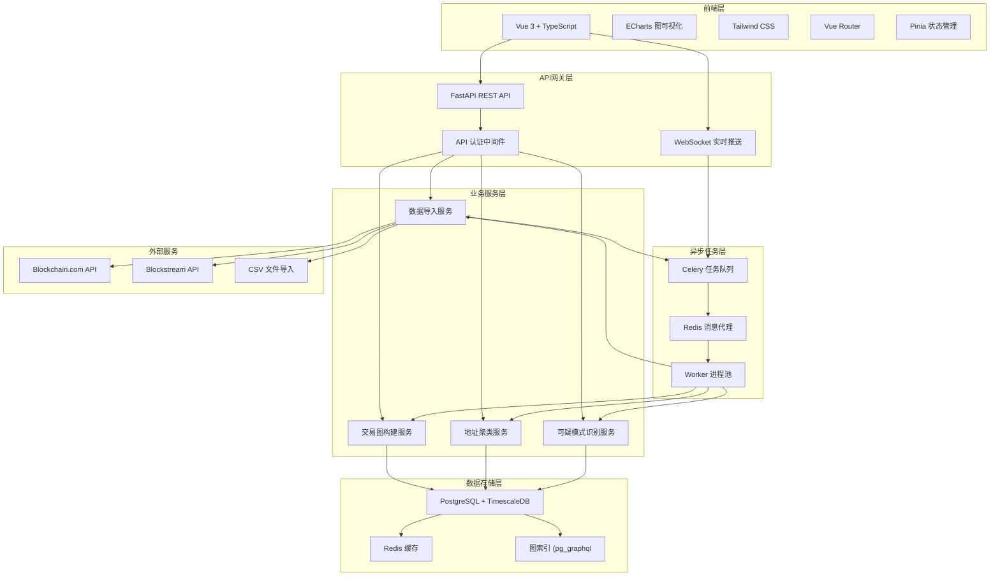
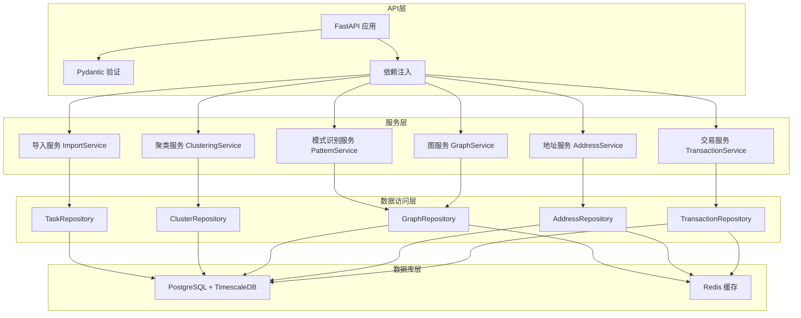
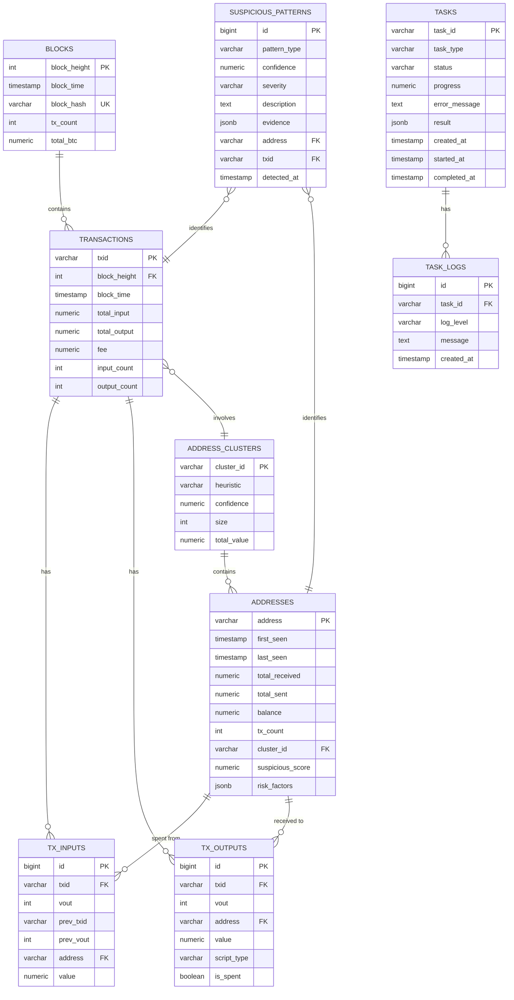

## 1. 架构设计



## 2. 技术描述

- **前端技术栈**：
  - Vue 3.4 + TypeScript 5.4
  - Vite 5.2 构建工具
  - ECharts 5.5 数据可视化
  - Tailwind CSS 3.4 样式框架
  - Pinia 2.1 状态管理
  - Vue Router 4.3 路由
  - Axios 1.7 HTTP客户端
  - Lucide Vue 图标库

- **后端技术栈**：
  - Python 3.11 + FastAPI 0.110
  - PostgreSQL 16 + TimescaleDB 2.13
  - SQLAlchemy 2.0 ORM
  - Celery 5.4 任务队列
  - Redis 7.2 缓存和消息代理
  - Pydantic 2.7 数据验证
  - Aiohttp 异步HTTP客户端

## 3. 路由定义

| 路由 | 页面/方法 | 用途 |
|------|------------|------|
| `/` | GET | 仪表盘页面 |
| `/graph` | GET | 交易图浏览页 |
| `/address/:id` | GET | 地址详情页 |
| `/import` | GET | 数据导入页 |
| `/tasks` | GET | 任务管理页 |
| `/clustering` | GET | 聚类分析页 |
| `/api/auth/login` | POST | 用户登录 |
| `/api/transactions` | GET | 获取交易列表 |
| `/api/transactions/graph` | GET | 获取交易图数据 |
| `/api/addresses/:id` | GET | 获取地址详情 |
| `/api/addresses/:id/suspicious-score` | GET | 获取地址可疑评分 |
| `/api/addresses/:id/subgraph` | GET | 获取地址关联子图 |
| `/api/import/csv` | POST | 上传CSV文件导入 |
| `/api/import/api` | POST | 通过API拉取数据 |
| `/api/tasks` | GET | 获取任务列表 |
| `/api/tasks/:id` | GET | 获取任务详情 |
| `/api/clustering/results` | GET | 获取聚类结果 |
| `/api/patterns/suspicious` | GET | 获取可疑模式列表 |

## 4. API 定义

```typescript
// 交易数据类型
interface Transaction {
  txid: string;
  blockHeight: number;
  blockTime: Date;
  inputs: TxInput[];
  outputs: TxOutput[];
  totalInput: number;
  totalOutput: number;
  fee: number;
}

interface TxInput {
  txid: string;
  vout: number;
  address: string;
  value: number;
}

interface TxOutput {
  address: string;
  value: number;
  scriptType: string;
}

// 地址数据类型
interface Address {
  address: string;
  firstSeen: Date;
  lastSeen: Date;
  totalReceived: number;
  totalSent: number;
  balance: number;
  txCount: number;
  clusterId?: string;
}

// 图数据类型
interface GraphNode {
  id: string;
  address: string;
  value: number;
  category: 'normal' | 'suspicious' | 'cluster';
  suspiciousScore?: number;
}

interface GraphEdge {
  source: string;
  target: string;
  value: number;
  txid: string;
  timestamp: Date;
}

interface GraphData {
  nodes: GraphNode[];
  edges: GraphEdge[];
}

// 可疑评分
interface SuspiciousScore {
  address: string;
  overallScore: number; // 0-100
  factors: {
    layeringScore: number;      // 多层级转账
    mixingScore: number;     // 混币模式
    structuringScore: number;   // 结构化拆分
    cycleScore: number;       // 循环交易
    suddenChangeScore: number; // 金额突变
  };
  riskLevel: 'low' | 'medium' | 'high' | 'critical';
  relatedPatterns: SuspiciousPattern[];
}

interface SuspiciousPattern {
  type: 'layering' | 'cycle' | 'structuring' | 'mixing';
  confidence: number;
  description: string;
  evidence: string[];
  severity: 'low' | 'medium' | 'high';
}

// 聚类结果
interface AddressCluster {
  clusterId: string;
  addresses: string[];
  size: number;
  totalValue: number;
  heuristic: 'common-input' | 'change-address' | 'combined';
  confidence: number;
}

// 任务类型
interface Task {
  id: string;
  type: 'import' | 'clustering' | 'pattern-detection' | 'graph-build';
  status: 'pending' | 'processing' | 'completed' | 'failed';
  progress: number;
  createdAt: Date;
  completedAt?: Date;
  error?: string;
  result?: any;
}
```

## 5. 服务器架构图



## 6. 数据模型

### 6.1 数据模型定义



### 6.2 数据定义语言

```sql
-- 启用 TimescaleDB 扩展
CREATE EXTENSION IF NOT EXISTS timescaledb;
CREATE EXTENSION IF NOT EXISTS pg_trgm;
CREATE EXTENSION IF NOT EXISTS btree_gist;

-- 区块表
CREATE TABLE blocks (
    block_height INTEGER PRIMARY KEY,
    block_time TIMESTAMPTZ NOT NULL,
    block_hash VARCHAR(64) UNIQUE NOT NULL,
    tx_count INTEGER NOT NULL DEFAULT 0,
    total_btc NUMERIC(28, 8) NOT NULL DEFAULT 0,
    created_at TIMESTAMPTZ NOT NULL DEFAULT NOW()
);

-- 交易表 (使用 TimescaleDB 分区
CREATE TABLE transactions (
    txid VARCHAR(64) PRIMARY KEY,
    block_height INTEGER NOT NULL REFERENCES blocks(block_height),
    block_time TIMESTAMPTZ NOT NULL,
    total_input NUMERIC(28, 8) NOT NULL DEFAULT 0,
    total_output NUMERIC(28, 8) NOT NULL DEFAULT 0,
    fee NUMERIC(28, 8) NOT NULL DEFAULT 0,
    input_count INTEGER NOT NULL DEFAULT 0,
    output_count INTEGER NOT NULL DEFAULT 0,
    is_coinbase BOOLEAN NOT NULL DEFAULT FALSE,
    created_at TIMESTAMPTZ NOT NULL DEFAULT NOW()
);

-- 创建 TimescaleDB 超表
SELECT create_hypertable('transactions', 'block_time');

-- 交易输入表
CREATE TABLE tx_inputs (
    id BIGSERIAL PRIMARY KEY,
    txid VARCHAR(64) NOT NULL REFERENCES transactions(txid),
    vout INTEGER NOT NULL,
    prev_txid VARCHAR(64),
    prev_vout INTEGER,
    address VARCHAR NOT NULL,
    value NUMERIC(28, 8) NOT NULL,
    created_at TIMESTAMPTZ NOT NULL DEFAULT NOW()
);

CREATE INDEX idx_tx_inputs_txid ON tx_inputs(txid);
CREATE INDEX idx_tx_inputs_address ON tx_inputs(address);
CREATE INDEX idx_tx_inputs_prev ON tx_inputs(prev_txid, prev_vout);

-- 交易输出表
CREATE TABLE tx_outputs (
    id BIGSERIAL PRIMARY KEY,
    txid VARCHAR(64) NOT NULL REFERENCES transactions(txid),
    vout INTEGER NOT NULL,
    address VARCHAR NOT NULL,
    value NUMERIC(28, 8) NOT NULL,
    script_type VARCHAR(50),
    is_spent BOOLEAN NOT NULL DEFAULT FALSE,
    created_at TIMESTAMPTZ NOT NULL DEFAULT NOW()
);

CREATE INDEX idx_tx_outputs_txid ON tx_outputs(txid);
CREATE INDEX idx_tx_outputs_address ON tx_outputs(address);
CREATE INDEX idx_tx_outputs_unspent ON tx_outputs(address, is_spent) WHERE is_spent = FALSE;

-- 地址表
CREATE TABLE addresses (
    address VARCHAR PRIMARY KEY,
    first_seen TIMESTAMPTZ,
    last_seen TIMESTAMPTZ,
    total_received NUMERIC(28, 8) NOT NULL DEFAULT 0,
    total_sent NUMERIC(28, 8) NOT NULL DEFAULT 0,
    balance NUMERIC(28, 8) NOT NULL DEFAULT 0,
    tx_count INTEGER NOT NULL DEFAULT 0,
    cluster_id VARCHAR(36),
    suspicious_score NUMERIC(5, 2),
    risk_factors JSONB,
    risk_level VARCHAR(20),
    created_at TIMESTAMPTZ NOT NULL DEFAULT NOW(),
    updated_at TIMESTAMPTZ NOT NULL DEFAULT NOW()
);

CREATE INDEX idx_addresses_cluster ON addresses(cluster_id);
CREATE INDEX idx_addresses_risk ON addresses(suspicious_score DESC NULLS LAST);
CREATE INDEX idx_addresses_balance ON addresses(balance DESC);

-- 地址聚类表
CREATE TABLE address_clusters (
    cluster_id VARCHAR(36) PRIMARY KEY,
    heuristic VARCHAR(50) NOT NULL,
    confidence NUMERIC(5, 4) NOT NULL,
    size INTEGER NOT NULL DEFAULT 0,
    total_value NUMERIC(28, 8) NOT NULL DEFAULT 0,
    created_at TIMESTAMPTZ NOT NULL DEFAULT NOW(),
    updated_at TIMESTAMPTZ NOT NULL DEFAULT NOW()
);

-- 可疑模式表
CREATE TABLE suspicious_patterns (
    id BIGSERIAL PRIMARY KEY,
    pattern_type VARCHAR(50) NOT NULL,
    confidence NUMERIC(5, 4) NOT NULL,
    severity VARCHAR(20) NOT NULL,
    description TEXT,
    evidence JSONB,
    address VARCHAR REFERENCES addresses(address),
    txid VARCHAR(64) REFERENCES transactions(txid),
    detected_at TIMESTAMPTZ NOT NULL DEFAULT NOW()
);

CREATE INDEX idx_patterns_type ON suspicious_patterns(pattern_type);
CREATE INDEX idx_patterns_address ON suspicious_patterns(address);
CREATE INDEX idx_patterns_severity ON suspicious_patterns(severity);
CREATE INDEX idx_patterns_detected ON suspicious_patterns(detected_at DESC);

-- 任务表
CREATE TABLE tasks (
    task_id VARCHAR(36) PRIMARY KEY,
    task_type VARCHAR(50) NOT NULL,
    status VARCHAR(20) NOT NULL DEFAULT 'pending',
    progress NUMERIC(5, 2) NOT NULL DEFAULT 0,
    error_message TEXT,
    result JSONB,
    params JSONB,
    created_at TIMESTAMPTZ NOT NULL DEFAULT NOW(),
    started_at TIMESTAMPTZ,
    completed_at TIMESTAMPTZ
);

CREATE INDEX idx_tasks_type ON tasks(task_type);
CREATE INDEX idx_tasks_status ON tasks(status);
CREATE INDEX idx_tasks_created ON tasks(created_at DESC);

-- 任务日志表
CREATE TABLE task_logs (
    id BIGSERIAL PRIMARY KEY,
    task_id VARCHAR(36) NOT NULL REFERENCES tasks(task_id),
    log_level VARCHAR(20) NOT NULL,
    message TEXT NOT NULL,
    created_at TIMESTAMPTZ NOT NULL DEFAULT NOW()
);

CREATE INDEX idx_task_logs_task ON task_logs(task_id);
CREATE INDEX idx_task_logs_level ON task_logs(log_level);

-- 图边表 (用于高效图查询)
CREATE TABLE graph_edges (
    id BIGSERIAL PRIMARY KEY,
    from_address VARCHAR NOT NULL REFERENCES addresses(address),
    to_address VARCHAR NOT NULL REFERENCES addresses(address),
    txid VARCHAR(64) NOT NULL REFERENCES transactions(txid),
    value NUMERIC(28, 8) NOT NULL,
    block_time TIMESTAMPTZ NOT NULL,
    created_at TIMESTAMPTZ NOT NULL DEFAULT NOW()
);

SELECT create_hypertable('graph_edges', 'block_time');
CREATE INDEX idx_edges_from ON graph_edges(from_address);
CREATE INDEX idx_edges_to ON graph_edges(to_address);
CREATE INDEX idx_edges_value ON graph_edges(value DESC);

-- 地址聚类成员表
CREATE TABLE cluster_members (
    cluster_id VARCHAR(36) NOT NULL REFERENCES address_clusters(cluster_id),
    address VARCHAR NOT NULL REFERENCES addresses(address),
    joined_at TIMESTAMPTZ NOT NULL DEFAULT NOW(),
    PRIMARY KEY (cluster_id, address)
);

CREATE INDEX idx_cluster_members_address ON cluster_members(address);
```
