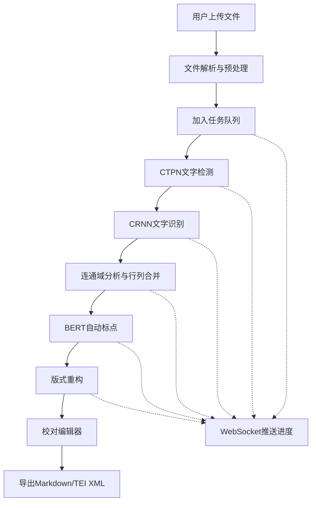

## 1. 产品概述

竖排古籍文字识别系统，面向古籍数字化研究者、图书馆、文史学者，提供从古籍图片/PDF到可编辑结构化文本的端到端OCR解决方案。支持繁体异体字识别、原书版式还原、在线校对、多格式导出，解决传统古籍数字化效率低、人工录入成本高的痛点。

核心价值：深度学习驱动的高精度识别 + 版式智能还原 + 人机协同校对，实现古籍数字化的工业化生产。

## 2. 核心功能

### 2.1 用户角色

| 角色 | 注册方式 | 核心权限 |
|------|----------|----------|
| 普通用户 | 无需注册 | 上传文件、查看识别结果、导出文件 |
| 高级用户 | 邮箱注册 | 保存任务历史、批量处理、API调用 |
| 管理员 | 后台分配 | 系统配置、模型管理、任务监控 |

### 2.2 功能模块

1. **上传模块**：图片/PDF上传、拖拽上传、多文件批量上传
2. **任务管理**：异步处理队列、进度实时推送、任务状态查询
3. **识别引擎**：CTPN文字检测、CRNN文字识别、BERT自动标点
4. **版式还原**：竖排行列合并、原书版式重构、阅读视图
5. **校对编辑**：点击修改、候选词建议、批量替换
6. **导出模块**：Markdown导出、TEI XML导出、原文对照导出

### 2.3 页面详情

| 页面名称 | 模块名称 | 功能描述 |
|----------|----------|----------|
| 首页 | 上传区域 | 拖拽上传、文件选择、格式说明、示例展示 |
| 首页 | 功能介绍 | 技术栈展示、识别流程、系统特性 |
| 任务列表 | 任务卡片 | 缩略图、状态标签、进度条、操作按钮 |
| 校对编辑器 | 原文预览区 | 古籍原图展示、检测框叠加、缩放平移 |
| 校对编辑器 | 文本编辑区 | 版式对齐文本、点击修改、候选词下拉 |
| 校对编辑器 | 工具栏 | 撤销重做、查找替换、导出按钮、识别重跑 |
| 导出页面 | 格式选择 | Markdown/TEI XML切换、导出选项配置 |
| 进度面板 | 实时状态 | 阶段进度、WebSocket推送、日志展示 |

## 3. 核心流程

用户上传古籍图片或PDF文件，系统自动解析并加入处理队列，通过WebSocket实时推送处理进度。处理流程依次为：图像预处理 → CTPN文字区域检测 → CRNN文字识别（支持繁体异体字）→ 连通域分析合并行列 → BERT自动标点 → 版式重构。完成后进入校对界面，用户可点击任意文字进行修改，系统提供候选词建议。最终可导出为Markdown或TEI XML格式。

## 4. 用户界面设计

### 4.1 设计风格

- **主色调**：宣纸米白 (#F5F0E6) 为主背景，篆刻朱红 (#C41E3A) 为强调色，墨黑 (#1A1A1A) 为文字色，辅以拓片灰 (#8B8680) 作为辅助色
- **按钮风格**：圆角矩形 (8px)、轻微投影、悬停时朱红填充、宋体字按钮
- **字体方案**：标题使用「思源宋体」加粗，正文使用「思源宋体」Regular，代码和数字使用「JetBrains Mono」
- **布局风格**：古籍卷轴式布局、左右分栏校对界面、卡片式任务列表
- **装饰元素**：水印式古籍纹理背景、细线分隔、仿印章式状态标签

### 4.2 页面设计概述

| 页面名称 | 模块名称 | UI元素 |
|----------|----------|--------|
| 首页 | 上传区域 | 虚线边框拖拽区、朱红色上传按钮、宣纸纹理背景、淡入动画 |
| 任务列表 | 任务卡片 | 古籍缩略图、印章式状态标签、进度条、悬停上浮效果 |
| 校对编辑器 | 双栏布局 | 左侧原图带检测框、右侧可编辑文本、同步滚动、点击高亮 |
| 校对编辑器 | 工具栏 | 仿宋字体按钮、分隔细线、下拉式导出菜单 |
| 进度面板 | 状态展示 | 阶段时间线、旋转加载动画、实时日志滚动 |

### 4.3 响应性

- 桌面端优先设计 (1280px+)，双栏校对界面充分利用宽屏
- 平板端 (768px-1279px)：校对界面改为上下布局，工具栏折行
- 移动端 (<768px)：单栏流式布局，隐藏高级校对功能，保留查看和基础导出
- 触摸优化：按钮最小高度48px，检测框可触摸放大，支持双指缩放原图

### 4.4 动效设计

- 页面加载：卷轴展开式动画，内容从下往上渐入
- 上传状态：文件拖拽进入时边框变为朱红，背景轻微高亮
- 进度推送：状态切换时平滑过渡，进度条缓动填充
- 校对交互：点击文字时轻微放大，候选词下拉弹性动画
- 导出成功：印章盖下动画，文件图标从模糊到清晰

---

**设计理念**：整体视觉语言致敬中国传统古籍装帧艺术，米白宣纸背景配合朱红色印章元素，宋体字体贯穿始终，让数字化工具保有传统文化的温度与质感。
