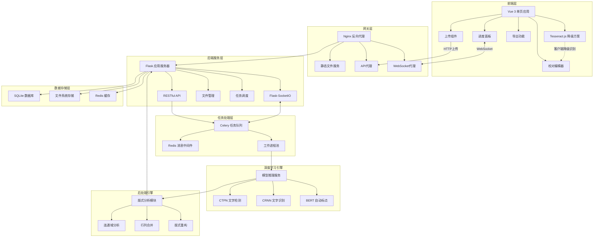
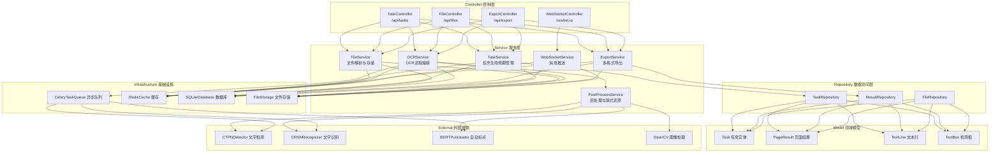
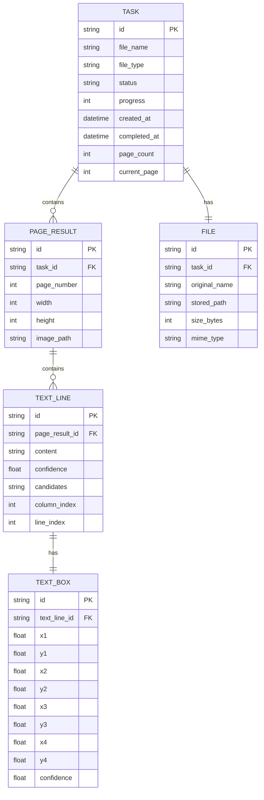

## 1. 架构设计

系统采用前后端分离架构，前端Vue负责用户交互与可视化展示，后端Flask提供RESTful API与WebSocket实时通信，深度学习模型作为独立模块通过Python调用。任务处理采用异步队列架构，通过WebSocket推送处理进度。



## 2. 技术描述

### 2.1 前端技术栈
- **框架**: Vue 3 + Composition API
- **构建工具**: Vite 5
- **状态管理**: Pinia
- **路由**: Vue Router 4
- **UI组件库**: Element Plus
- **样式方案**: SCSS + CSS变量
- **WebSocket**: socket.io-client
- **Canvas操作**: fabric.js
- **OCR降级**: tesseract.js v5
- **图标**: @icon-park/vue-next

### 2.2 后端技术栈
- **Web框架**: Flask 3.0
- **WebSocket**: Flask-SocketIO 5.3
- **异步任务**: Celery 5.3 + Redis
- **ORM**: SQLAlchemy 2.0
- **数据库**: SQLite (开发) / PostgreSQL (生产)
- **文件处理**: Pillow, PyMuPDF (PDF解析)
- **图像预处理**: OpenCV 4.8

### 2.3 深度学习技术栈
- **框架**: PyTorch 2.1
- **文字检测**: CTPN (Connectionist Text Proposal Network)
- **文字识别**: CRNN + Attention (支持繁体异体字)
- **自动标点**: BERT (bert-base-chinese 微调)
- **推理优化**: TorchScript, ONNX Runtime

### 2.4 初始化工具
- 前端: `npm create vite@latest`
- 后端: 手动搭建Flask项目结构

## 3. 路由定义

| 路由路径 | 页面/功能 |
|----------|----------|
| `/` | 首页 - 文件上传与系统介绍 |
| `/tasks` | 任务列表 - 历史任务管理 |
| `/task/:id` | 校对编辑器 - 识别结果校对与编辑 |
| `/task/:id/export` | 导出页面 - 格式选择与下载 |
| `/about` | 关于页面 - 技术说明与帮助 |

## 4. API 定义

### 4.1 TypeScript 类型定义

```typescript
// 任务状态
type TaskStatus = 'pending' | 'preprocessing' | 'detecting' | 'recognizing' | 'postprocessing' | 'punctuating' | 'completed' | 'failed';

// 任务信息
interface Task {
  id: string;
  fileName: string;
  fileType: 'image' | 'pdf';
  status: TaskStatus;
  progress: number;
  createdAt: string;
  completedAt?: string;
  pageCount: number;
  currentPage: number;
}

// 文字检测框
interface TextBox {
  id: string;
  x1: number;
  y1: number;
  x2: number;
  y2: number;
  x3: number;
  y3: number;
  x4: number;
  y4: number;
  confidence: number;
}

// 识别结果
interface TextLine {
  id: string;
  textBox: TextBox;
  content: string;
  confidence: number;
  candidates: string[];
  columnIndex: number;
  lineIndex: number;
}

// 页面识别结果
interface PageResult {
  pageNumber: number;
  width: number;
  height: number;
  imageUrl: string;
  textLines: TextLine[];
  columns: TextLine[][];
}

// 任务结果
interface TaskResult {
  taskId: string;
  pages: PageResult[];
  fullText: string;
}

// WebSocket进度消息
interface ProgressMessage {
  taskId: string;
  status: TaskStatus;
  progress: number;
  message: string;
  currentPage?: number;
  totalPages?: number;
}
```

### 4.2 RESTful API 定义

| 方法 | 路径 | 描述 | 请求 | 响应 |
|------|------|------|------|------|
| POST | `/api/tasks` | 创建识别任务 | `multipart/form-data` 包含文件 | `{ taskId: string }` |
| GET | `/api/tasks` | 获取任务列表 | 查询参数: page, pageSize | `{ tasks: Task[], total: number }` |
| GET | `/api/tasks/:id` | 获取任务详情 | - | `Task` |
| GET | `/api/tasks/:id/result` | 获取识别结果 | - | `TaskResult` |
| PUT | `/api/tasks/:id/result` | 保存校对修改 | `{ pages: PageResult[] }` | `{ success: boolean }` |
| POST | `/api/tasks/:id/rerun` | 重新运行识别 | `{ pageNumbers?: number[] }` | `{ success: boolean }` |
| GET | `/api/tasks/:id/export` | 导出文件 | 查询参数: format (markdown/tei) | 文件流 |
| DELETE | `/api/tasks/:id` | 删除任务 | - | `{ success: boolean }` |

### 4.3 WebSocket 事件

| 事件名 | 方向 | 数据 | 描述 |
|--------|------|------|------|
| `join-task` | 客户端→服务端 | `{ taskId: string }` | 订阅任务进度 |
| `leave-task` | 客户端→服务端 | `{ taskId: string }` | 取消订阅 |
| `progress` | 服务端→客户端 | `ProgressMessage` | 处理进度推送 |
| `completed` | 服务端→客户端 | `{ taskId: string, result: TaskResult }` | 处理完成 |
| `error` | 服务端→客户端 | `{ taskId: string, error: string }` | 处理出错 |

## 5. 服务器架构图



## 6. 数据模型

### 6.1 ER 图



### 6.2 DDL 语句

```sql
-- 任务表
CREATE TABLE tasks (
    id VARCHAR(36) PRIMARY KEY,
    file_name VARCHAR(255) NOT NULL,
    file_type VARCHAR(10) NOT NULL CHECK (file_type IN ('image', 'pdf')),
    status VARCHAR(20) NOT NULL DEFAULT 'pending',
    progress INTEGER NOT NULL DEFAULT 0,
    created_at DATETIME NOT NULL DEFAULT CURRENT_TIMESTAMP,
    completed_at DATETIME,
    page_count INTEGER NOT NULL DEFAULT 1,
    current_page INTEGER NOT NULL DEFAULT 0,
    error_message TEXT
);

CREATE INDEX idx_tasks_status ON tasks(status);
CREATE INDEX idx_tasks_created_at ON tasks(created_at);

-- 文件表
CREATE TABLE files (
    id VARCHAR(36) PRIMARY KEY,
    task_id VARCHAR(36) NOT NULL REFERENCES tasks(id) ON DELETE CASCADE,
    original_name VARCHAR(255) NOT NULL,
    stored_path VARCHAR(500) NOT NULL,
    size_bytes BIGINT NOT NULL,
    mime_type VARCHAR(100) NOT NULL,
    created_at DATETIME NOT NULL DEFAULT CURRENT_TIMESTAMP
);

CREATE INDEX idx_files_task_id ON files(task_id);

-- 页面结果表
CREATE TABLE page_results (
    id VARCHAR(36) PRIMARY KEY,
    task_id VARCHAR(36) NOT NULL REFERENCES tasks(id) ON DELETE CASCADE,
    page_number INTEGER NOT NULL,
    width INTEGER NOT NULL,
    height INTEGER NOT NULL,
    image_path VARCHAR(500) NOT NULL,
    created_at DATETIME NOT NULL DEFAULT CURRENT_TIMESTAMP,
    updated_at DATETIME NOT NULL DEFAULT CURRENT_TIMESTAMP
);

CREATE INDEX idx_page_results_task_id ON page_results(task_id);
CREATE UNIQUE INDEX idx_page_results_task_page ON page_results(task_id, page_number);

-- 文本行表
CREATE TABLE text_lines (
    id VARCHAR(36) PRIMARY KEY,
    page_result_id VARCHAR(36) NOT NULL REFERENCES page_results(id) ON DELETE CASCADE,
    content TEXT NOT NULL,
    confidence REAL NOT NULL,
    candidates TEXT,
    column_index INTEGER NOT NULL,
    line_index INTEGER NOT NULL,
    is_edited BOOLEAN NOT NULL DEFAULT FALSE,
    created_at DATETIME NOT NULL DEFAULT CURRENT_TIMESTAMP,
    updated_at DATETIME NOT NULL DEFAULT CURRENT_TIMESTAMP
);

CREATE INDEX idx_text_lines_page_result_id ON text_lines(page_result_id);
CREATE INDEX idx_text_lines_column ON text_lines(page_result_id, column_index, line_index);

-- 检测框表
CREATE TABLE text_boxes (
    id VARCHAR(36) PRIMARY KEY,
    text_line_id VARCHAR(36) NOT NULL UNIQUE REFERENCES text_lines(id) ON DELETE CASCADE,
    x1 REAL NOT NULL,
    y1 REAL NOT NULL,
    x2 REAL NOT NULL,
    y2 REAL NOT NULL,
    x3 REAL NOT NULL,
    y3 REAL NOT NULL,
    x4 REAL NOT NULL,
    y4 REAL NOT NULL,
    confidence REAL NOT NULL
);
```

## 7. 目录结构

```
h28/
├── frontend/                 # 前端Vue应用
│   ├── public/
│   ├── src/
│   │   ├── api/              # API接口定义
│   │   ├── assets/           # 静态资源
│   │   ├── components/       # 公共组件
│   │   ├── composables/      # 组合式函数
│   │   ├── router/           # 路由配置
│   │   ├── stores/           # Pinia状态管理
│   │   ├── types/            # TypeScript类型定义
│   │   ├── utils/            # 工具函数
│   │   ├── views/            # 页面组件
│   │   ├── App.vue
│   │   └── main.ts
│   ├── index.html
│   ├── package.json
│   ├── vite.config.ts
│   └── tsconfig.json
│
├── backend/                  # 后端Flask应用
│   ├── app/
│   │   ├── api/              # API路由
│   │   ├── controllers/      # 控制器
│   │   ├── services/         # 业务逻辑
│   │   ├── repositories/     # 数据访问
│   │   ├── models/           # 数据模型
│   │   ├── schemas/          # 请求/响应模式
│   │   ├── core/             # 核心配置
│   │   ├── extensions/       # Flask扩展
│   │   └── __init__.py
│   ├── ml/                   # 深度学习模块
│   │   ├── detection/        # CTPN检测
│   │   ├── recognition/      # CRNN识别
│   │   ├── punctuation/      # BERT标点
│   │   └── postprocessing/   # 后处理
│   ├── tasks/                # Celery任务
│   ├── migrations/           # 数据库迁移
│   ├── tests/                # 测试用例
│   ├── requirements.txt
│   ├── config.py
│   ├── run.py
│   └── celery_worker.py
│
├── storage/                  # 文件存储
│   ├── uploads/
│   ├── processed/
│   └── exports/
│
├── docker-compose.yml
└── README.md
```
