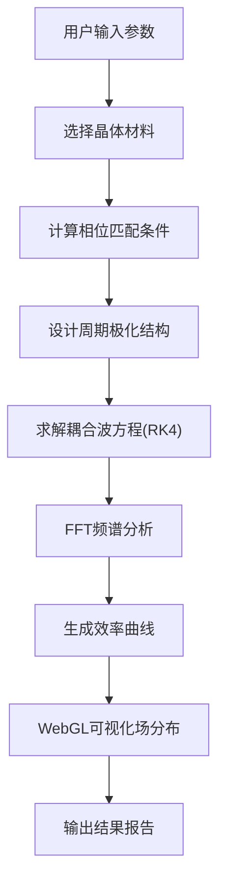

## 1. 产品概述

本产品是一个基于纯前端技术（WebAssembly + WebGL）的非线性光学相位匹配与周期极化晶体设计仿真平台，为科研人员和工程师提供交互式的非线性光学过程数值模拟工具。

- 主要用途：计算相位匹配条件、设计周期极化晶体结构、求解耦合波方程、评估非线性转换效率
- 目标用户：光学工程师、激光物理学家、非线性光学研究人员、相关专业学生
- 解决的问题：无需安装专业软件，在浏览器中即可完成复杂的非线性光学数值模拟
- 市场价值：提供便捷、高性能、可视化的科研辅助工具，降低非线性光学设计门槛

## 2. 核心功能

### 2.1 用户角色

| 角色 | 注册方法 | 核心权限 |
|------|----------|----------|
| 普通用户 | 无需注册，直接访问 | 使用所有计算和可视化功能 |

### 2.2 功能模块

1. **主控制面板**：参数输入、材料选择、计算控制
2. **相位匹配计算**：相位匹配角、温度、波长计算
3. **周期极化设计**：一维/二维啁啾畴反转周期设计
4. **耦合波方程求解**：RK4数值积分、转换效率计算
5. **结果可视化**：效率曲线、带宽、容许公差图表
6. **场分布可视化**：WebGL电场分布、畴结构显示
7. **频谱分析**：FFT非线性和衍射评估

### 2.3 页面详情

| 页面名称 | 模块名称 | 功能描述 |
|---------|----------|----------|
| 主界面 | 参数输入区 | 泵浦光波长、信号光波长范围、晶体材料、温度、角度等参数输入 |
| 主界面 | 材料选择器 | 支持LiNbO3、KTP、BBO、LBO等多种非线性晶体材料选择 |
| 主界面 | 相位匹配计算 | 自动计算I类/II类相位匹配条件，输出匹配角、有效非线性系数 |
| 主界面 | 周期极化设计 | 设计一维均匀、一维啁啾、二维啁啾畴反转结构 |
| 主界面 | 耦合波求解器 | RK4数值积分求解三波混频耦合波方程，计算转换效率 |
| 主界面 | 图表区 | 显示效率-长度曲线、效率-温度曲线、效率-角度曲线、带宽谱 |
| 主界面 | 3D可视化区 | WebGL显示晶体内部电场分布、畴结构、极化周期分布 |
| 主界面 | 频谱分析区 | FFT分析非线性频谱成分和衍射效应 |

## 3. 核心流程

用户输入泵浦光波长、信号光波长范围，选择晶体材料后，系统自动计算相位匹配条件，然后根据用户选择设计周期极化结构，最后求解耦合波方程并输出转换效率曲线和可视化结果。

## 4. 用户界面设计

### 4.1 设计风格

- **主色调**：深蓝色(#0a1628)作为背景，代表光学科技感；青色(#00d4ff)作为主强调色，代表激光光束；橙色(#ff6b35)作为次强调色，代表信号光
- **按钮风格**：圆角矩形按钮，带有微妙的发光边框效果，hover时有光晕动画
- **字体**：使用JetBrains Mono作为数值显示字体，Inter作为界面字体
- **布局风格**：三栏式布局，左侧控制面板、中间可视化区、右侧图表区
- **视觉元素**：使用激光光束动画、晶体晶格纹理、傅里叶变换图案作为装饰元素

### 4.2 页面设计概述

| 页面名称 | 模块名称 | UI元素 |
|---------|----------|--------|
| 主界面 | 控制面板 | 深色卡片式设计，每个参数组有独立边框，输入框带单位标签 |
| 主界面 | 可视化区 | 黑色背景，带有网格参考线，支持鼠标交互旋转/缩放 |
| 主界面 | 图表区 | 半透明深色背景，曲线带渐变填充，支持数据点悬停显示 |
| 主界面 | 顶部导航栏 | 渐变背景，带有logo和功能切换标签 |
| 主界面 | 状态显示区 | 实时显示计算进度、内存使用、当前参数状态 |

### 4.3 响应性

- 桌面端优先设计，最低支持1280px宽度
- 平板端（768-1280px）：两栏布局，控制面板居上，可视化区和图表区并列
- 移动端（<768px）：单栏堆叠布局，简化部分功能
- 支持触控操作，所有交互元素尺寸≥44px

### 4.4 WebGL场景设计

- **环境**：深色空间背景，带有柔和的体积光效果模拟激光传播
- **光照**：使用Phong光照模型，主光源模拟泵浦光方向，环境光保持低亮度
- **相机**：默认正交投影，支持切换透视投影，可自由旋转、平移、缩放
- **构成**：晶体模型使用半透明材质，内部用粒子系统表示电场分布，畴结构用不同颜色区分
- **交互**：支持鼠标拾取、切片查看、动画播放控制
- **后处理**：添加轻微的Bloom效果模拟激光发光，FXAA抗锯齿
- **性能**：控制粒子数量在10000以内，保持60fps帧率
