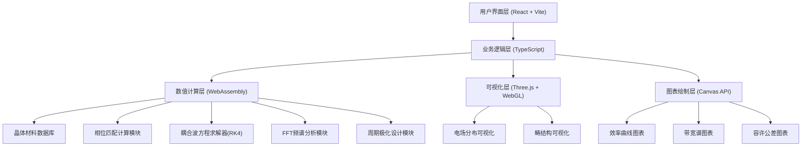
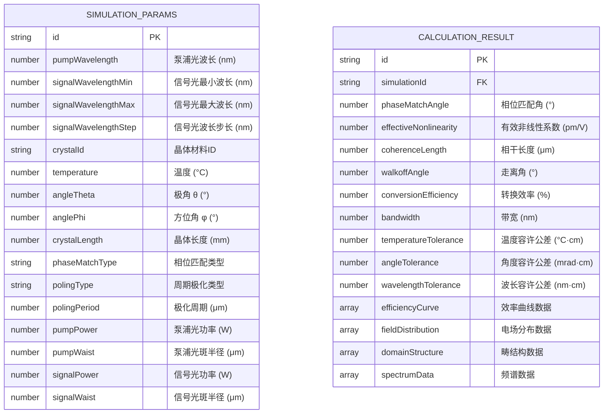

## 1. 架构设计

本系统为纯前端应用，采用分层架构设计，核心计算层使用WebAssembly实现高性能数值计算，可视化层使用WebGL实现3D场分布渲染，界面层使用React构建交互式控制面板。



## 2. 技术描述

### 2.1 核心技术栈
- **前端框架**：React 18 + TypeScript + Vite 5
- **UI组件库**：自定义组件 + TailwindCSS 3
- **数值计算**：WebAssembly (AssemblyScript)
- **3D可视化**：Three.js r160 + @react-three/fiber + @react-three/drei + @react-three/postprocessing
- **2D图表**：Canvas 2D API 自定义实现
- **状态管理**：Zustand
- **样式方案**：TailwindCSS 3 + CSS Variables

### 2.2 WebAssembly模块
使用AssemblyScript编写高性能数值计算模块，包括：
- Sellmeier方程求解（折射率计算）
- 相位匹配条件求解（牛顿迭代法）
- 四阶龙格-库塔（RK4）数值积分
- 快速傅里叶变换（Cooley-Tukey算法）
- 周期极化结构生成算法

### 2.3 性能优化策略
- Web Worker后台线程执行计算任务，避免UI阻塞
- 计算结果增量更新，避免全量重绘
- WebGL实例化渲染优化大量粒子显示
- 内存池管理WebAssembly内存分配
- 虚拟滚动处理大数据集显示

## 3. 路由定义

| 路由 | 用途 |
|------|------|
| / | 主应用界面，包含所有功能模块 |

## 4. 核心模块设计

### 4.1 晶体材料数据库模块

**数据结构定义**：
```typescript
interface CrystalMaterial {
  id: string;
  name: string;
  formula: string;
  sellmeier: {
    ordinary: SellmeierCoefficients;
    extraordinary?: SellmeierCoefficients;
  };
  nonlinearCoefficients: {
    d33: number;
    d31: number;
    d22: number;
  };
  thermoOpticCoefficients: {
    dn_o_dT: number;
    dn_e_dT: number;
  };
  transparencyRange: [number, number];
  damageThreshold: number;
}

interface SellmeierCoefficients {
  A1: number; B1: number;
  A2: number; B2: number;
  A3: number; B3: number;
}
```

**内置材料**：LiNbO3、KTP、BBO、LBO、KDP、DKDP、MgO:LiNbO3

### 4.2 相位匹配计算模块

**核心算法**：
- I类相位匹配：o + o → e, e + e → o
- II类相位匹配：o + e → e, e + o → e
- 走离角计算
- 有效非线性系数计算
- 群速度失配计算

**输出参数**：
- 相位匹配角 θ、φ
- 走离角 ρ
- 有效非线性系数 deff
- 相干长度 Lc
- 群速度延迟 GVM

### 4.3 周期极化设计模块

**支持结构**：
1. 一维均匀周期：Λ(z) = Λ0
2. 一维线性啁啾：Λ(z) = Λ0 + α·z
3. 一维二次啁啾：Λ(z) = Λ0 + α·z + β·z²
4. 二维周期极化：Λ(x,z) = Λx(x)·Λz(z)
5. 扇形结构：Λ(x) = Λ0 + γ·x

**设计参数**：
- 中心周期 Λ0
- 啁啾率 α, β
- 晶体长度 L
- 占空比 D
- 畴反转数目 N

### 4.4 耦合波方程求解器

**求解方程**（三波混频）：
```
dA_p/dz = -α_p·A_p/2 + i·ω_p·deff/(n_p·c)·A_s·A_i*·exp(-i·Δk·z)
dA_s/dz = -α_s·A_s/2 + i·ω_s·deff/(n_s·c)·A_p·A_i*·exp(-i·Δk·z)
dA_i/dz = -α_i·A_i/2 + i·ω_i·deff/(n_i·c)·A_p·A_s*·exp(-i·Δk·z)
```

**数值方法**：
- 四阶龙格-库塔法（RK4）
- 自适应步长控制
- 相位失配 Δk(z) 空间分布

**输出结果**：
- 光强演化 I_p(z), I_s(z), I_i(z)
- 转换效率 η = I_s(L)/I_p(0)
- 相位分布 φ(z)

### 4.5 FFT频谱分析模块

**算法**：Cooley-Tukey基2FFT算法

**功能**：
- 输出光谱分析
- 空间频率分析
- 衍射效应评估
- 非线性谐波分析

## 5. 数据模型

### 5.1 计算参数模型



### 5.2 初始数据（内置材料数据库）

```typescript
const DEFAULT_CRYSTALS: CrystalMaterial[] = [
  {
    id: 'linbo3',
    name: '铌酸锂 (LiNbO3)',
    formula: 'LiNbO3',
    sellmeier: {
      ordinary: { A1: 4.9048, B1: 0.11768, A2: 0.11768, B2: 0.04750, A3: 2.8956, B3: 0.04582 },
      extraordinary: { A1: 4.5820, B1: 0.099169, A2: 0.099169, B2: 0.044432, A3: 2.4214, B3: 0.043313 }
    },
    nonlinearCoefficients: { d33: 27.0, d31: -4.5, d22: 2.1 },
    thermoOpticCoefficients: { dn_o_dT: 3.2e-5, dn_e_dT: 4.2e-5 },
    transparencyRange: [350, 5000],
    damageThreshold: 100
  },
  // ... 更多材料
];
```

## 6. WebAssembly接口设计

```typescript
// 相位匹配计算
export function calculatePhaseMatching(
  crystalId: string,
  pumpLambda: number,
  signalLambda: number,
  temperature: number,
  matchType: number
): PhaseMatchingResult;

// RK4求解耦合波方程
export function solveCoupledWaveEquations(
  params: SimulationParams,
  polingStructure: Float64Array
): CoupledWaveResult;

// FFT变换
export function fft(data: Float64Array, inverse: boolean): ComplexArray;

// 生成周期极化结构
export function generatePolingStructure(
  length: number,
  period: number,
  chirpType: number,
  chirpRate: number,
  dutyCycle: number
): Float64Array;

// 计算折射率
export function calculateRefractiveIndex(
  crystalId: string,
  wavelength: number,
  temperature: number,
  polarization: number
): number;
```

## 7. 性能指标

- 单次耦合波方程求解（1000步长）：< 50ms
- 效率曲线扫描（100个波长点）：< 2s
- WebGL渲染帧率：≥ 60fps
- 内存占用：< 500MB
- 首次加载时间：< 3s
