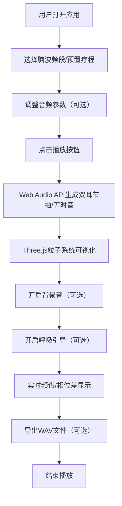

## 1. 产品概述

脑波音疗应用是一款基于Web Audio API和Three.js的沉浸式音频疗愈工具，通过生成双耳节拍、等时音等脑波同步技术，结合3D粒子音景可视化，帮助用户达到放松、专注、冥想等不同意识状态。

- 主要用途：提供科学的脑波频率干预，辅助用户进行冥想、放松、提升专注力、改善睡眠
- 目标用户：需要压力管理、冥想练习、专注力提升的都市人群、冥想爱好者、学生群体
- 产品价值：将神经科学与沉浸式视听体验结合，提供便捷、个性化的脑波疗愈方案

## 2. 核心功能

### 2.1 用户角色
| 角色 | 注册方式 | 核心权限 |
|------|----------|----------|
| 普通用户 | 无需注册 | 使用所有音频生成、可视化、导出功能 |

### 2.2 功能模块
1. **主控面板**：脑波频段选择、音量控制、双耳节拍/等时音切换、播放控制
2. **3D音景可视化**：粒子系统随频率和幅度实时波动
3. **频谱分析仪**：实时显示音频频谱和左右声道相位差
4. **背景音系统**：可叠加雨声、白噪音等自然背景音
5. **呼吸引导**：视觉呼吸灯与听觉节奏同步引导
6. **预置疗程**：放松、专注、冥想等一键启动的疗愈方案
7. **音频导出**：将生成的音频导出为WAV文件

### 2.3 页面详情
| 页面名称 | 模块名称 | 功能描述 |
|----------|----------|----------|
| 主应用页 | 脑波频段选择器 | 5个频段按钮：Delta(0.5-4Hz)、Theta(4-8Hz)、Alpha(8-13Hz)、Beta(13-30Hz)、Gamma(30-100Hz)，点击切换目标频段 |
| 主应用页 | 音频参数控制 | 载波频率滑块、调制深度滑块、主音量控制、左右声道平衡 |
| 主应用页 | 音频模式切换 | 双耳节拍模式/等时音模式切换按钮 |
| 主应用页 | 3D可视化区域 | Three.js粒子系统，粒子大小、颜色、运动速度随音频频率和幅度变化 |
| 主应用页 | 频谱分析面板 | Canvas绘制的实时频谱图、波形图、相位差指示器 |
| 主应用页 | 背景音控制 | 雨声、白噪音、粉红噪音、棕噪音选择及独立音量控制 |
| 主应用页 | 呼吸引导模块 | 圆形呼吸灯，按设定节奏进行吸气-屏息-呼气-屏息循环动画 |
| 主应用页 | 预置疗程面板 | 三个疗程卡片：深度放松、专注学习、冥想入定，点击加载预设参数 |
| 主应用页 | 导出控制 | 设置导出时长，点击按钮生成并下载WAV文件 |
| 主应用页 | 播放控制栏 | 播放/暂停按钮、当前状态指示器、时间显示 |

## 3. 核心流程

用户打开应用 → 选择目标脑波频段或预置疗程 → 调整音频参数（可选） → 启动播放 → 3D粒子可视化同步响应 → 可开启呼吸引导和背景音 → 实时观察频谱和相位差 → 导出WAV文件（可选） → 结束播放

## 4. 用户界面设计

### 4.1 设计风格
- **整体方向**：极简未来主义 × 有机自然感，科技感与疗愈感的平衡
- **主色调**：深空靛蓝 #0a0e1a 为背景，配合渐变霓虹色（各频段专属色）
  - Delta：深蓝紫 #6366f1
  - Theta：靛青紫 #8b5cf6
  - Alpha：天蓝 #3b82f6
  - Beta：翠绿 #10b981
  - Gamma：橙金 #f59e0b
- **按钮风格**：玻璃拟态（Glassmorphism），圆角矩形，背景模糊，hover时有发光效果
- **字体**：展示字体使用 'Space Mono' 等宽未来感字体，正文使用 'Inter' 清晰易读
- **布局风格**：左侧控制面板（30%宽度），右侧3D可视化区域（70%宽度），底部频谱分析条
- **动效**：所有交互带有缓动过渡，粒子系统采用平滑物理运动

### 4.2 页面设计概述
| 页面名称 | 模块名称 | UI元素 |
|----------|----------|--------|
| 主应用页 | 频段选择器 | 5个圆形按钮，各频段专属渐变色，选中时有脉冲发光动画 |
| 主应用页 | 控制面板 | 玻璃拟态卡片，半透明背景，模糊效果，滑块带有发光轨道 |
| 主应用页 | 3D可视化区 | 全屏WebGL画布，深空背景，漂浮粒子，深度雾效 |
| 主应用页 | 频谱分析条 | 底部固定高度区域，彩色频谱柱状图，左右声道波形叠加 |
| 主应用页 | 呼吸引导灯 | 中央可叠加圆形，呼吸节奏缩放，渐变光晕效果 |
| 主应用页 | 预置疗程卡 | 横向排列卡片，图标+标题+描述，hover时上浮效果 |

### 4.3 响应性
- Desktop-first设计，主布局为左右分栏
- 平板端：上下布局，控制面板在上，可视化区在下
- 移动端：垂直滚动布局，所有模块堆叠，优化触控区域大小
- 触控优化：所有可点击元素最小48x48px，滑块增加触控区域

### 4.4 3D场景指导
- **环境与氛围**：深空宇宙场景，深蓝渐变背景，漂浮的星尘粒子
- **光照设置**：环境光 + 3个点光源（分别对应RGB三色），随音频幅度变化强度
- **相机设置**：PerspectiveCamera，位置(0, 0, 15)，平滑跟随音频节奏轻微摇摆
- **构图与焦点**：中心为密集粒子群，外围稀疏粒子营造空间感
- **交互与动画**：粒子位置、大小、颜色随频率数据实时更新，整体有缓慢旋转
- **后处理效果**：Bloom泛光效果，轻微色差，增加梦幻感
- **性能预算**：粒子数量控制在5000以内，维持60fps
