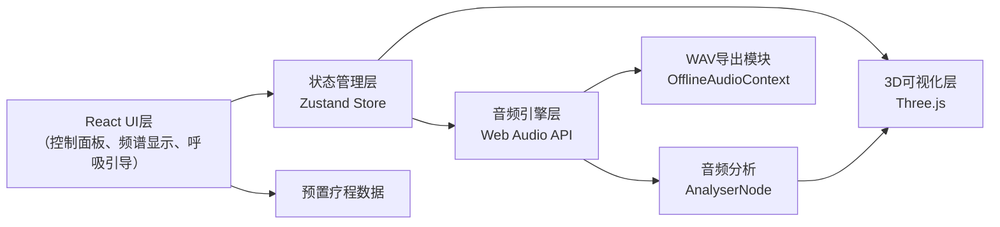

## 1. 架构设计



## 2. 技术描述
- **前端框架**：React@18 + TypeScript + Vite@5
- **样式方案**：TailwindCSS@3 + CSS自定义属性
- **音频引擎**：原生Web Audio API（无需额外库）
- **3D可视化**：Three.js@0.160
- **状态管理**：Zustand@4（轻量级，适合实时音频状态）
- **UI图标**：Lucide React
- **后端**：无后端，纯前端应用
- **数据库**：无数据库，使用localStorage存储用户偏好

## 3. 核心目录结构
```
src/
├── components/
│   ├── ControlPanel/       # 左侧控制面板
│   │   ├── BandSelector.tsx    # 脑波频段选择
│   │   ├── AudioControls.tsx   # 音频参数控制
│   │   ├── BackgroundSounds.tsx # 背景音控制
│   │   ├── Presets.tsx         # 预置疗程
│   │   └── ExportPanel.tsx     # 导出面板
│   ├── Visualizer3D/       # 3D可视化
│   │   ├── ParticleSystem.tsx  # 粒子系统
│   │   └── Scene.tsx           # Three.js场景
│   ├── SpectrumAnalyzer/   # 频谱分析
│   │   ├── SpectrumChart.tsx   # 频谱图
│   │   ├── WaveformChart.tsx   # 波形图
│   │   └── PhaseIndicator.tsx  # 相位差显示
│   ├── BreathingGuide/     # 呼吸引导
│   │   └── BreathingLight.tsx
│   └── common/             # 公共组件
├── hooks/
│   ├── useAudioEngine.ts       # 音频引擎Hook
│   ├── useParticleSystem.ts    # 粒子系统Hook
│   └── useBreathing.ts         # 呼吸节奏Hook
├── store/
│   └── useAudioStore.ts        # 音频状态管理
├── audio/
│   ├── BrainwaveGenerator.ts   # 脑波生成器
│   ├── BinauralBeat.ts         # 双耳节拍
│   ├── IsochronicTone.ts       # 等时音
│   ├── BackgroundNoise.ts      # 背景噪音
│   ├── WavExporter.ts          # WAV导出
│   └── AudioAnalyzer.ts        # 音频分析
├── data/
│   ├── brainwaveBands.ts       # 脑波频段数据
│   └── presets.ts              # 预置疗程数据
├── types/
│   └── audio.ts                # 类型定义
├── utils/
│   └── audioUtils.ts           # 音频工具函数
├── App.tsx
├── main.tsx
└── index.css
```

## 4. 核心数据模型

### 4.1 脑波频段定义
```typescript
interface BrainwaveBand {
  id: 'delta' | 'theta' | 'alpha' | 'beta' | 'gamma';
  name: string;
  frequencyRange: [number, number];
  defaultFrequency: number;
  color: string;
  description: string;
}
```

### 4.2 音频状态
```typescript
interface AudioState {
  isPlaying: boolean;
  currentBand: BrainwaveBand;
  beatFrequency: number;
  carrierFrequency: number;
  modulationDepth: number;
  masterVolume: number;
  channelBalance: number;
  audioMode: 'binaural' | 'isochronic';
  backgroundSounds: {
    rain: { enabled: boolean; volume: number };
    whiteNoise: { enabled: boolean; volume: number };
    pinkNoise: { enabled: boolean; volume: number };
    brownNoise: { enabled: boolean; volume: number };
  };
  breathing: {
    enabled: boolean;
    inhaleTime: number;
    holdTime: number;
    exhaleTime: number;
    restTime: number;
  };
  frequencyData: Uint8Array;
  timeDataLeft: Float32Array;
  timeDataRight: Float32Array;
  phaseDifference: number;
}
```

### 4.3 预置疗程
```typescript
interface Preset {
  id: string;
  name: string;
  description: string;
  icon: string;
  duration: number;
  settings: Partial<AudioState>;
  bandProgression?: { time: number; band: string }[];
}
```

## 5. 核心技术实现要点

### 5.1 Web Audio API 音频引擎
- 使用 `AudioContext` 创建音频上下文
- **双耳节拍**：两个 `OscillatorNode` 分别连接到左右声道 `ChannelSplitterNode`，频率差即为脑波频率
- **等时音**：`OscillatorNode` + `GainNode` 实现脉冲幅度调制，`GainNode.gain` 连接到 `OscillatorNode`（LFO）实现周期性音量变化
- **背景噪音**：使用 `AudioBufferSourceNode` 播放预生成的噪音buffer，或 `ScriptProcessorNode` 实时生成
- **音频分析**：`AnalyserNode` 获取频域和时域数据，`fftSize = 2048`

### 5.2 Three.js 粒子系统
- `BufferGeometry` 存储5000个粒子位置、颜色、大小
- `PointsMaterial` + `ShaderMaterial` 自定义着色器
- 顶点着色器接收音频Uniform数据，动态调整粒子位置和大小
- 粒子运动使用正弦波叠加，与音频频率同步
- `EffectComposer` + `UnrealBloomPass` 实现泛光效果

### 5.3 WAV导出
- 使用 `OfflineAudioContext` 离线渲染
- 按导出时长生成完整音频buffer
- 转换为WAV格式（16位PCM，44100Hz采样率）
- 使用 `Blob` + `URL.createObjectURL` 触发下载

### 5.4 性能优化
- 使用 `requestAnimationFrame` 统一动画循环
- 音频数据每帧更新一次，避免过度计算
- 粒子系统使用 `BufferGeometry` 而非 `Geometry`
- 频谱分析使用 `getByteFrequencyData` 而非 `getFloatFrequencyData`

## 6. 预置疗程数据

```typescript
// 深度放松
{
  id: 'deep-relaxation',
  name: '深度放松',
  description: '从Alpha慢慢过渡到Theta，释放压力，进入深度放松状态',
  icon: 'moon',
  duration: 20,
  settings: {
    audioMode: 'binaural',
    carrierFrequency: 200,
    modulationDepth: 0.5,
    breathing: { enabled: true, inhaleTime: 4, holdTime: 4, exhaleTime: 8, restTime: 4 }
  },
  bandProgression: [
    { time: 0, band: 'alpha' },
    { time: 300, band: 'theta' }
  ]
}

// 专注学习
{
  id: 'focus',
  name: '专注学习',
  description: 'Beta频段，提升专注力和思维清晰度',
  icon: 'brain',
  duration: 25,
  settings: {
    audioMode: 'isochronic',
    currentBand: { id: 'beta', ... },
    beatFrequency: 18,
    carrierFrequency: 300,
    breathing: { enabled: false }
  }
}

// 冥想入定
{
  id: 'meditation',
  name: '冥想入定',
  description: 'Alpha/Theta边界，适合深度冥想和内观',
  icon: 'lotus',
  duration: 15,
  settings: {
    audioMode: 'binaural',
    beatFrequency: 7.5,
    carrierFrequency: 150,
    backgroundSounds: { rain: { enabled: true, volume: 0.2 } },
    breathing: { enabled: true, inhaleTime: 6, holdTime: 6, exhaleTime: 12, restTime: 6 }
  }
}
```
