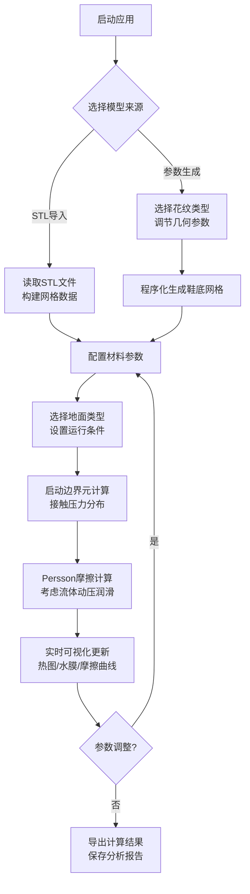

## 1. 产品概述

鞋底摩擦模拟系统是一款基于Unity3D的科学计算可视化软件，用于模拟橡胶鞋底与不同地面接触时的摩擦力学行为。系统集成边界元法接触压力计算、Persson摩擦理论及流体动压润滑模型，为鞋类设计、材料研发提供量化分析工具。

- 核心价值：将复杂的接触力学与摩擦理论转化为直观的可视化分析工具，降低研发门槛
- 目标用户：鞋类设计师、材料工程师、运动生物力学研究者
- 技术创新：GPU加速的边界元计算、实时参数化调整、多物理场耦合可视化

## 2. 核心功能

### 2.1 用户角色

| 角色 | 注册方式 | 核心权限 |
|------|----------|----------|
| 工程师用户 | 无需注册，本地应用 | 完整的模型导入、参数调整、模拟计算、结果导出权限 |

### 2.2 功能模块

1. **模型输入模块**：STL模型导入、参数化花纹生成（人字纹、波浪纹、块状）
2. **材料参数模块**：橡胶硬度调节、表面粗糙度谱配置、载荷设置
3. **地面选择模块**：沥青、瓷砖、冰面三种典型地面类型
4. **接触力学计算模块**：边界元法接触压力分布计算
5. **摩擦模拟模块**：Persson摩擦理论、流体动压润滑效应
6. **可视化模块**：接触压力热图、水膜厚度分布、摩擦系数-滑移速度曲线
7. **数据导出模块**：计算数据导出、图像截图保存

### 2.3 页面详情

| 页面名称 | 模块名称 | 功能描述 |
|----------|----------|----------|
| 主场景视图 | 3D鞋底模型展示 | 实时显示鞋底3D模型，支持旋转、缩放、平移交互 |
| 参数控制面板 | 材质与地面参数 | 滑块控制橡胶硬度(Shore A 30-80)、表面粗糙度、法向载荷(100-1000N) |
| 花纹生成面板 | 花纹类型与参数 | 选择花纹类型（人字纹/波浪纹/块状），调节花纹间距、深度、方向角度 |
| 计算控制区 | 模拟计算控制 | 开始/暂停/重置计算按钮，显示计算进度条 |
| 结果可视化区 | 热图与曲线展示 | 接触压力热力图、水膜厚度分布图、摩擦系数-滑移速度曲线图 |
| 模型导入区 | STL文件导入 | 文件选择对话框，支持STL格式模型导入与预览 |

## 3. 核心流程

用户启动应用后，可选择导入STL鞋底模型或使用参数化生成花纹。配置橡胶材料参数、表面粗糙度谱、法向载荷及地面类型后，启动接触力学计算。系统通过边界元法计算接触压力分布，结合Persson摩擦理论和流体动压润滑模型，计算不同滑移速度下的摩擦系数。计算过程中实时更新可视化结果，用户可调节参数重新计算，最终导出分析报告。

## 4. 用户界面设计

### 4.1 设计风格

- **主色调**：科技蓝(#1E88E5)作为主色，深灰(#263238)背景，强调专业工程软件风格
- **辅助色**：热力图使用彩虹色谱(蓝→青→绿→黄→红)表示压力从低到高
- **按钮风格**：圆角矩形按钮(4px圆角)，悬停时有轻微缩放和发光效果
- **字体**：主标题使用Roboto Bold 18px，参数标签使用Roboto Regular 14px，数值显示使用等宽字体JetBrains Mono 13px
- **布局风格**：左侧参数控制面板(300px固定宽度)，中间3D视图区，右侧可视化图表区(350px固定宽度)
- **视觉层次**：半透明毛玻璃效果面板，柔和阴影(box-shadow: 0 4px 20px rgba(0,0,0,0.3))

### 4.2 页面设计概述

| 页面名称 | 模块名称 | UI元素 |
|----------|----------|--------|
| 主界面 | 3D视图区 | 居中布局，纯色背景(#1A1A2E)，OrbitControl相机控制，模型边缘高亮轮廓线 |
| 主界面 | 左侧控制面板 | 垂直堆叠的参数组，每组包含标题栏+参数行，支持折叠展开 |
| 主界面 | 右侧可视化区 | 上下布局：上方接触压力热力图，中间水膜厚度分布图，下方摩擦系数曲线图 |
| 主界面 | 底部状态栏 | 显示当前计算状态、FPS、内存占用、计算耗时 |
| 对话框 | STL导入 | 标准文件选择对话框，预览窗口显示模型缩略图 |

### 4.3 3D场景设计指导

- **环境与氛围**：深色空间背景，配合柔和的环境光，突出鞋底模型的几何细节
- **光照设置**：主光源(方向光，45°俯角) + 两盏辅助补光，开启软阴影，材质使用PBR金属工作流
- **相机设置**：初始相机距离模型1.5倍包围球半径，视角45°，支持滚轮缩放、右键旋转、中键平移
- **交互与动画**：参数调整时模型平滑过渡，计算时显示进度动画，热力图颜色实时更新
- **后处理效果**：Bloom发光效果(强度0.4)，轻微景深，色彩分级增强科技感
- **性能预算**：单帧Draw Call < 200，目标帧率 > 60fps，模型三角面数控制在5万以内

### 4.4 交互细节

- **滑块交互**：参数滑块拖动时实时预览效果，数值输入框支持键盘输入
- **热力图交互**：鼠标悬停在热图上显示具体压力数值和坐标位置
- **曲线交互**：曲线图支持缩放、平移，点击数据点显示精确数值
- **快捷键**：Space开始/暂停计算，R重置场景，Ctrl+S保存截图
