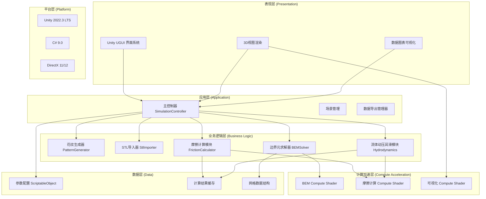
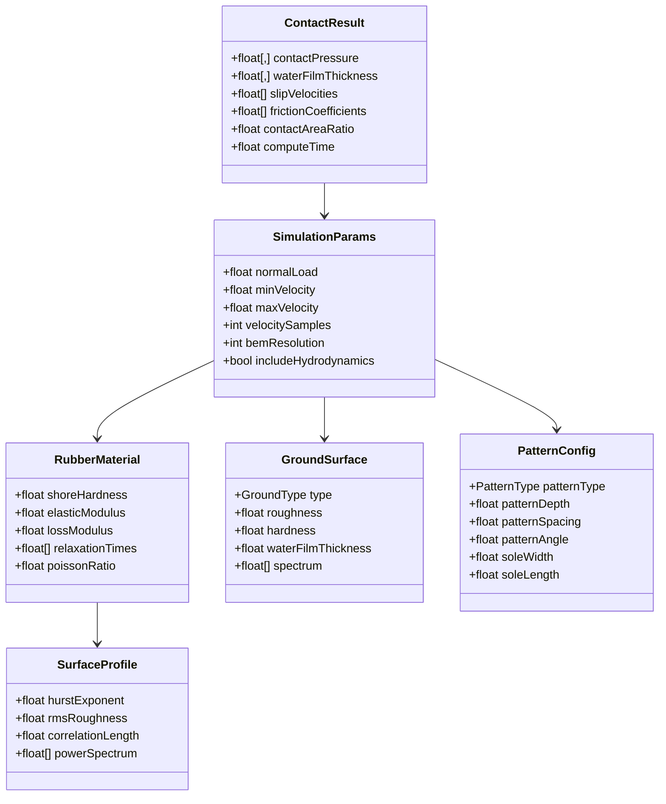

## 1. 架构设计

系统采用分层架构设计，确保计算核心与可视化层解耦，支持GPU/CPU混合计算模式。



## 2. 技术描述

### 2.1 技术栈

| 层级 | 技术选型 | 版本 | 说明 |
|------|----------|------|------|
| 游戏引擎 | Unity | 2022.3 LTS | 长期支持版本，Compute Shader支持完善 |
| 编程语言 | C# | 9.0 | 支持泛型、异步、Span等高性能特性 |
| GPU计算 | HLSL Compute Shader | Shader Model 5.0+ | DirectX 11以上支持 |
| UI框架 | Unity UGUI | 内置 | 原生UI系统，性能优异 |
| 图表绘制 | Unity GraphView | 内置 | 绘制摩擦系数曲线 |
| 数据格式 | STL (ASCII/Binary) | - | 3D模型导入格式 |
| 数学库 | Unity.Mathematics | 1.2.6 | Burst编译，SIMD加速数学计算 |
| 内存管理 | Unity.Collections | 2.1.4 | NativeArray高效内存管理 |

### 2.2 核心算法说明

#### 边界元法(BEM)接触计算
- **理论基础**：半无限空间弹性体接触问题，使用Green函数求解
- **离散化**：将接触区域离散为N×N边界元，每个单元假设恒压分布
- **核心公式**：u_i = Σ_j K_ij * p_j，其中K_ij为影响系数矩阵
- **求解器**：共轭梯度法(CG)求解线性方程组，GPU加速矩阵乘法
- **收敛准则**：压力残差 < 1e-6 或最大迭代步数200

#### Persson摩擦理论
- **接触面积分数**：A/A₀ = erf(√(π/2) * p₀ / E' * (h_rms/ρ)^(-1/2))
- **橡胶粘弹性摩擦**：μ_viscous = ∫ G''(ω) / |G*(ω)| * d(log ω)
- **流体动压润滑**：p_hydro = (6ηv h₀) / h³，考虑Reynolds方程
- **综合摩擦系数**：μ = μ_adhesion * (1 - A_fluid/A₀) + μ_hydro * (A_fluid/A₀)

#### 表面粗糙度谱
- **自仿射分形表面**：C(q) = C₀ * (q/q₀)^(-2(H+1))，H为Hurst指数
- **频谱采样**：q ∈ [q₀, q₁]，对数均匀采样N=256点
- **均方根粗糙度**：h_rms = √(∫ C(q) d²q)

## 3. 核心数据结构

### 3.1 数据模型定义



### 3.2 Compute Shader数据布局

```c
// BEM计算缓冲区结构
struct BEMData {
    float2 position;      // 单元中心坐标 (xy)
    float pressure;       // 接触压力
    float displacement;   // 法向位移
    float gap;            // 初始间隙
};

// 摩擦计算数据
struct FrictionData {
    float slipVelocity;   // 滑移速度
    float frictionCoeff;  // 摩擦系数
    float contactRatio;   // 接触面积比
    float hydroPressure;  // 流体动压力
};

// 粗糙度谱数据
cbuffer RoughnessParams {
    int spectrumSize;
    float hurstExponent;
    float rmsHeight;
    float shortCutoff;
    float longCutoff;
};
```

## 4. 模块接口定义

### 4.1 核心接口

```csharp
public interface IPatternGenerator
{
    Mesh Generate(PatternConfig config);
    float[] GetHeightField(int resolution);
}

public interface IBEMSolver
{
    Task<ContactResult> SolveAsync(
        Mesh contactSurface,
        RubberMaterial material,
        GroundSurface ground,
        SimulationParams parameters,
        IProgress<float> progress);
}

public interface IFrictionCalculator
{
    float[] CalculateFrictionCurve(
        ContactResult contactData,
        RubberMaterial material,
        GroundSurface ground,
        float[] velocities);
}

public interface IStlImporter
{
    Mesh Import(string filePath);
    bool ValidateMesh(Mesh mesh);
}

public interface IResultExporter
{
    void ExportCsv(ContactResult data, string path);
    void ExportImage(Texture2D heatmap, string path);
}
```

### 4.2 主控制器API

```csharp
public class SimulationController : MonoBehaviour
{
    // 模型操作
    public void LoadStlModel(string path);
    public void GeneratePattern(PatternConfig config);
    
    // 参数设置
    public void SetRubberMaterial(RubberMaterial material);
    public void SetGroundSurface(GroundSurface ground);
    public void SetSimulationParams(SimulationParams parameters);
    
    // 计算控制
    public async Task StartSimulation();
    public void PauseSimulation();
    public void ResetSimulation();
    
    // 事件回调
    public event Action<float> OnProgressUpdated;
    public event Action<ContactResult> OnSimulationComplete;
    public event Action<string> OnErrorOccurred;
}
```

## 5. 性能优化策略

### 5.1 计算优化
- **GPU加速**：边界元矩阵乘法、共轭梯度迭代、摩擦系数计算全部迁移到Compute Shader
- **Burst编译**：C#侧代码使用Burst Compiler和Job System进行CPU并行计算
- **内存池**：NativeArray使用内存池管理，避免频繁GC
- **层级计算**：采用多分辨率策略，先低分辨率快速预览，再高分辨率精细计算

### 5.2 渲染优化
- **GPU实例化**：使用Graphics.DrawMeshInstanced渲染多个元素
- **LOD系统**：鞋底模型根据距离自动切换细节等级
- **RenderTexture复用**：热图和可视化纹理使用对象池
- **异步回读**：GPU计算结果使用AsyncGPUReadback避免主线程阻塞

### 5.3 数值算法优化
- **预处理共轭梯度**：使用不完全Cholesky分解预条件器加速收敛
- **FFT加速**：接触影响系数计算使用FFT将O(N²)降为O(N log N)
- **自适应时间步**：滑移速度范围使用对数采样，重点关注低速度区
- **增量计算**：参数小范围调整时复用上次计算结果作为初值

## 6. 文件结构规范

```
Assets/
├── Scripts/
│   ├── Core/                 # 核心算法
│   │   ├── BEMSolver.cs
│   │   ├── FrictionCalculator.cs
│   │   └── Hydrodynamics.cs
│   ├── Geometry/             # 几何处理
│   │   ├── PatternGenerator.cs
│   │   ├── StlImporter.cs
│   │   └── MeshProcessor.cs
│   ├── Data/                 # 数据结构
│   │   ├── RubberMaterial.cs
│   │   ├── GroundSurface.cs
│   │   └── SimulationParams.cs
│   ├── Compute/              # Compute Shader包装
│   │   ├── BEMCompute.cs
│   │   └── FrictionCompute.cs
│   ├── UI/                   # 界面控制
│   │   ├── ParameterPanel.cs
│   │   ├── VisualizationPanel.cs
│   │   └── CurveRenderer.cs
│   └── Controllers/          # 管理类
│       ├── SimulationController.cs
│       └── SceneController.cs
├── ComputeShaders/
│   ├── BEMSolver.compute
│   ├── Friction.compute
│   └── Visualization.compute
├── Shaders/
│   ├── Heatmap.shader
│   ├── WaterFilm.shader
│   └── Outline.shader
├── ScriptableObjects/
│   ├── RubberMaterials/
│   └── GroundSurfaces/
└── Scenes/
    └── Main.unity
```

## 7. 核心算法参数配置

### 7.1 边界元计算参数

| 参数 | 默认值 | 范围 | 说明 |
|------|--------|------|------|
| 分辨率 | 64×64 | 32-256 | 接触区域离散网格数 |
| 最大迭代数 | 200 | 50-500 | 共轭梯度最大迭代步数 |
| 收敛容差 | 1e-6 | 1e-8 - 1e-4 | 压力残差收敛判据 |
| 泊松比 | 0.495 | 0.45-0.499 | 橡胶近似不可压缩 |

### 7.2 摩擦计算参数

| 参数 | 默认值 | 范围 | 说明 |
|------|--------|------|------|
| 最小速度 | 0.001 m/s | 0.0001-0.01 | 对数坐标起始点 |
| 最大速度 | 10 m/s | 1-100 | 对数坐标终点 |
| 采样点数 | 50 | 20-200 | 曲线数据点数量 |
| 流体粘度 | 0.001 Pa·s | 0.0001-0.01 | 水的动力粘度 |

### 7.3 材料参数预设

| 材料 | 硬度(Shore A) | 弹性模量(MPa) | 损耗因子 |
|------|--------------|--------------|----------|
| 软橡胶 | 40 | 1.2 | 0.3 |
| 中等橡胶 | 55 | 2.5 | 0.25 |
| 硬橡胶 | 70 | 5.0 | 0.2 |

### 7.4 地面参数预设

| 地面类型 | 粗糙度(μm) | 硬度(GPa) | 水膜厚度(μm) |
|----------|-----------|----------|-------------|
| 干燥沥青 | 500 | 20 | 0 |
| 湿滑沥青 | 500 | 20 | 50 |
| 干燥瓷砖 | 5 | 60 | 0 |
| 湿滑瓷砖 | 5 | 60 | 10 |
| 冰面 | 1 | 10 | 100 |
