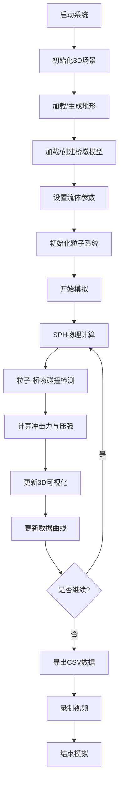

## 1. 产品概述

SPH泥石流模拟系统是一款基于光滑粒子流体动力学（SPH）的科学计算可视化平台，专门用于模拟非牛顿流体（Bingham模型）的泥石流运动及其对桥梁结构的冲击作用。系统面向水利工程、地质灾害研究人员和土木工程师，提供高精度的物理模拟、实时3D可视化和数据分析功能。

产品核心价值：
- 实现泥石流运动的高精度物理模拟，支持Bingham非牛顿流体模型
- 提供直观的3D可视化界面，实时展示粒子运动状态
- 量化分析泥石流对桥墩的冲击力，为工程设计提供数据支持
- 支持参数化调节，便于进行不同工况的对比研究

## 2. 核心功能

### 2.1 用户角色
| 角色 | 注册方式 | 核心权限 |
|------|---------|----------|
| 研究人员 | 无需注册，本地使用 | 完整的模拟控制、参数调节、数据导出权限 |
| 工程师 | 无需注册，本地使用 | 模拟运行、结果查看、数据导出 |

### 2.2 功能模块
1. **主模拟页面**：3D可视化场景、实时控制按钮、状态信息显示
2. **参数控制面板**：流体参数调节、地形设置、桥墩配置
3. **数据监控面板**：冲击力时序曲线、最大冲击压强显示、粒子统计
4. **数据导出模块**：CSV格式冲击力数据导出、模拟视频录制

### 2.3 页面详情
| 页面名称 | 模块名称 | 功能描述 |
|---------|---------|----------|
| 主模拟页面 | 3D场景渲染 | Three.js渲染粒子系统，颜色编码速度，支持鼠标交互（旋转、缩放、平移） |
| 主模拟页面 | 控制工具栏 | 开始/暂停/重置模拟、录制视频、导出数据按钮 |
| 主模拟页面 | 状态信息栏 | 实时显示粒子数、FPS、模拟时间、最大冲击力 |
| 参数控制面板 | 流体参数 | 粘度、屈服应力、密度、粒子数滑块调节 |
| 参数控制面板 | 地形设置 | DEM文件导入、程序生成地形参数调节 |
| 参数控制面板 | 桥墩设置 | OBJ模型导入、桥墩位置/尺寸调节 |
| 数据监控面板 | 冲击力时序 | Chart.js实时绘制冲击力-时间曲线 |
| 数据监控面板 | 统计信息 | 最大冲击压强、总冲击力峰值、平均速度显示 |

## 3. 核心流程

用户操作流程：
1. 用户启动系统，进入主界面
2. 选择地形生成方式（程序生成或DEM导入）
3. 导入或创建桥墩模型
4. 调节流体参数（粘度、屈服应力、密度、粒子数）
5. 点击"开始模拟"按钮启动计算
6. 实时观察3D粒子运动和冲击力数据
7. 可随时暂停、重置或调整参数
8. 模拟结束后导出CSV数据和录制视频

## 4. 用户界面设计

### 4.1 设计风格
- **主色调**：深科技风格，以深蓝色（#0a192f）为主背景，搭配青色（#64ffda）和橙色（#ff6b35）作为强调色
- **辅助色**：粒子速度颜色编码：蓝色→青色→绿色→黄色→红色（低速到高速）
- **按钮风格**：扁平化设计，圆角4px，悬停时有微妙的发光效果
- **字体**：显示字体使用 Orbitron（科技感），正文字体使用 JetBrains Mono（等宽清晰）
- **布局风格**：三栏布局，左侧参数面板、中央3D场景、右侧数据监控面板
- **视觉效果**：深色主题配合发光边框、半透明面板、微妙的网格背景

### 4.2 页面设计概述
| 页面名称 | 模块名称 | UI元素 |
|---------|---------|--------|
| 主模拟页面 | 3D场景 | 全屏WebGL画布，粒子系统带发光效果，地形采用高程着色，桥墩金属质感 |
| 主模拟页面 | 控制栏 | 顶部固定工具栏，图标+文字按钮，半透明毛玻璃效果 |
| 主模拟页面 | 状态栏 | 底部信息栏，实时数据以 monospace 字体显示 |
| 参数面板 | 参数控件 | 滑块带实时数值显示，分组折叠面板，导入按钮带文件预览 |
| 数据监控 | 曲线图 | 实时更新的折线图，双Y轴显示冲击力和压强，网格背景 |
| 数据监控 | 统计卡片 | 带图标和数值的卡片，数值变化时有动画效果 |

### 4.3 响应性
- 桌面端优先设计（1920×1080及以上）
- 支持窗口大小自适应，3D场景自动缩放
- 面板可拖拽调整宽度，可折叠隐藏
- 触屏设备支持手势操作（双指缩放、滑动旋转）

### 4.4 3D场景设计
- **环境**：深色星空背景，柔和的半球光+方向光，模拟专业工程可视化氛围
- **光照**：主光源45°俯角，带环境光遮蔽（AO），粒子自发光效果
- **相机**：初始透视视角，可切换正交投影，支持轨道控制器
- **后处理**：Bloom泛光效果（突出高速粒子），FXAA抗锯齿，色调映射
- **性能**：粒子使用InstancedMesh渲染，地形使用LOD，目标帧率60FPS

## 5. 非功能性需求
- **性能**：支持10,000+粒子实时模拟，物理计算≥30FPS，渲染≥60FPS
- **精度**：SPH核函数采用三次样条核，时间积分采用半隐式欧拉法
- **可扩展性**：模块化设计，便于添加新的流体模型和边界条件
- **数据完整性**：导出CSV包含时间戳、总冲击力、最大压强、粒子数等完整信息
