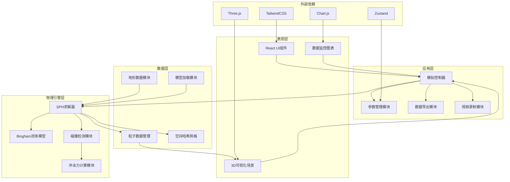

## 1. 架构设计



## 2. 技术描述

### 2.1 技术栈选择
- **前端框架**：React@18 + TypeScript
- **构建工具**：Vite@5
- **状态管理**：Zustand@4
- **样式方案**：TailwindCSS@3
- **3D渲染**：Three.js@0.160 + @react-three/fiber@8 + @react-three/drei@9
- **后处理效果**：@react-three/postprocessing@2
- **图表绘制**：Chart.js@4 + react-chartjs-2@5
- **图标库**：lucide-react@0.300

### 2.2 核心技术决策
1. **纯前端架构**：所有计算在浏览器端完成，无需后端服务，便于部署和使用
2. **WebGL加速**：使用Three.js进行GPU加速的3D渲染，支持10,000+粒子实时显示
3. **物理计算优化**：采用空间哈希网格（Spatial Hash Grid）加速邻域粒子搜索
4. **模块化设计**：物理引擎与渲染层完全解耦，便于后续扩展和维护
5. **响应式布局**：使用TailwindCSS实现自适应界面，支持多种屏幕尺寸

## 3. 目录结构

```
e:\soloH\h46
├── src/
│   ├── components/          # React组件
│   │   ├── ControlPanel/    # 参数控制面板
│   │   ├── DataMonitor/     # 数据监控面板
│   │   ├── Scene3D/         # 3D场景组件
│   │   ├── Toolbar/         # 工具栏组件
│   │   └── StatusBar/       # 状态栏组件
│   ├── physics/             # 物理引擎核心
│   │   ├── SPHEngine.ts     # SPH求解器主类
│   │   ├── BinghamModel.ts  # Bingham非牛顿流体模型
│   │   ├── Particle.ts      # 粒子数据结构
│   │   ├── SpatialHash.ts   # 空间哈希网格
│   │   ├── Collision.ts     # 碰撞检测
│   │   └── ForceCalculator.ts # 冲击力计算
│   ├── store/               # Zustand状态管理
│   │   ├── useSimulationStore.ts  # 模拟状态
│   │   └── useParameterStore.ts   # 参数状态
│   ├── utils/               # 工具函数
│   │   ├── terrainGenerator.ts   # 地形生成器
│   │   ├── demLoader.ts          # DEM文件加载
│   │   ├── objLoader.ts          # OBJ模型加载
│   │   ├── csvExporter.ts        # CSV数据导出
│   │   ├── videoRecorder.ts      # 视频录制
│   │   └── colorMapping.ts       # 颜色映射工具
│   ├── types/               # TypeScript类型定义
│   │   ├── physics.ts       # 物理相关类型
│   │   └── simulation.ts    # 模拟相关类型
│   ├── App.tsx              # 主应用组件
│   ├── main.tsx             # 入口文件
│   └── index.css            # 全局样式
├── public/                  # 静态资源
│   └── models/              # 示例OBJ模型
├── .trae/
│   └── documents/           # 项目文档
├── package.json
├── tsconfig.json
├── vite.config.ts
└── tailwind.config.js
```

## 4. 核心模块设计

### 4.1 SPH物理引擎模块

**SPHEngine 类接口**：
```typescript
class SPHEngine {
    constructor(params: SPHParameters);
    initParticles(count: number, position: Vector3[]): void;
    step(dt: number): void;
    getParticles(): Particle[];
    getImpactForceData(): ImpactForceData;
    reset(): void;
    updateParameters(params: Partial<SPHParameters>): void;
}
```

**Bingham 流体模型**：
- 本构方程：τ = τ_y + μ·γ̇ （当 τ > τ_y 时流体流动，否则为刚体）
- 粘度正则化：使用双曲正切函数平滑过渡区域
- 屈服应力：作为Bingham流体的关键参数，控制流体的"流动阈值"

**空间哈希网格**：
- 网格尺寸 = 2 × 平滑核半径（h）
- 哈希函数：hash(i,j,k) = (i × 73856093) ⊕ (j × 19349663) ⊕ (k × 83492791)
- 邻域搜索：仅查询粒子所在网格及相邻26个网格

### 4.2 数据模型

```typescript
// 粒子数据结构
interface Particle {
    id: number;
    position: Vector3;
    velocity: Vector3;
    acceleration: Vector3;
    density: number;
    pressure: number;
    mass: number;
    viscosity: number;
    impactForce: Vector3;
    isActive: boolean;
}

// SPH参数
interface SPHParameters {
    density0: number;           // 参考密度 (kg/m³)
    viscosity: number;          // 动力粘度 (Pa·s)
    yieldStress: number;        // 屈服应力 (Pa)
    smoothingLength: number;    // 平滑核半径 (m)
    particleRadius: number;     // 粒子半径 (m)
    particleMass: number;       // 粒子质量 (kg)
    gravity: Vector3;           // 重力加速度
    stiffness: number;          // 状态方程刚度系数
    timeStep: number;           // 时间步长 (s)
    maxParticles: number;       // 最大粒子数
}

// 冲击力数据
interface ImpactForceData {
    timestamp: number;
    totalForce: Vector3;        // 总冲击力
    maxPressure: number;        // 最大冲击压强 (Pa)
    impactArea: number;         // 冲击面积 (m²)
    particleCount: number;      // 冲击粒子数
}
```

### 4.3 状态管理（Zustand）

```typescript
// 模拟状态存储
interface SimulationState {
    isRunning: boolean;
    isPaused: boolean;
    simulationTime: number;
    frameCount: number;
    fps: number;
    particles: Particle[];
    impactForceHistory: ImpactForceData[];
    start: () => void;
    pause: () => void;
    reset: () => void;
    step: () => void;
}

// 参数状态存储
interface ParameterState {
    sphParams: SPHParameters;
    terrainParams: TerrainParams;
    bridgeParams: BridgeParams;
    updateSPHParams: (params: Partial<SPHParameters>) => void;
    updateTerrainParams: (params: Partial<TerrainParams>) => void;
    updateBridgeParams: (params: Partial<BridgeParams>) => void;
    loadDEM: (file: File) => Promise<void>;
    loadOBJ: (file: File) => Promise<void>;
}
```

## 5. 核心算法流程

### 5.1 SPH单步求解流程


### 5.2 核函数与导数
```
三次样条核函数（2D/3D通用）：
W(r, h) = σ × (1 - 3/2·q² + 3/4·q³)  当 0 ≤ q ≤ 1
W(r, h) = σ × (1/4)·(2 - q)³        当 1 < q ≤ 2
W(r, h) = 0                          当 q > 2

其中 q = |r|/h，σ为归一化常数（3D: σ = 1/πh³）
```

### 5.3 冲击力计算
```
单个粒子冲击力：
F_impact = m_particle × (v_after - v_before) / dt

总冲击力：
F_total = Σ F_impact （对所有与桥墩碰撞的粒子求和）

冲击压强：
P = F_n / A  （F_n为法向冲击力，A为粒子碰撞面积）
```

## 6. 性能优化策略

1. **空间哈希网格**：O(n)复杂度的邻域搜索，避免O(n²)暴力遍历
2. **InstancedMesh**：使用GPU实例化渲染，单个draw call渲染所有粒子
3. **Web Worker**：物理计算在Worker线程执行，避免阻塞UI线程
4. **对象池**：粒子对象复用，避免频繁GC
5. **LOD地形**：远处地形使用低分辨率网格
6. **时间步长自适应**：根据CFL条件自动调整dt，保证数值稳定性

## 7. 数据导出格式

### CSV导出字段
```csv
时间(s),总冲击力_X(N),总冲击力_Y(N),总冲击力_Z(N),总冲击力大小(N),最大压强(Pa),冲击粒子数,冲击面积(m²)
0.000,0.000,0.000,0.000,0.000,0.000,0,0.000
0.010,123.456,78.901,234.567,275.432,12500.00,42,0.022
...
```
