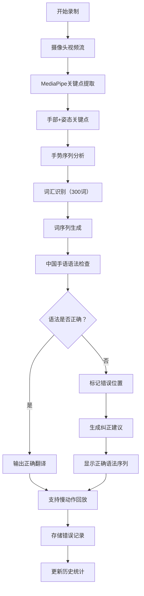

## 1. 产品概述

中国手语智能识别与语法纠正系统，通过摄像头实时采集手语视频流，提取手部和姿态关键点，识别手语词汇，并基于中国手语语法规则（主题-评论结构、时间-动作-对象）进行词序检查，标记语法错误并提供纠正建议。

- **主要目的**：帮助手语学习者和使用者纠正手语表达中的语法错误，提升手语沟通的准确性和规范性。
- **解决问题**：手语学习缺乏实时语法反馈，传统手语翻译不关注语法结构正确性。
- **目标用户**：手语学习者、聋人教育工作者、手语翻译人员。
- **市场价值**：填补手语学习领域实时语法纠正的技术空白，为手语教育提供智能化工具。

## 2. 核心功能

### 2.1 用户角色

| 角色 | 注册方式 | 核心权限 |
|------|----------|----------|
| 普通用户 | 无需注册，本地使用 | 使用所有识别、纠正、统计功能 |

### 2.2 功能模块

1. **实时识别页面**：视频捕获、关键点可视化、词汇识别、语法检查
2. **回放对比页面**：慢动作回放、原视频与纠正后对比
3. **历史统计页面**：错误类型统计、学习进度追踪

### 2.3 页面详情

| 页面名称 | 模块名称 | 功能描述 |
|----------|----------|----------|
| 实时识别页面 | 视频捕获模块 | 调用摄像头，实时显示视频流，支持开始/暂停/停止录制 |
| 实时识别页面 | 关键点提取模块 | 实时提取手部21个关键点和身体33个姿态关键点，可视化叠加显示 |
| 实时识别页面 | 词汇识别模块 | 基于预训练模型识别300个常见手语词汇，实时显示识别结果 |
| 实时识别页面 | 语法检查模块 | 检查词序是否符合中国手语语法规则，标记错误位置 |
| 实时识别页面 | 纠正建议模块 | 生成正确的语法序列，高亮显示错误词 |
| 回放对比页面 | 慢动作回放模块 | 支持0.25x/0.5x/0.75x/1x倍速回放 |
| 回放对比页面 | 视频对比模块 | 左右分屏对比原始视频与纠正后的标准手势 |
| 回放对比页面 | 翻译输出模块 | 显示完整的文字翻译结果 |
| 历史统计页面 | 错误统计模块 | 按错误类型分类统计，展示历史错误趋势 |
| 历史统计页面 | 数据存储模块 | 本地存储用户历史记录，支持数据导出 |

## 3. 核心流程

用户打开摄像头开始录制 → 实时提取手部和姿态关键点 → 连续帧序列分析 → 识别手语词汇序列 → 语法规则检查 → 标记语法错误位置 → 生成纠正建议和正确序列 → 支持慢动作回放对比 → 存储错误记录并更新统计数据。

## 4. 用户界面设计

### 4.1 设计风格

- **主色调**：深海蓝 (#0F3460) 作为主色，代表专业和信任；珊瑚橙 (#FF6B6B) 作为强调色，用于错误标记；薄荷绿 (#4ECDC4) 用于正确提示。
- **按钮风格**：圆角矩形按钮，带有微妙的阴影和悬停动效，点击时轻微缩放。
- **字体**：标题使用 "Noto Sans SC" 思源黑体，正文使用系统无衬线字体，确保中文显示清晰。
- **布局风格**：卡片式布局，左侧视频区域，右侧信息面板，底部操作栏。
- **图标风格**：线性图标，统一24px标准尺寸，线条粗细2px。

### 4.2 页面设计概述

| 页面名称 | 模块名称 | UI元素 |
|----------|----------|----------|
| 实时识别页面 | 视频区域 | 全屏视频显示，关键点半透明叠加，手部骨骼连线，错误词汇实时高亮 |
| 实时识别页面 | 识别结果面板 | 词汇序列卡片，正确/错误状态标签 |
| 实时识别页面 | 语法建议面板 | 错误位置红色波浪下划线，正确序列绿色高亮，对比展示 |
| 回放对比页面 | 视频播放器 | 自定义播放控件，倍速选择滑块，时间轴标记错误点 |
| 回放对比页面 | 对比视图 | 左右分屏，左侧原始视频，右侧标准示范 |
| 历史统计页面 | 统计图表 | 饼图展示错误类型分布，折线图展示学习趋势 |
| 历史统计页面 | 数据列表 | 历史记录表格，支持筛选和导出 |

### 4.3 响应性

- **桌面优先设计**：主布局针对1920x1080分辨率优化
- **移动端适配**：视频区域自适应，面板改为上下布局，触摸操作优化
- **触摸优化**：按钮最小尺寸44x44px，滑动手势支持

### 4.4 交互动效

- **页面加载**：元素渐入动画，视频区域先显示骨架屏
- **关键点检测**：骨骼线条平滑过渡动画
- **错误标记**：错误词轻微抖动动画，吸引用户注意
- **按钮交互**：悬停时背景色渐变，点击时缩放0.95倍
