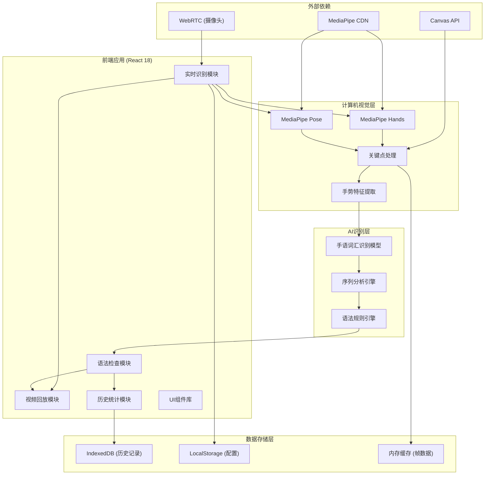
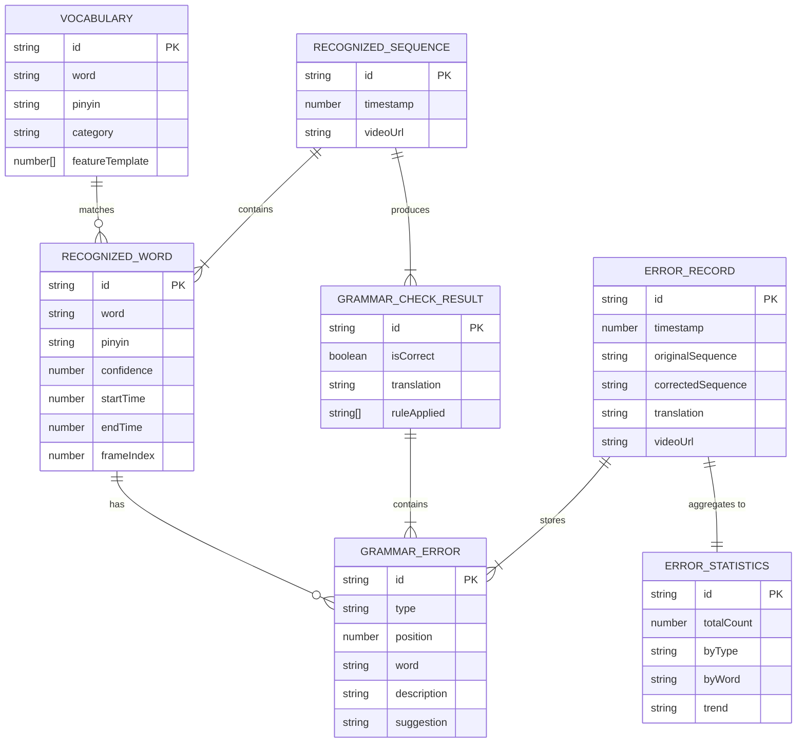

## 1. 架构设计



## 2. 技术描述

- **前端框架**: React@18 + TypeScript@5
- **构建工具**: Vite@5
- **样式方案**: TailwindCSS@3 + CSS Variables
- **计算机视觉**: MediaPipe Hands + MediaPipe Pose (CDN加载)
- **图表库**: Recharts@2 (用于统计页面)
- **图标库**: Lucide React@0.344
- **本地存储**: IndexedDB (历史记录) + LocalStorage (配置)
- **路由**: React Router@6
- **状态管理**: React Context + useReducer

**后端**: 无后端，纯前端应用，所有计算在浏览器端完成
**数据库**: IndexedDB 本地存储

## 3. 路由定义

| 路由 | 页面 | 组件路径 | 功能 |
|------|------|----------|------|
| / | 实时识别页面 | pages/RealtimeRecognition.tsx | 摄像头捕获、关键点提取、词汇识别、语法检查 |
| /playback | 回放对比页面 | pages/PlaybackComparison.tsx | 慢动作回放、视频对比、翻译输出 |
| /statistics | 历史统计页面 | pages/Statistics.tsx | 错误类型统计、历史记录管理 |

## 4. 核心模块 API 定义

### 4.1 关键点数据类型

```typescript
interface HandLandmark {
  x: number;
  y: number;
  z: number;
  visibility?: number;
}

interface PoseLandmark {
  x: number;
  y: number;
  z: number;
  visibility: number;
}

interface FrameData {
  timestamp: number;
  leftHand: HandLandmark[] | null;
  rightHand: HandLandmark[] | null;
  pose: PoseLandmark[];
  features: number[];
}

interface RecognizedWord {
  word: string;
  pinyin: string;
  confidence: number;
  startTime: number;
  endTime: number;
  frameIndex: number;
  isCorrect?: boolean;
}

interface GrammarError {
  type: 'word_order' | 'missing_topic' | 'missing_time' | 'structure_error';
  position: number;
  word: string;
  description: string;
  suggestion: string;
}

interface GrammarCheckResult {
  isCorrect: boolean;
  errors: GrammarError[];
  correctedSequence: RecognizedWord[];
  translation: string;
  ruleApplied: string[];
}

interface ErrorRecord {
  id: string;
  timestamp: number;
  originalSequence: string[];
  correctedSequence: string[];
  errors: GrammarError[];
  translation: string;
  videoUrl?: string;
}

interface ErrorStatistics {
  totalCount: number;
  byType: Record<string, number>;
  byWord: Record<string, number>;
  trend: { date: string; count: number }[];
}
```

### 4.2 核心服务接口

```typescript
interface ICameraService {
  start(): Promise<MediaStream>;
  stop(): void;
  getVideoElement(): HTMLVideoElement;
}

interface IKeypointExtractor {
  init(): Promise<void>;
  processFrame(videoFrame: HTMLVideoElement): Promise<FrameData>;
  drawOverlay(canvas: HTMLCanvasElement, frameData: FrameData): void;
  close(): void;
}

interface IGestureRecognizer {
  init(vocabulary: VocabularyItem[]): Promise<void>;
  recognizeSequence(frames: FrameData[]): Promise<RecognizedWord[]>;
  extractFeatures(frame: FrameData): number[];
}

interface IGrammarChecker {
  check(sequence: RecognizedWord[]): GrammarCheckResult;
  getRules(): GrammarRule[];
}

interface IStorageService {
  saveErrorRecord(record: ErrorRecord): Promise<void>;
  getErrorRecords(limit?: number): Promise<ErrorRecord[]>;
  getStatistics(): Promise<ErrorStatistics>;
  clearAll(): Promise<void>;
  exportData(): Promise<string>;
}
```

## 5. 数据模型

### 5.1 数据模型定义



### 5.2 IndexedDB 存储结构

```javascript
// 数据库名称: SignLanguageCorrector
// 版本: 1

const dbSchema = {
  errorRecords: {
    keyPath: 'id',
    indexes: [
      { name: 'timestamp', keyPath: 'timestamp', unique: false },
      { name: 'errorType', keyPath: 'errors.type', unique: false, multiEntry: true }
    ]
  },
  vocabulary: {
    keyPath: 'id',
    indexes: [
      { name: 'word', keyPath: 'word', unique: true },
      { name: 'category', keyPath: 'category', unique: false }
    ]
  },
  userSettings: {
    keyPath: 'key',
    data: [
      { key: 'playbackSpeed', value: 1 },
      { key: 'showOverlay', value: true },
      { key: 'minConfidence', value: 0.6 }
    ]
  }
};
```

## 6. 性能优化策略

1. **Web Worker 处理**: 关键点特征提取和词汇识别在 Web Worker 中进行，避免阻塞主线程
2. **帧采样优化**: 根据设备性能动态调整处理帧率（15-30 FPS）
3. **内存管理**: 帧数据环形缓冲区，仅保留最近60帧用于序列分析
4. **懒加载**: MediaPipe 模型按需加载，词汇表分块加载
5. **缓存策略**: 识别结果缓存，相似手势直接复用
6. **requestAnimationFrame**: 所有 Canvas 绘制使用 RAF 确保流畅
