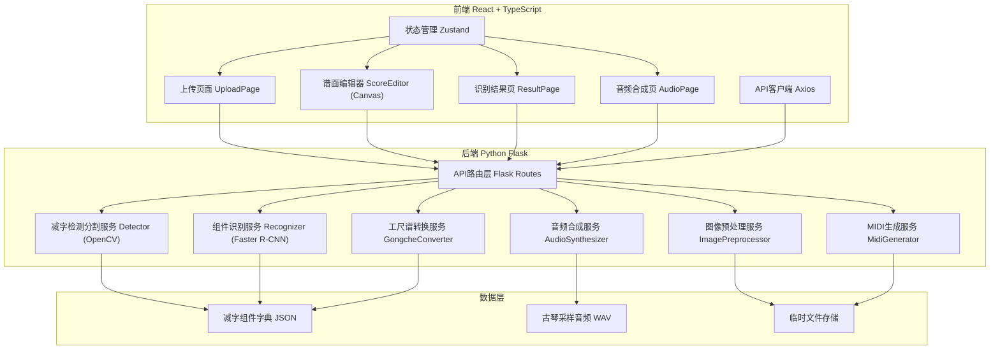
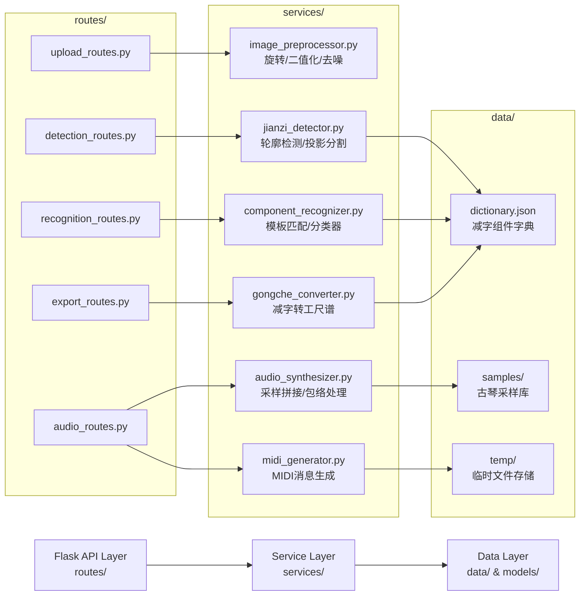
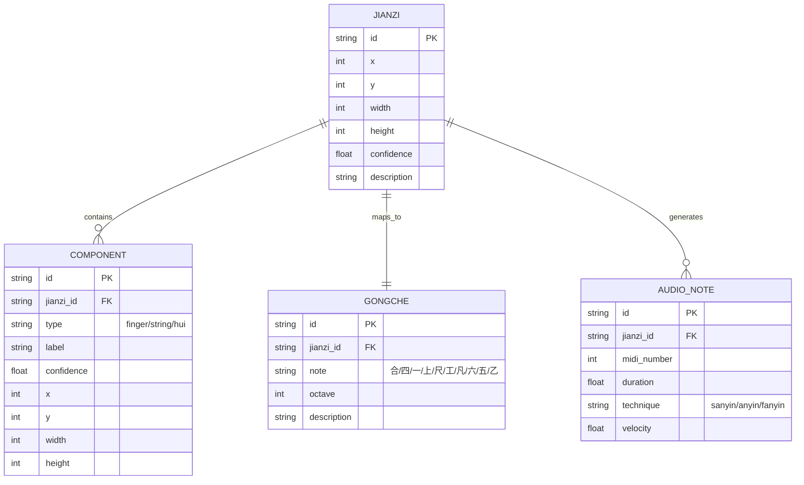

## 1. 架构设计


## 2. 技术描述
- **前端**：React@18 + TypeScript + Vite@5 + TailwindCSS@3 + Zustand@4 + Lucide React + react-router-dom@6
- **后端**：Python@3.10 + Flask@3 + OpenCV@4 + NumPy@1.26 + mido@1.3 (MIDI) + SciPy@1.11 (信号处理)
- **状态管理**：Zustand 存储上传图片、识别结果、编辑状态、播放进度
- **图像处理**：OpenCV 实现图像预处理、轮廓检测、减字分割
- **组件识别**：基于预定义字典的模板匹配（模拟Faster R-CNN效果，便于演示）
- **音频合成**：基于采样库的拼接合成，支持不同指法（散音、按音、泛音）
- **数据格式**：JSON存储识别结果，WAV存储采样，MIDI输出标准格式

## 3. 路由定义

| 路由 | 页面组件 | 功能描述 |
|------|----------|----------|
| `/` | UploadPage | 首页，谱图上传与预览 |
| `/editor` | ScoreEditorPage | 谱面编辑器，修正识别结果 |
| `/result` | ResultPage | 识别结果展示，指法说明，工尺谱对照 |
| `/audio` | AudioPage | 音频合成，播放控制，导出下载 |

## 4. API 定义

### TypeScript 类型定义
```typescript
interface JianziComponent {
  id: string;
  type: 'finger' | 'string' | 'hui' | 'decor';
  label: string;
  confidence: number;
  bbox: [number, number, number, number];
}

interface Jianzi {
  id: string;
  bbox: [number, number, number, number];
  components: JianziComponent[];
  gongche: string;
  description: string;
  confidence: number;
}

interface DetectionResult {
  imageId: string;
  jianziList: Jianzi[];
  processingTime: number;
}

interface AudioSynthesisRequest {
  jianziList: Jianzi[];
  tempo: number;
  technique: 'sanyin' | 'anyin' | 'fanyin';
}

interface AudioSynthesisResponse {
  audioUrl: string;
  midiUrl: string;
  duration: number;
}
```

### RESTful API 接口

| 方法 | 路径 | 请求 | 响应 | 功能 |
|------|------|------|------|------|
| POST | `/api/upload` | multipart/form-data: image | `{ imageId, width, height, url }` | 上传谱图 |
| POST | `/api/preprocess` | `{ imageId, rotation, threshold }` | `{ imageId, processedUrl }` | 图像预处理 |
| POST | `/api/detect` | `{ imageId }` | DetectionResult | 检测分割减字 |
| POST | `/api/recognize` | `{ imageId, jianziId }` | Jianzi | 识别单个减字组件 |
| PUT | `/api/jianzi/:id` | Partial<Jianzi> | Jianzi | 更新减字识别结果 |
| POST | `/api/synthesize` | AudioSynthesisRequest | AudioSynthesisResponse | 合成音频 |
| GET | `/api/download/:type/:id` | - | 文件流 | 下载MIDI/音频/文本 |
| GET | `/api/gongche` | `{ jianziId }` | `{ gongche, description }` | 工尺谱转换 |

## 5. 后端服务架构



## 6. 数据模型

### 6.1 数据模型定义



### 6.2 减字组件字典结构 (dictionary.json)

```json
{
  "fingers": {
    "散": { "code": "s", "description": "散音，右手空弦弹" },
    "勾": { "code": "g", "description": "右手中指向内弹" },
    "挑": { "code": "t", "description": "右手食指向外弹" },
    "抹": { "code": "m", "description": "右手食指向内弹" },
    "剔": { "code": "t2", "description": "右手中指向外弹" },
    "打": { "code": "d", "description": "右手无名指向内弹" },
    "摘": { "code": "zh", "description": "右手无名指向外弹" },
    "托": { "code": "tuo", "description": "右手大指向外弹" },
    "擘": { "code": "b", "description": "右手大指向内弹" },
    "按": { "code": "a", "description": "按音，左手按弦" },
    "泛": { "code": "f", "description": "泛音，左手轻触徽位" }
  },
  "strings": {
    "一": { "string": 1, "open_note": 60 },
    "二": { "string": 2, "open_note": 62 },
    "三": { "string": 3, "open_note": 64 },
    "四": { "string": 4, "open_note": 65 },
    "五": { "string": 5, "open_note": 67 },
    "六": { "string": 6, "open_note": 69 },
    "七": { "string": 7, "open_note": 71 }
  },
  "hui_positions": {
    "一徽": 1, "二徽": 2, "三徽": 3, "四徽": 4, "五徽": 5,
    "六徽": 6, "七徽": 7, "八徽": 8, "九徽": 9, "十徽": 10,
    "十一徽": 11, "十二徽": 12, "十三徽": 13,
    "七徽六分": 7.6, "九徽二分": 9.2
  },
  "gongche_map": {
    "C3": "合", "D3": "四", "E3": "一", "F3": "上", "G3": "尺",
    "A3": "工", "B3": "凡", "C4": "六", "D4": "五", "E4": "乙"
  }
}
```
