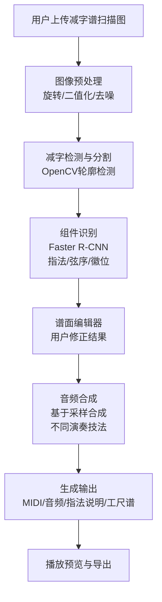

## 1. 产品概述
古琴减字谱智能识别与音频合成系统，用户上传竖排减字谱扫描图像，系统自动检测、分割并识别减字组件，合成古琴演奏音频，输出MIDI文件与指法说明文本，支持谱面编辑修正与工尺谱对照导出。
- 核心解决古琴减字谱数字化、可听化问题，面向古琴学习者、研究者与音乐爱好者
- 实现传统乐谱向现代数字音频的智能转换，降低古琴学习门槛

## 2. 核心功能

### 2.1 用户角色
| 角色 | 注册方式 | 核心权限 |
|------|----------|----------|
| 普通用户 | 无需注册，直接使用 | 上传谱图、识别减字、播放音频、导出结果、编辑修正 |

### 2.2 功能模块
1. **首页/上传页**：谱图上传区域、操作指引、历史记录
2. **谱面编辑器**：Canvas谱面显示、减字标注框、组件编辑面板
3. **识别结果页**：减字列表、指法说明、工尺谱对照表
4. **音频合成页**：播放控制、参数调节、MIDI导出、音频下载

### 2.3 页面详情
| 页面名称 | 模块名称 | 功能描述 |
|---------|----------|----------|
| 上传页面 | 拖拽上传区 | 支持拖拽或点击上传减字谱扫描图，支持竖排版式预览 |
| 上传页面 | 预处理选项 | 图像旋转、对比度调整、二值化处理 |
| 谱面编辑器 | Canvas画布 | 显示原图、检测框、支持缩放平移、点击选择减字 |
| 谱面编辑器 | 组件编辑面板 | 修改指法、弦序、徽位等识别结果，实时更新 |
| 识别结果页 | 减字列表 | 按阅读顺序展示所有识别的减字及置信度 |
| 识别结果页 | 指法说明 | 将减字翻译为白话文指法说明 |
| 识别结果页 | 工尺谱对照 | 减字与工尺谱的逐字对照表 |
| 音频合成页 | 播放控制 | 播放/暂停、进度条、速度调节、循环播放 |
| 音频合成页 | 导出功能 | 导出MIDI文件、WAV音频、识别结果文本 |

## 3. 核心流程
用户上传竖排减字谱扫描图 → 系统进行图像预处理与减字检测分割 → Faster R-CNN识别每个减字的指法/弦序/徽位组件 → 用户在谱面编辑器中修正识别错误 → 基于识别结果合成古琴音频（不同指法对应不同演奏技法采样） → 生成指法说明文本与工尺谱对照 → 播放预览并导出MIDI和音频文件。

## 4. 用户界面设计

### 4.1 设计风格
- 主色调：深檀木色 #4A2C1A 作为主色，宣纸米白 #F5F0E6 为背景，朱砂红 #C0392B 为强调色
- 按钮风格：圆角古典风格，带有微妙的木纹纹理渐变，hover时有淡淡光泽
- 字体：标题使用衬线字体（Noto Serif SC），正文使用思源宋体，数字使用等宽字体
- 布局风格：中国古典卷轴式布局，左右分栏，带有传统纹样装饰元素
- 图标风格：线性简约图标，融入古琴元素（琴弦、琴徽等）

### 4.2 页面设计概述
| 页面名称 | 模块名称 | UI元素 |
|---------|----------|--------|
| 上传页面 | 上传区域 | 仿宣纸质感背景、虚线边框、古琴纹样装饰、淡入动画 |
| 谱面编辑器 | Canvas画布 | 卷轴式边框、可拖拽检测框、选中高亮效果、缩放控制 |
| 谱面编辑器 | 编辑面板 | 木纹质感卡片、下拉选择器、确认按钮、滑动过渡动画 |
| 识别结果页 | 减字列表 | 卡片式布局、置信度进度条、工尺谱对照双列布局 |
| 音频合成页 | 播放控件 | 古琴弦式进度条、古典样式旋钮、流畅播放动画 |

### 4.3 响应式
桌面端优先设计，采用左右分栏布局（左侧谱面/右侧编辑）。移动端自动调整为上下布局，Canvas支持触摸手势缩放平移，工具栏优化为底部浮动操作栏。

### 4.4 交互动效
- 页面加载时卷轴展开动画
- 检测框识别完成时逐个淡入显示
- 切换减字时平滑过渡高亮
- 播放音频时对应减字高亮脉冲效果
- 导出成功时卷轴收起完成动画
