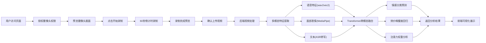

## 1. 产品概述

多模态情感分析系统，通过WebRTC采集用户视频数据，融合语音、面部表情、文本三种模态进行情感识别，输出7种情感分类及效价唤醒度，并提供可解释的模态贡献度分析。

- **核心价值**：突破单一模态情感识别的局限性，通过多模态融合提升情感分析准确率，同时提供AI决策的可解释性
- **目标用户**：心理咨询师、人机交互研究者、用户体验设计师、情感计算领域开发者
- **应用场景**：心理健康评估、在线教育情绪监测、智能客服交互优化、游戏玩家体验分析

## 2. 核心功能

### 2.1 用户角色

| 角色 | 注册方式 | 核心权限 |
|------|----------|----------|
| 普通用户 | 无需注册，匿名使用 | 视频录制、情感分析、结果查看 |
| 研究者 | 邮箱注册 | 数据导出、批量分析、历史记录管理 |

### 2.2 功能模块

1. **视频录制页面**：WebRTC摄像头采集、实时预览、1分钟倒计时录制、视频上传
2. **实时分析页面**：流式数据传输、实时情感预测、动态时序图表展示
3. **结果展示页面**：情感类别分布饼图、效价唤醒度散点图、模态贡献度热图、时序变化折线图
4. **历史记录页面**：分析历史列表、详情查看、数据导出

### 2.3 页面详情

| 页面名称 | 模块名称 | 功能描述 |
|----------|----------|----------|
| 视频录制页 | 摄像头预览模块 | 实时显示摄像头画面，支持设备切换、画面镜像 |
| 视频录制页 | 录制控制模块 | 开始/停止录制按钮、60秒倒计时进度环、录制状态指示 |
| 视频录制页 | 视频预览模块 | 录制完成后回放、重新录制、确认上传 |
| 实时分析页 | 流式传输模块 | WebSocket实时音视频流传输、帧采样控制 |
| 实时分析页 | 情感仪表盘 | 7种情感概率实时柱状图、动态更新动画 |
| 结果展示页 | 情感分类模块 | 最高置信度情感标签展示、7类情感概率分布饼图 |
| 结果展示页 | 效价唤醒度模块 | 二维坐标系散点图、情感象限可视化 |
| 结果展示页 | 可解释性模块 | 跨模态注意力权重热图、各模态贡献度百分比条 |
| 结果展示页 | 时序变化模块 | 情感强度随时间变化折线图、关键时间点标注 |

## 3. 核心流程

用户通过浏览器授权摄像头权限，录制约1分钟视频，系统上传至后端进行多模态特征提取与融合分析，最终返回完整的情感分析结果及可解释性可视化。

## 4. 用户界面设计

### 4.1 设计风格

**美学方向**：科技感与人文关怀结合的「数据可视化美学」

- **主色调**：深空蓝 `#1a1a2e`（代表信任与专业），搭配紫罗兰渐变 `#667eea → #764ba2`（代表AI与创新）
- **辅助色**：情感七色谱系——愤怒`#e74c3c`、快乐`#f1c40f`、悲伤`#3498db`、惊讶`#e67e22`、厌恶`#27ae60`、恐惧`#9b59b6`、中性`#95a5a6`
- **字体**：标题使用 **Space Grotesk**（现代科技感），正文使用 **Inter**（清晰易读），数据可视化使用 **JetBrains Mono**（等宽数字对齐）
- **按钮风格**：圆润胶囊形按钮，hover时有轻微上浮和发光效果，active时有按压反馈
- **布局风格**：卡片式布局，毛玻璃效果（backdrop-filter: blur），微妙的边框发光，层次分明的阴影系统
- **动效风格**：数据驱动的动画，图表加载时的绘制动画，情感变化时的平滑过渡，注意力热图的呼吸效果

### 4.2 页面设计概述

| 页面名称 | 模块名称 | UI元素 |
|----------|----------|--------|
| 视频录制页 | 摄像头预览 | 圆角视频容器、网格参考线、录制时红色脉冲边框、倒计时环形进度条 |
| 视频录制页 | 控制区域 | 大型圆形录制按钮、状态指示灯、时间显示、设备选择下拉菜单 |
| 结果展示页 | 情感概览卡片 | 主要情感大标签、置信度进度条、辅助情感小标签、渐变色背景 |
| 结果展示页 | 效价唤醒度图 | 象限背景网格、动态散点、轨迹线、坐标标签、悬停详情弹窗 |
| 结果展示页 | 注意力热图 | 彩色热力矩阵、时间轴滑块、模态标签、悬停数值显示 |
| 结果展示页 | 时序折线图 | 多色折线、区域填充、交互tooltip、可缩放时间轴 |

### 4.3 响应式设计

- **桌面端**（≥1200px）：三栏布局，左侧视频区、中间分析区、右侧详情区
- **平板端**（768px-1199px）：上下布局，视频区在上，分析区在下，两列展示图表
- **移动端**（<768px）：单列流式布局，卡片堆叠，图表自适应缩小，触控按钮放大至48x48px

### 4.4 交互细节

- 视频录制按钮：点击时从白色变为红色，有3圈向外扩散的波纹动画
- 倒计时进度环：SVG绘制，剩余时间越多颜色越绿，最后10秒变红并闪烁
- 情感切换动画：当主导情感变化时，新标签从底部滑入，旧标签向上滑出，背景色渐变过渡
- 注意力热图：鼠标悬停时高亮单元格，显示具体权重值和模态名称
- 时序图表：支持拖拽缩放，双击重置，悬停显示该时间点的多模态详细数据
