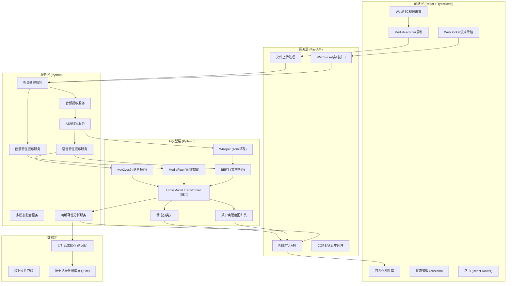
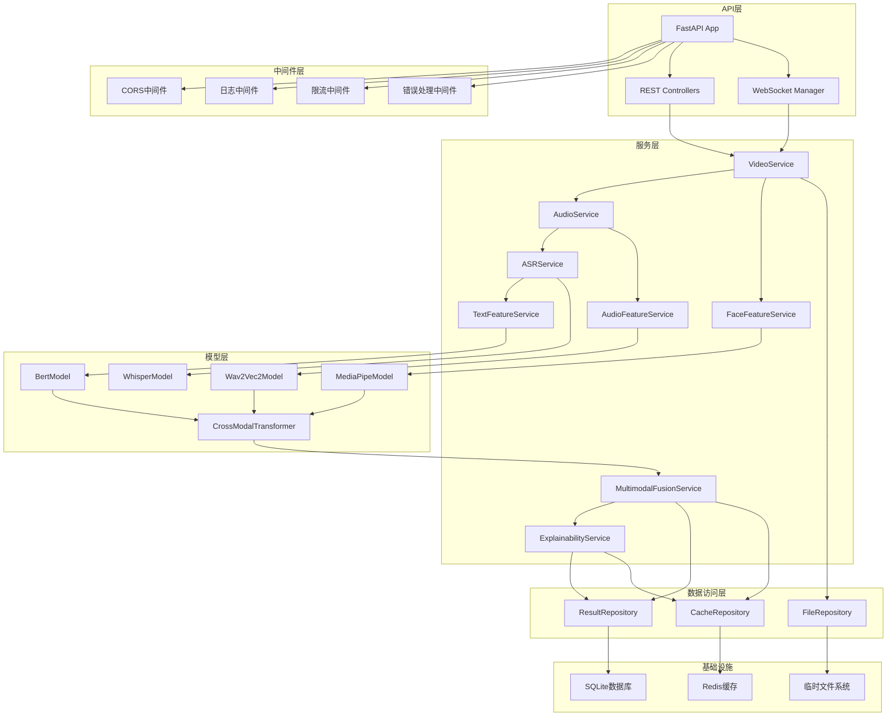
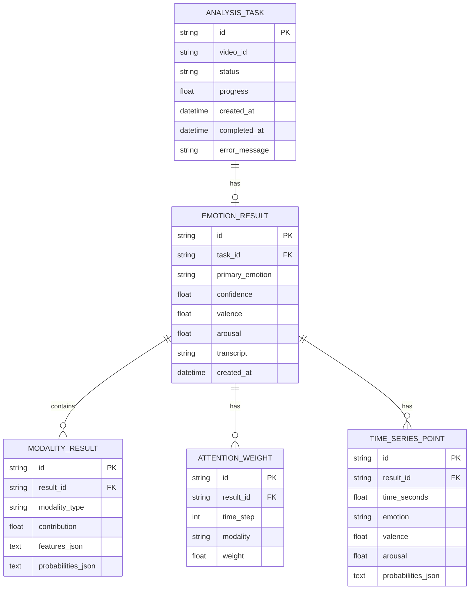

## 1. 架构设计



## 2. 技术选型

### 2.1 前端技术栈
- **框架**: React 18 + TypeScript 5
- **构建工具**: Vite 5
- **样式方案**: TailwindCSS 3 + CSS Variables
- **状态管理**: Zustand 4
- **路由**: React Router 6
- **图表库**: Recharts 2 + D3.js 7
- **HTTP客户端**: Axios
- **WebSocket**: 原生 WebSocket API
- **视频处理**: MediaRecorder API + WebRTC

### 2.2 后端技术栈
- **Web框架**: FastAPI 0.109
- **ASGI服务器**: Uvicorn
- **深度学习**: PyTorch 2.1 + TorchVision 0.16
- **语音处理**: Transformers 4.36 + librosa 0.10
- **计算机视觉**: MediaPipe 0.10 + OpenCV 4.8
- **ASR**: faster-whisper 1.0
- **视频处理**: moviepy 1.0 + ffmpeg-python
- **数据序列化**: Pydantic 2
- **缓存**: Redis + redis-py
- **数据库**: SQLAlchemy 2 + SQLite

### 2.3 核心依赖版本
```json
{
  "frontend": {
    "react": "^18.2.0",
    "typescript": "^5.3.0",
    "vite": "^5.0.0",
    "tailwindcss": "^3.4.0",
    "zustand": "^4.4.0",
    "recharts": "^2.10.0",
    "d3": "^7.8.0"
  },
  "backend": {
    "fastapi": "^0.109.0",
    "torch": "^2.1.0",
    "transformers": "^4.36.0",
    "mediapipe": "^0.10.0",
    "faster-whisper": "^1.0.0",
    "librosa": "^0.10.0",
    "opencv-python": "^4.8.0"
  }
}
```

## 3. 路由定义

| 路由路径 | 页面/接口 | 用途 |
|----------|----------|------|
| `/` | 首页 | 产品介绍、快速入口 |
| `/record` | 视频录制页 | WebRTC摄像头采集、视频录制 |
| `/realtime` | 实时分析页 | 流式情感预测、动态仪表盘 |
| `/result/:id` | 结果展示页 | 完整分析报告、可视化图表 |
| `/history` | 历史记录页 | 分析历史列表、数据导出 |
| `/api/v1/upload` | POST接口 | 视频文件上传 |
| `/api/v1/analyze/:id` | POST接口 | 触发情感分析任务 |
| `/api/v1/result/:id` | GET接口 | 获取分析结果 |
| `/api/v1/stream` | WebSocket | 实时流式分析 |
| `/api/v1/history` | GET接口 | 获取历史记录列表 |

## 4. API 定义

### 4.1 TypeScript 类型定义

```typescript
// 情感类别
type EmotionCategory = 'anger' | 'joy' | 'sadness' | 'surprise' | 'disgust' | 'fear' | 'neutral';

// 模态类型
type Modality = 'audio' | 'video' | 'text';

// 情感分析结果
interface EmotionResult {
  id: string;
  timestamp: number;
  emotion: {
    category: EmotionCategory;
    confidence: number;
    probabilities: Record<EmotionCategory, number>;
  };
  valenceArousal: {
    valence: number;  // -1 ~ 1, 消极-积极
    arousal: number;  // -1 ~ 1, 平静-兴奋
  };
  modalities: {
    audio: ModalityResult;
    video: ModalityResult;
    text: ModalityResult;
  };
  attentionWeights: AttentionMatrix;
  timeSeries: TimeSeriesPoint[];
  transcript: string;
}

interface ModalityResult {
  contribution: number;  // 0 ~ 1
  features: number[];
  emotionProbabilities: Record<EmotionCategory, number>;
}

interface AttentionMatrix {
  timeSteps: number;
  modalities: Modality[];
  weights: number[][];  // [timeStep][modality]
}

interface TimeSeriesPoint {
  time: number;  // 秒
  emotion: EmotionCategory;
  valence: number;
  arousal: number;
  probabilities: Record<EmotionCategory, number>;
}

// WebSocket消息
interface StreamMessage {
  type: 'frame' | 'audio' | 'result' | 'error';
  data: unknown;
  timestamp: number;
}
```

### 4.2 请求/响应 Schema

```typescript
// POST /api/v1/upload
interface UploadResponse {
  videoId: string;
  filename: string;
  size: number;
  duration: number;
}

// POST /api/v1/analyze/:id
interface AnalyzeRequest {
  modalities?: Modality[];  // 可选，指定使用的模态
  includeAttention?: boolean;
  timeStep?: number;  // 时序采样间隔(秒)
}

interface AnalyzeResponse {
  taskId: string;
  status: 'queued' | 'processing' | 'completed' | 'failed';
  progress: number;
}

// GET /api/v1/result/:id
interface ResultResponse {
  taskId: string;
  status: 'completed';
  result: EmotionResult;
  processingTime: number;
}

// WebSocket 流式接口
interface StreamFrame {
  frame: string;  // base64编码的JPEG
  audio?: string;  // base64编码的音频片段
  timestamp: number;
}

interface StreamResult {
  timestamp: number;
  emotion: EmotionCategory;
  confidence: number;
  valence: number;
  arousal: number;
  probabilities: Record<EmotionCategory, number>;
  modalityContributions: Record<Modality, number>;
}
```

## 5. 后端服务架构



## 6. 数据模型

### 6.1 ER图



### 6.2 DDL (SQLite)

```sql
CREATE TABLE analysis_tasks (
    id TEXT PRIMARY KEY,
    video_id TEXT NOT NULL,
    status TEXT NOT NULL DEFAULT 'queued',
    progress REAL NOT NULL DEFAULT 0,
    created_at TIMESTAMP NOT NULL DEFAULT CURRENT_TIMESTAMP,
    completed_at TIMESTAMP,
    error_message TEXT,
    modalities TEXT,
    include_attention INTEGER NOT NULL DEFAULT 1,
    time_step REAL NOT NULL DEFAULT 1.0
);

CREATE TABLE emotion_results (
    id TEXT PRIMARY KEY,
    task_id TEXT NOT NULL UNIQUE,
    primary_emotion TEXT NOT NULL,
    confidence REAL NOT NULL,
    valence REAL NOT NULL,
    arousal REAL NOT NULL,
    transcript TEXT,
    probabilities_json TEXT NOT NULL,
    created_at TIMESTAMP NOT NULL DEFAULT CURRENT_TIMESTAMP,
    FOREIGN KEY (task_id) REFERENCES analysis_tasks(id)
);

CREATE TABLE modality_results (
    id TEXT PRIMARY KEY,
    result_id TEXT NOT NULL,
    modality_type TEXT NOT NULL,
    contribution REAL NOT NULL,
    features_json TEXT NOT NULL,
    probabilities_json TEXT NOT NULL,
    FOREIGN KEY (result_id) REFERENCES emotion_results(id)
);

CREATE TABLE attention_weights (
    id TEXT PRIMARY KEY,
    result_id TEXT NOT NULL,
    time_step INTEGER NOT NULL,
    modality TEXT NOT NULL,
    weight REAL NOT NULL,
    FOREIGN KEY (result_id) REFERENCES emotion_results(id)
);

CREATE TABLE time_series_points (
    id TEXT PRIMARY KEY,
    result_id TEXT NOT NULL,
    time_seconds REAL NOT NULL,
    emotion TEXT NOT NULL,
    valence REAL NOT NULL,
    arousal REAL NOT NULL,
    probabilities_json TEXT NOT NULL,
    FOREIGN KEY (result_id) REFERENCES emotion_results(id)
);

CREATE INDEX idx_tasks_status ON analysis_tasks(status);
CREATE INDEX idx_results_created ON emotion_results(created_at);
CREATE INDEX idx_timeseries_result ON time_series_points(result_id, time_seconds);
```

## 7. 项目目录结构

### 7.1 前端目录
```
frontend/
├── src/
│   ├── components/
│   │   ├── video/          # 视频录制组件
│   │   ├── charts/         # 可视化图表组件
│   │   ├── emotion/        # 情感展示组件
│   │   └── ui/             # 通用UI组件
│   ├── pages/              # 页面组件
│   ├── store/              # Zustand状态管理
│   ├── services/           # API和WebSocket服务
│   ├── types/              # TypeScript类型定义
│   ├── utils/              # 工具函数
│   ├── hooks/              # 自定义Hooks
│   ├── App.tsx
│   ├── main.tsx
│   └── index.css
├── public/
├── package.json
├── vite.config.ts
├── tsconfig.json
└── tailwind.config.js
```

### 7.2 后端目录
```
backend/
├── app/
│   ├── api/                # API路由
│   │   ├── v1/
│   │   └── websocket.py
│   ├── services/           # 业务逻辑服务
│   │   ├── video_service.py
│   │   ├── audio_service.py
│   │   ├── asr_service.py
│   │   ├── face_service.py
│   │   ├── fusion_service.py
│   │   └── explain_service.py
│   ├── models/             # PyTorch模型定义
│   │   ├── wav2vec2_wrapper.py
│   │   ├── mediapipe_wrapper.py
│   │   ├── whisper_wrapper.py
│   │   ├── bert_wrapper.py
│   │   └── crossmodal_transformer.py
│   ├── repositories/       # 数据访问层
│   ├── schemas/            # Pydantic模型
│   ├── middleware/         # 中间件
│   ├── config.py           # 配置
│   ├── database.py         # 数据库连接
│   └── main.py             # FastAPI入口
├── data/                   # 临时文件和数据库
├── models/                 # 预训练模型缓存
├── requirements.txt
└── start_server.sh
```
