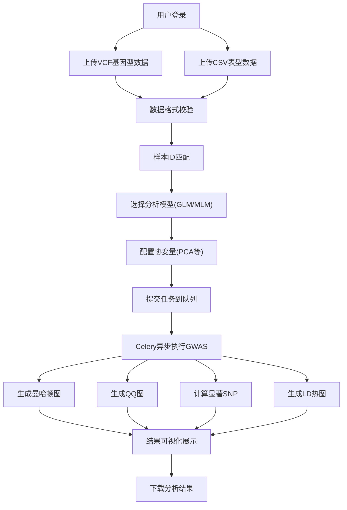

# GWAS全基因组关联分析系统 - 产品需求文档

## 1. 产品概述

本系统是一个面向科研人员的全基因组关联分析（GWAS）Web平台，支持用户上传基因型数据（VCF格式）和表型数据（CSV），通过广义线性模型（GLM）或混合线性模型（MLM）进行关联分析，输出可视化分析结果。

- **核心目的**：为玉米育种及遗传学研究提供便捷、高效的GWAS分析工具
- **目标用户**：植物遗传学家、育种学家、生物信息学研究人员
- **市场价值**：降低GWAS分析技术门槛，加速作物遗传改良研究进程

## 2. 核心功能

### 2.1 用户角色

| 角色 | 注册方式 | 核心权限 |
|------|---------|---------|
| 普通用户 | 邮箱注册 | 上传数据、运行分析、查看结果、下载报告 |
| 管理员 | 系统分配 | 用户管理、参考基因组管理、系统配置 |

### 2.2 功能模块

1. **数据上传页**：VCF基因型数据上传、CSV表型数据上传、协变量文件上传
2. **分析配置页**：模型选择（GLM/MLM）、协变量选择、显著性阈值设置
3. **任务队列页**：任务列表、任务状态监控、任务取消/删除
4. **结果可视化页**：曼哈顿图、QQ图、显著SNP列表、LD热图
5. **参考基因组页**：玉米自交系参考基因组选择与管理

### 2.3 页面详情

| 页面名称 | 模块名称 | 功能描述 |
|---------|---------|----------|
| 数据上传 | 文件上传模块 | 拖拽上传VCF/CSV文件，文件格式校验，数据预览 |
| 数据上传 | 样本匹配模块 | 自动匹配基因型与表型样本，手动调整样本对应关系 |
| 分析配置 | 模型选择模块 | GLM/MLM模型切换，模型参数配置 |
| 分析配置 | 协变量校正模块 | PCA协变量选择，自定义协变量导入 |
| 任务队列 | 任务列表模块 | 任务状态（排队/运行/完成/失败），进度条显示 |
| 结果可视化 | 曼哈顿图模块 | 染色体分布可视化，点击查看详细SNP信息 |
| 结果可视化 | QQ图模块 | 观测值与期望值分布对比，inflation factor显示 |
| 结果可视化 | 显著SNP列表 | 筛选、排序、导出功能，基因注释信息 |
| 结果可视化 | LD热图 | 区域连锁不平衡分析，单倍型块展示 |
| 结果下载 | 报告导出 | 分析报告PDF导出，原始数据CSV导出，图片高清下载 |

## 3. 核心流程

用户登录后，依次上传基因型和表型数据，系统自动校验数据格式并匹配样本。用户选择分析模型和协变量后提交任务，Celery后台异步执行GWAS分析，生成多种可视化图表，最终用户可在线查看并下载分析结果。

## 4. 用户界面设计

### 4.1 设计风格

- **主色调**：科技蓝 (#165DFF)，代表科研严谨性
- **辅助色**：基因绿 (#00B42A)，代表生命科学
- **强调色**：警示橙 (#FF7D00)，用于显著性标记
- **背景色**：深空灰 (#0F172A) 渐变，营造专业科研氛围
- **按钮风格**：圆角8px，微渐变填充，悬停浮起效果
- **字体**：标题使用 Space Grotesk，正文使用 Inter，等宽数据使用 JetBrains Mono
- **布局风格**：卡片式布局，左侧导航，右侧内容区，模块化分区
- **图标风格**：线性图标，统一2px描边，科技感设计

### 4.2 页面设计概览

| 页面名称 | 模块名称 | UI元素 |
|---------|---------|--------|
| 数据上传 | 上传区域 | 虚线边框上传区，拖拽高亮效果，文件列表卡片 |
| 数据上传 | 数据预览 | 表格展示前10行数据，滚动加载，染色体高亮 |
| 分析配置 | 模型卡片 | 3D卡片切换，GLM/MLM图标，参数展开折叠 |
| 分析配置 | 协变量面板 | 多选标签，PCA方差解释率柱状图 |
| 任务队列 | 任务卡片 | 状态徽章，进度条动画，操作按钮组 |
| 结果可视化 | 图表容器 | 玻璃拟态背景，ECharts交互图表，工具栏悬浮 |
| 结果可视化 | SNP列表 | 斑马纹表格，显著性热力背景，分页器 |

### 4.3 响应式设计

- **桌面优先**：1920px标准设计，12栅格系统
- **平板适配**：1024px断点，侧边栏折叠，图表自适应
- **移动端**：768px断点，底部导航，单列布局，触控优化
- **触控优化**：按钮最小高度44px，滑动手势支持，双击缩放图表

## 5. 非功能性需求

### 5.1 性能要求
- 支持100万+ SNP位点的VCF文件处理
- 任务队列支持100+并行任务
- 图表渲染<3秒，数据查询<1秒

### 5.2 安全要求
- 用户数据隔离，加密存储
- 文件格式白名单校验
- 支持大文件分片上传

### 5.3 兼容性
- 支持Chrome、Firefox、Safari最新版
- 支持Windows、macOS、Linux操作系统
