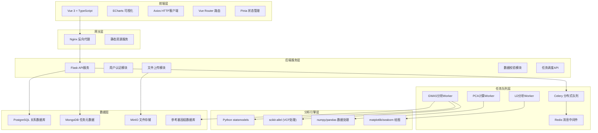
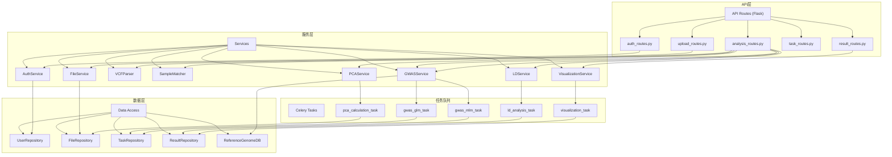
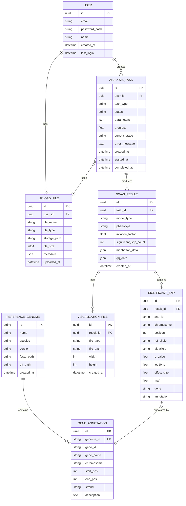

# GWAS全基因组关联分析系统 - 技术架构文档

## 1. 架构设计



## 2. 技术选型说明

### 2.1 前端技术栈
- **框架**: Vue 3.4 + TypeScript 5.4
- **构建工具**: Vite 5.2
- **UI组件库**: Element Plus 2.7
- **可视化**: ECharts 5.5
- **状态管理**: Pinia 2.1
- **路由**: Vue Router 4.3
- **HTTP客户端**: Axios 1.7
- **样式**: TailwindCSS 3.4
- **图标**: Iconify Vue

### 2.2 后端技术栈
- **Web框架**: Flask 3.0
- **异步任务**: Celery 5.4 + Redis 7.2
- **科学计算**: 
  - numpy 1.26, pandas 2.2
  - statsmodels 0.14 (GLM/MLM)
  - scikit-allel 1.3 (VCF处理, LD计算)
  - matplotlib 3.8, seaborn 0.13
- **数据库**: 
  - PostgreSQL 16 (用户、任务元数据)
  - SQLite (轻量级部署备选)
- **文件存储**: MinIO (本地对象存储)

### 2.3 初始化工具
- 前端: `npm create vite@latest`
- 后端: 手动搭建Flask项目结构

## 3. 路由定义

| 前端路由 | 页面 | 后端API前缀 |
|---------|------|-------------|
| /login | 登录页 | /api/auth |
| /upload | 数据上传页 | /api/upload |
| /analysis/config | 分析配置页 | /api/analysis |
| /tasks | 任务队列页 | /api/tasks |
| /results/:taskId | 结果可视化页 | /api/results |
| /reference | 参考基因组页 | /api/reference |
| /settings | 用户设置页 | /api/user |

## 4. API定义

```typescript
// ============ 文件上传相关 ============
interface FileUploadResponse {
  fileId: string;
  fileName: string;
  fileType: 'vcf' | 'phenotype' | 'covariate';
  sampleCount: number;
  variantCount?: number;
  uploadTime: string;
}

// POST /api/upload/vcf
// POST /api/upload/phenotype
// POST /api/upload/covariate

// ============ 样本匹配 ============
interface SampleMatchRequest {
  vcfFileId: string;
  phenotypeFileId: string;
}

interface SampleMatchResponse {
  matchedSamples: string[];
  vcfOnlySamples: string[];
  phenotypeOnlySamples: string[];
}

// POST /api/analysis/match-samples

// ============ PCA计算 ============
interface PCARequest {
  vcfFileId: string;
  nComponents: number;
}

interface PCAResponse {
  taskId: string;
  explainedVarianceRatio: number[];
  pcData: { sampleId: string; PC1: number; PC2: number; PC3: number }[];
}

// POST /api/analysis/pca

// ============ GWAS任务提交 ============
interface GWASRequest {
  vcfFileId: string;
  phenotypeFileId: string;
  phenotypeName: string;
  model: 'GLM' | 'MLM';
  covariates: {
    pcaComponents: number[];
    customCovariateFileId?: string;
    customCovariateNames: string[];
  };
  significanceThreshold: number;
  referenceGenome: string;
}

interface GWASResponse {
  taskId: string;
  status: 'queued' | 'running' | 'completed' | 'failed';
  createdAt: string;
}

// POST /api/analysis/gwas

// ============ 任务查询 ============
interface TaskStatusResponse {
  taskId: string;
  status: 'queued' | 'running' | 'completed' | 'failed';
  progress: number;
  stage: string;
  errorMessage?: string;
  createdAt: string;
  startedAt?: string;
  completedAt?: string;
}

// GET /api/tasks/:taskId
// GET /api/tasks?page=1&pageSize=20

// ============ GWAS结果 ============
interface GWASResultResponse {
  taskId: string;
  model: string;
  phenotype: string;
  inflationFactor: number;
  significantSNPCount: number;
  manhattanData: {
    chr: string;
    pos: number;
    snp: string;
    pValue: number;
    log10P: number;
  }[];
  qqData: {
    expected: number;
    observed: number;
  }[];
  significantSNPs: {
    snp: string;
    chr: string;
    pos: number;
    ref: string;
    alt: string;
    pValue: number;
    log10P: number;
    effectSize: number;
    maf: number;
    gene?: string;
    annotation?: string;
  }[];
}

// GET /api/results/:taskId

// ============ LD热图 ============
interface LDHeatmapRequest {
  vcfFileId: string;
  chr: string;
  start: number;
  end: number;
}

interface LDHeatmapResponse {
  snpNames: string[];
  positions: number[];
  ldMatrix: number[][];
  hapBlocks?: { start: number; end: number; snps: string[] }[];
}

// POST /api/analysis/ld-heatmap

// ============ 结果下载 ============
// GET /api/results/:taskId/download/manhattan.png
// GET /api/results/:taskId/download/qq.png
// GET /api/results/:taskId/download/ld-heatmap.png
// GET /api/results/:taskId/download/snps.csv
// GET /api/results/:taskId/download/report.pdf
```

## 5. 后端服务架构



## 6. 数据模型

### 6.1 ER图



### 6.2 DDL语句

```sql
-- PostgreSQL DDL

CREATE EXTENSION IF NOT EXISTS "uuid-ossp";

CREATE TABLE users (
    id UUID PRIMARY KEY DEFAULT uuid_generate_v4(),
    email VARCHAR(255) UNIQUE NOT NULL,
    password_hash VARCHAR(255) NOT NULL,
    name VARCHAR(100) NOT NULL,
    created_at TIMESTAMP DEFAULT CURRENT_TIMESTAMP,
    last_login TIMESTAMP
);

CREATE TABLE upload_files (
    id UUID PRIMARY KEY DEFAULT uuid_generate_v4(),
    user_id UUID REFERENCES users(id) NOT NULL,
    file_name VARCHAR(255) NOT NULL,
    file_type VARCHAR(50) NOT NULL CHECK (file_type IN ('vcf', 'phenotype', 'covariate')),
    storage_path VARCHAR(500) NOT NULL,
    file_size BIGINT NOT NULL,
    metadata JSONB,
    uploaded_at TIMESTAMP DEFAULT CURRENT_TIMESTAMP
);

CREATE TABLE analysis_tasks (
    id UUID PRIMARY KEY DEFAULT uuid_generate_v4(),
    user_id UUID REFERENCES users(id) NOT NULL,
    task_type VARCHAR(50) NOT NULL,
    status VARCHAR(20) NOT NULL DEFAULT 'queued' CHECK (status IN ('queued', 'running', 'completed', 'failed', 'cancelled')),
    parameters JSONB NOT NULL,
    progress FLOAT DEFAULT 0,
    current_stage VARCHAR(100),
    error_message TEXT,
    created_at TIMESTAMP DEFAULT CURRENT_TIMESTAMP,
    started_at TIMESTAMP,
    completed_at TIMESTAMP
);

CREATE TABLE gwas_results (
    id UUID PRIMARY KEY DEFAULT uuid_generate_v4(),
    task_id UUID REFERENCES analysis_tasks(id) ON DELETE CASCADE NOT NULL,
    model_type VARCHAR(10) NOT NULL,
    phenotype VARCHAR(100) NOT NULL,
    inflation_factor FLOAT,
    significant_snp_count INTEGER DEFAULT 0,
    manhattan_data JSONB,
    qq_data JSONB,
    created_at TIMESTAMP DEFAULT CURRENT_TIMESTAMP
);

CREATE TABLE significant_snps (
    id UUID PRIMARY KEY DEFAULT uuid_generate_v4(),
    result_id UUID REFERENCES gwas_results(id) ON DELETE CASCADE NOT NULL,
    snp_id VARCHAR(100) NOT NULL,
    chromosome VARCHAR(20) NOT NULL,
    position INTEGER NOT NULL,
    ref_allele VARCHAR(50) NOT NULL,
    alt_allele VARCHAR(50) NOT NULL,
    p_value DOUBLE PRECISION NOT NULL,
    log10_p DOUBLE PRECISION NOT NULL,
    effect_size DOUBLE PRECISION,
    maf FLOAT,
    gene VARCHAR(100),
    annotation TEXT
);

CREATE TABLE visualization_files (
    id UUID PRIMARY KEY DEFAULT uuid_generate_v4(),
    result_id UUID REFERENCES gwas_results(id) ON DELETE CASCADE NOT NULL,
    file_type VARCHAR(50) NOT NULL,
    file_path VARCHAR(500) NOT NULL,
    width INTEGER,
    height INTEGER,
    created_at TIMESTAMP DEFAULT CURRENT_TIMESTAMP
);

CREATE TABLE reference_genomes (
    id VARCHAR(50) PRIMARY KEY,
    name VARCHAR(100) NOT NULL,
    species VARCHAR(100) NOT NULL,
    version VARCHAR(50) NOT NULL,
    fasta_path VARCHAR(500) NOT NULL,
    gff_path VARCHAR(500),
    created_at TIMESTAMP DEFAULT CURRENT_TIMESTAMP
);

CREATE TABLE gene_annotations (
    id UUID PRIMARY KEY DEFAULT uuid_generate_v4(),
    genome_id VARCHAR(50) REFERENCES reference_genomes(id) NOT NULL,
    gene_id VARCHAR(50) NOT NULL,
    gene_name VARCHAR(100),
    chromosome VARCHAR(20) NOT NULL,
    start_pos INTEGER NOT NULL,
    end_pos INTEGER NOT NULL,
    strand CHAR(1),
    description TEXT
);

-- 索引
CREATE INDEX idx_snps_result_id ON significant_snps(result_id);
CREATE INDEX idx_snps_chr_pos ON significant_snps(chromosome, position);
CREATE INDEX idx_tasks_user_id ON analysis_tasks(user_id);
CREATE INDEX idx_tasks_status ON analysis_tasks(status);
CREATE INDEX idx_files_user_id ON upload_files(user_id);
CREATE INDEX idx_gene_ann_chr ON gene_annotations(chromosome, start_pos, end_pos);
```

## 7. 玉米参考基因组预存储配置

系统预配置以下常见玉米自交系参考基因组：

| 基因组ID | 名称 | 版本 | 说明 |
|---------|------|------|------|
| B73_v5 | B73 | v5 | 玉米标准参考基因组 |
| Mo17_v1 | Mo17 | v1 | 重要自交系 |
| W22_v2 | W22 | v2 | 常用实验品系 |
| PH207_v1 | PH207 | v1 | 玉米父本系 |
| B97_v1 | B97 | v1 | 耐旱自交系 |

参考基因组数据存储在 `/data/reference/maize/` 目录，包含FASTA序列和GFF注释文件。
