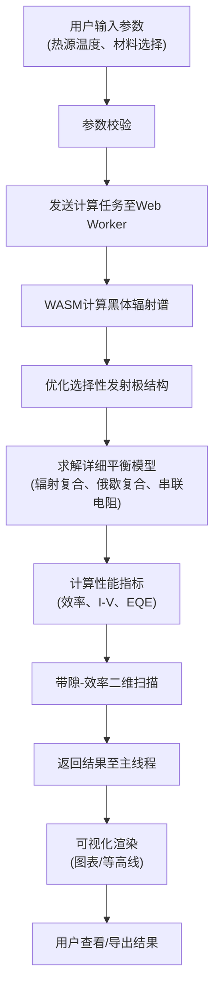

## 1. 产品概述

热光伏（TPV）电池模拟器是一款纯前端科学计算应用，为科研人员和工程师提供高效的TPV电池性能仿真工具。用户可自定义热源温度和电池材料参数，系统通过详细平衡模型计算转换效率、I-V曲线、量子效率等关键性能指标。

- 核心价值：将复杂的物理计算封装为易用的Web应用，无需安装专业软件即可进行TPV电池设计与优化
- 目标用户：光伏领域研究人员、材料科学家、能源工程专业学生

## 2. 核心功能

### 2.1 用户角色
| 角色 | 注册方式 | 核心权限 |
|------|----------|----------|
| 普通用户 | 无需注册 | 使用全部计算功能，自定义材料参数，导出计算结果 |

### 2.2 功能模块
1. **主计算界面**：参数输入、计算控制、结果可视化
2. **材料数据库**：内置半导体材料库，支持用户自定义材料
3. **可视化模块**：黑体辐射谱、I-V曲线、量子效率、带隙-效率等高线图
4. **优化模块**：一维光子晶体/多层膜选择性发射极结构优化

### 2.3 页面详情
| 页面名称 | 模块名称 | 功能描述 |
|---------|----------|---------|
| 主计算界面 | 参数输入面板 | 热源温度滑块(600-2000K)、电池材料选择、串联电阻输入、复合系数设置 |
| 主计算界面 | 计算控制区 | 开始计算按钮、计算进度显示、中止计算功能 |
| 主计算界面 | 结果展示区 | 转换效率数值、短路电流、开路电压、填充因子显示 |
| 主计算界面 | 图形可视化 | 黑体辐射谱图、I-V曲线图、量子效率图、带隙-效率等高线图 |
| 材料数据库 | 材料列表 | 内置材料(InGaAs, GaSb, Si等)参数展示 |
| 材料数据库 | 自定义材料 | 用户添加/编辑/删除自定义材料参数(带隙、电子亲和能、有效质量等) |
| 发射极优化 | 结构定义 | 多层膜结构层数、厚度、材料折射率设置 |
| 发射极优化 | 优化算法 | 基于遗传算法的光谱选择性优化 |

## 3. 核心流程

用户首先选择或定义电池材料，设置热源温度和器件参数，触发计算。Web Worker在后台执行黑体辐射谱计算、选择性发射极优化、详细平衡模型求解，最后将结果返回主线程进行可视化展示。

## 4. 用户界面设计

### 4.1 设计风格
- **主色调**：科技蓝 (#165DFF) 搭配 深灰背景 (#0F172A)，营造专业科研工具氛围
- **辅助色**：能量橙 (#FF7D00) 用于强调关键数据，光谱渐变色用于辐射谱可视化
- **按钮风格**：微立体圆角按钮，hover时有轻微上浮和发光效果
- **字体**：标题使用 Orbitron (科技感显示字体)，正文使用 JetBrains Mono (等宽字体便于数据阅读)
- **布局风格**：三栏式专业布局，左侧参数面板、中间可视化区、右侧数据详情
- **视觉元素**：科技感网格背景、渐变发光边框、数据流动动画

### 4.2 页面设计概述
| 页面名称 | 模块名称 | UI元素 |
|---------|----------|--------|
| 主计算界面 | 参数面板 | 滑块组件带实时数值显示、下拉选择器、数值输入框带单位、参数分组折叠 |
| 主计算界面 | 可视化区 | 四个可切换图表Tab（辐射谱/I-V曲线/QE/等高线），支持全屏查看、PNG导出 |
| 主计算界面 | 状态栏 | 计算进度条、当前计算步骤提示、WASM运行状态指示 |
| 材料数据库 | 数据表格 | 带筛选功能的材料参数表，行选中高亮，双击编辑 |
| 材料数据库 | 编辑弹窗 | 表单式材料参数编辑，支持公式输入带隙随组分变化 |
| 发射极优化 | 结构编辑器 | 可视化多层膜堆叠结构，拖拽调整层顺序，实时预览反射谱 |

### 4.3 响应性
- 桌面端（≥1200px）：三栏完整布局，图表区域自适应
- 平板端（768-1199px）：两栏布局，参数面板可折叠收起
- 移动端（<768px）：单栏垂直布局，图表按顺序排列，优化触控区域
- 图表组件使用响应式SVG，支持触摸缩放和平移

### 4.4 视觉动效
- 页面加载：分区块渐入动画，图表区域有数据流入动效
- 计算过程：进度条有脉冲发光效果，状态文字逐字更新
- 图表交互：数据点hover时放大并显示详细数值，曲线有绘制动画
- 面板切换：平滑过渡动画，带轻微模糊过渡效果
