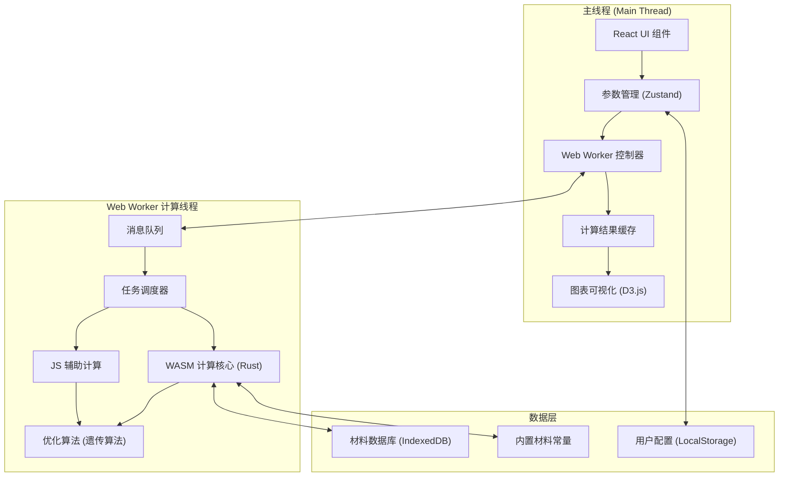

## 1. 架构设计

本应用为纯前端科学计算应用，采用主线程+Web Worker的多线程架构。主线程负责UI渲染和用户交互，Web Worker负责CPU密集型物理计算，WASM模块提供高性能计算核心。



## 2. 技术描述

- **前端框架**：React@18 + TypeScript + Vite@5
- **样式方案**：TailwindCSS@3 + CSS变量主题系统
- **状态管理**：Zustand (轻量级状态管理)
- **Web Worker**：原生 Web Worker API + Comlink (简化通信)
- **WASM**：Rust + wasm-pack 编译核心计算模块
- **可视化**：D3.js@7 (科学图表) + Plotly.js (等高线图)
- **数据持久化**：IndexedDB (材料数据库) + LocalStorage (用户配置)
- **UI组件库**：Radix UI (无样式组件) + Lucide React (图标)

## 3. 核心数据结构

### 3.1 材料参数
```typescript
interface Material {
  id: string;
  name: string;
  formula: string;
  bandgap: number;        // eV
  bandgapTempCoeff: number; // eV/K
  electronAffinity: number; // eV
  effectiveMassElectron: number; // m0
  effectiveMassHole: number;    // m0
  refractiveIndex: number;
  absorptionCoeff: number[];    // cm^-1 vs wavelength
  augerCoefficient: number;     // cm^6/s
  radiativeCoeff: number;       // cm^3/s
  mobilityElectron: number;     // cm²/Vs
  mobilityHole: number;         // cm²/Vs
  isCustom: boolean;
  createdAt: number;
}
```

### 3.2 计算参数
```typescript
interface CalculationParams {
  sourceTemperature: number;    // K, 600-2000
  materialId: string;
  seriesResistance: number;     // Ω·cm²
  shuntResistance: number;      // Ω·cm²
  temperature: number;          // K, 电池温度
  includeAuger: boolean;
  includeRadiative: boolean;
  includeSeriesResistance: boolean;
  emitterStructure: EmitterLayer[];
  optimizeEmitter: boolean;
}

interface EmitterLayer {
  thickness: number;    // nm
  material: string;
  n: number;            // 折射率
  k: number;            // 消光系数
}
```

### 3.3 计算结果
```typescript
interface CalculationResult {
  efficiency: number;           // %
  shortCircuitCurrent: number;  // A/cm²
  openCircuitVoltage: number;   // V
  fillFactor: number;           // %
  ivCurve: { v: number; j: number }[];
  quantumEfficiency: { wavelength: number; eqe: number }[];
  blackbodySpectrum: { wavelength: number; intensity: number }[];
  emitterReflectance: { wavelength: number; r: number }[];
  bandgapScan: {
    bandgaps: number[];
    temperatures: number[];
    efficiencies: number[][];
  };
  optimizedEmitter: EmitterLayer[];
  calculationTime: number;
}
```

## 4. 核心计算模型

### 4.1 黑体辐射谱 (Planck定律)
```
I(λ, T) = (2πhc²/λ⁵) / (exp(hc/(λkBT)) - 1)
```
WASM实现，向量化计算1000个波长点。

### 4.2 详细平衡模型
- 光子吸收产生载流子
- 辐射复合：J_rad = q(n_i² / N_A N_D) * (exp(qV/(kBT)) - 1)
- 俄歇复合：J_auger = q * Cn * n² * p + q * Cp * n * p²
- 串联电阻损失：J = J_sc - J_rad - J_auger - V/(R_s * A)

### 4.3 多层膜反射率计算
传输矩阵法 (TMM) 计算一维光子晶体的反射谱和透射谱。

### 4.4 优化算法
自适应遗传算法优化多层膜厚度，目标函数最大化光谱匹配度：
```
F = ∫ I(λ) * EQE(λ) * (1 - R(λ)) dλ
```

## 5. 目录结构
```
src/
├── components/
│   ├── layout/           # 布局组件
│   ├── params/           # 参数输入组件
│   ├── charts/           # 图表组件
│   ├── materials/        # 材料数据库组件
│   └── emitter/          # 发射极优化组件
├── hooks/                # 自定义Hooks
├── store/                # Zustand状态管理
├── workers/              # Web Worker
│   ├── calculation.worker.ts
│   └── comlink.ts
├── wasm/                 # Rust WASM模块
│   ├── src/
│   │   ├── blackbody.rs
│   │   ├── detailed_balance.rs
│   │   ├── tmm.rs        # 传输矩阵法
│   │   └── optimizer.rs  # 遗传算法
│   └── Cargo.toml
├── data/                 # 内置材料数据
├── utils/                # 工具函数
├── types/                # TypeScript类型定义
└── App.tsx
```

## 6. 关键技术点

### 6.1 Web Worker + WASM 通信
使用 Comlink 简化主线程与Worker通信，WASM模块在Worker中加载，避免阻塞UI线程。

### 6.2 计算可中断性
计算任务分片执行，支持用户中止，每100ms检查一次中止信号。

### 6.3 二维扫描并行化
带隙-效率扫描使用多个WASM实例并行计算，充分利用多核CPU。

### 6.4 材料数据库
IndexedDB存储自定义材料，内置材料数据以JSON形式打包，首次加载时初始化。

### 6.5 图表性能优化
D3.js 使用 requestAnimationFrame 分帧渲染大量数据点，等高线图使用简化算法适应浏览器性能。
