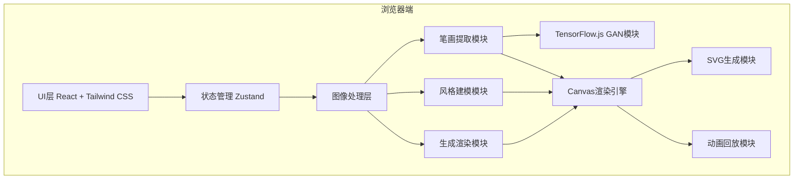

## 1. 架构设计

纯前端单页应用，无后端服务依赖。



## 2. 技术描述
- 前端：React@18 + TypeScript + Vite
- 样式：Tailwind CSS@3
- 状态管理：Zustand
- 图像处理：Canvas API + 自研算法
- 机器学习：TensorFlow.js
- 图标：Lucide React
- 初始化工具：vite-init

## 3. 路由定义
| 路由 | 用途 |
|------|------|
| / | 主应用页面 |

## 4. 核心模块结构

### 4.1 图像处理模块 (`src/utils/imageProcessor.ts
- 二值化处理：Otsu阈值法自适应阈值
- 去噪滤波：中值滤波、形态学操作
- 骨架化：Zhang-Suen细化算法
- 轮廓检测：Suzuki-Abe边界跟踪

### 4.2 笔画提取模块 (`src/utils/strokeExtractor.ts
- 图构建：像素邻接图
- 节点分类：端点、交点、普通点
- 路径搜索：深度优先搜索提取笔画
- 顺序推断：基于汉字书写规则启发式

### 4.3 风格建模模块 (`src/utils/styleModel.ts
- 笔画特征：粗细变化、速度曲线、压力模型
- 风格融合：加权平均融合多风格
- 参数控制：粗细、速度、飞白参数化

### 4.4 SVG生成模块 (`src/utils/svgGenerator.ts
- 路径生成：贝塞尔曲线拟合
- 动画：逐笔动画SVG
- 导出功能：SVG文件生成与代码

### 4.5 GAN模块 (`src/utils/ganGenerator.ts
- 条件GAN：TensorFlow.js实现
- 笔画生成：风格迁移
- 可选降级：笔画拼接作为备选方案

## 5. 数据模型

### 5.1 数据类型定义

```typescript
interface Point {
  x: number;
  y: number;
  pressure?: number;
  speed?: number;
}

interface Stroke {
  id: string;
  points: Point[];
  thickness: number[];
  order: number;
  type: string;
}

interface CharacterStyle {
  id: string;
  name: string;
  strokes: Stroke[];
  features: {
    avgThickness: number;
    slantAngle: number;
    speedVariation: number;
    flyingWhite: number;
  };
  weight: number;
}

interface GeneratedCharacter {
  character: string;
  strokes: Stroke[];
  styleId: string;
  svg: string;
}

interface AppState {
  samples: CharacterStyle[];
  targetText: string;
  parameters: {
    thickness: number;
    speed: number;
    flyingWhite: number;
  };
  generatedCharacters: GeneratedCharacter[];
  isPlaying: boolean;
  currentStrokeIndex: number;
}
```
