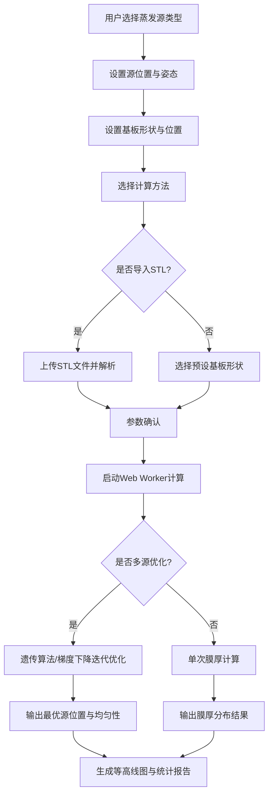

## 1. 产品概述

本产品是一款纯前端的真空镀膜膜厚分布计算模拟器，为科研人员和工程师提供精确的膜厚分布预测和蒸发源优化工具。用户可通过直观的界面输入蒸发源与基板参数，快速获得膜厚分布的可视化结果与均匀性分析。

- **核心价值**：无需安装软件，在浏览器中即可完成复杂的物理仿真计算，显著提升镀膜工艺设计效率
- **目标用户**：真空镀膜领域的科研人员、工艺工程师、光学薄膜设计人员

## 2. 核心功能

### 2.1 用户角色

| 角色 | 注册方式 | 核心权限 |
|------|----------|----------|
| 普通用户 | 无需注册，直接使用 | 完整使用所有计算、可视化、优化功能 |

### 2.2 功能模块

1. **参数配置面板**：蒸发源类型选择、位置姿态设置、基板形状定义、计算方法选择
2. **3D场景预览**：蒸发源与基板的三维可视化展示
3. **膜厚计算引擎**：基于 Web Worker 的数值积分与蒙特卡洛计算
4. **结果可视化**：膜厚等高线图、彩色热力图、均匀性统计数据
5. **多源优化模块**：遗传算法/梯度下降优化蒸发源位置
6. **STL导入模块**：读取并解析基板CAD文件

### 2.3 页面详情

| 页面名称 | 模块名称 | 功能描述 |
|----------|----------|----------|
| 主页面 | 左侧参数配置区 | 分步骤引导用户设置蒸发源、基板、计算参数 |
| 主页面 | 中央3D视图区 | 实时展示蒸发源与基板的空间位置关系 |
| 主页面 | 右侧结果展示区 | 膜厚等高线图、均匀性数据、优化结果 |
| 主页面 | 底部控制栏 | 计算启动/暂停、进度显示、数据导出 |

## 3. 核心流程

用户完成参数配置后，系统在后台 Web Worker 中进行数值积分或蒙特卡洛模拟计算，计算过程中可实时查看进度，完成后自动渲染等高线图并计算均匀性百分比。

## 4. 用户界面设计

### 4.1 设计风格

- **主色调**：深空蓝 (#0A1929) 作为背景，科技蓝 (#1976D2) 作为主色，青色 (#00BCD4) 作为强调色
- **辅助色**：膜厚热力图采用彩虹色带（蓝-青-绿-黄-红）
- **按钮风格**：圆角矩形，微立体效果，悬停时有发光边框
- **字体**：标题使用 'JetBrains Mono' 等宽字体，正文使用 'Inter' 无衬线字体
- **布局风格**：三栏式卡片布局，左侧参数配置、中央3D视图、右侧结果展示
- **图标风格**：线性科技风图标，配合细微发光效果

### 4.2 页面设计概述

| 页面名称 | 模块名称 | UI元素 |
|----------|----------|--------|
| 主页面 | 参数配置区 | 分组折叠面板、下拉选择器、数值输入框、滑块、单位标签 |
| 主页面 | 3D视图区 | Three.js渲染场景、轨道控制器、网格辅助线、坐标轴指示 |
| 主页面 | 结果展示区 | Canvas等高线图、色带图例、统计卡片、进度条 |
| 主页面 | 底部控制栏 | 主操作按钮组、计算进度条、状态指示灯 |

### 4.3 响应性

- 桌面端（1280px+）：三栏并列完整布局
- 平板端（768px-1279px）：参数区与结果区可折叠，3D视图自适应
- 移动端（<768px）：垂直堆叠布局，优先展示3D视图与计算结果

### 4.4 3D场景指导

- **环境**：深色科技感背景，配合微弱网格地面
- **光照**：多光源设置，主光源平行光 + 环境光，突出蒸发源与基板的立体感
- **相机**：透视相机，支持轨道控制（旋转、缩放、平移），初始视角为45度俯视
- **交互**：鼠标悬停高亮对象，点击显示详细参数，滚轮缩放
- **动画**：计算过程中蒸发源有粒子发射动画效果，膜厚分布通过颜色渐变实时更新
- **后处理**：轻微泛光效果，提升科技感
- **性能**：控制多边形数量，STL导入后自动进行简化处理
