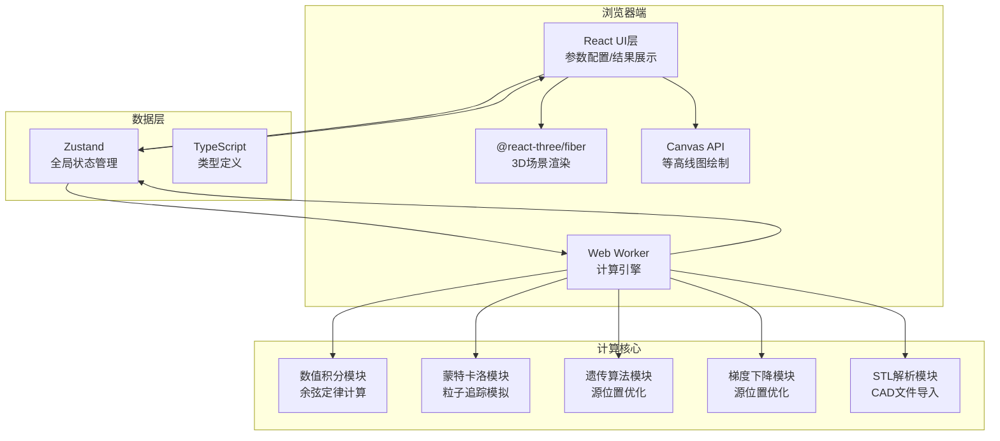

## 1. 架构设计



## 2. 技术描述

- **前端框架**: React@18 + TypeScript
- **构建工具**: Vite@5
- **样式方案**: TailwindCSS@3 + CSS Variables
- **3D渲染**: three@0.160 + @react-three/fiber@8 + @react-three/drei@9 + @react-three/postprocessing@2
- **状态管理**: Zustand@4
- **数值计算**: 自定义实现（基于 Web Worker 隔离）
- **STL解析**: 自定义二进制/ASCII STL解析器
- **可视化**: Canvas API (等高线图) + three.js (3D热力图)

## 3. 目录结构

```
src/
├── components/
│   ├── layout/           # 布局组件
│   ├── params/           # 参数配置组件
│   ├── viewer3d/         # 3D视图组件
│   ├── results/          # 结果展示组件
│   └── common/           # 通用组件
├── store/                # Zustand 状态管理
├── workers/              # Web Worker 定义
│   └── calculation.worker.ts
├── engine/               # 计算引擎核心
│   ├── sources/          # 蒸发源模型
│   ├── substrates/       # 基板模型
│   ├── methods/          # 计算方法
│   ├── optimization/     # 优化算法
│   └── stl/              # STL解析
├── types/                # TypeScript 类型定义
├── utils/                # 工具函数
├── App.tsx
├── main.tsx
└── index.css
```

## 4. 类型定义

```typescript
// 蒸发源类型
type SourceType = 'point' | 'small_face' | 'extended';

// 基板类型
type SubstrateType = 'plane' | 'sphere' | 'aspheric' | 'stl';

// 计算方法
type CalculationMethod = 'cosine' | 'monte_carlo';

// 优化算法
type OptimizationMethod = 'genetic' | 'gradient_descent';

// 三维向量
interface Vector3 {
  x: number;
  y: number;
  z: number;
}

// 欧拉角
interface Euler {
  x: number;
  y: number;
  z: number;
  order: string;
}

// 蒸发源配置
interface SourceConfig {
  id: string;
  type: SourceType;
  position: Vector3;
  orientation: Euler;
  power: number;
  emissionCoefficient: number;
}

// 基板配置
interface SubstrateConfig {
  type: SubstrateType;
  position: Vector3;
  orientation: Euler;
  size: { width: number; height: number; radius?: number };
  resolution: { x: number; y: number };
  stlData?: STLData;
}

// STL数据
interface STLData {
  vertices: Float32Array;
  normals: Float32Array;
  faces: Uint32Array;
}

// 计算配置
interface CalculationConfig {
  method: CalculationMethod;
  monteCarloParticles?: number;
  integrationPoints?: number;
}

// 计算结果
interface CalculationResult {
  thickness: Float64Array;
  coordinates: { x: Float64Array; y: Float64Array };
  uniformity: number;
  maxThickness: number;
  minThickness: number;
  avgThickness: number;
}

// 优化配置
interface OptimizationConfig {
  enabled: boolean;
  method: OptimizationMethod;
  sources: string[];
  bounds: { min: Vector3; max: Vector3 };
  targetUniformity: number;
  maxIterations: number;
}
```

## 5. 核心计算原理

### 5.1 余弦定律膜厚计算

基于蒸发镀膜的经典余弦定律：

```
d(h) = (M * cos(θ) * cos(φ)) / (π * r²)
```

其中：
- `θ` - 蒸发源表面法线与蒸发方向的夹角
- `φ` - 基板表面法线与入射方向的夹角
- `r` - 源到基板点的距离
- `M` - 蒸发源总蒸发质量

### 5.2 蒙特卡洛方法

通过模拟大量粒子的发射、飞行、沉积过程，统计基板上各点的粒子沉积数量来计算膜厚分布。

### 5.3 优化算法

**遗传算法**：
- 编码：源位置坐标作为基因
- 适应度：均匀性百分比（越高越好）
- 选择：轮盘赌选择 + 精英保留
- 交叉：单点交叉
- 变异：高斯变异

**梯度下降**：
- 目标函数：`f = 1 - 均匀性`
- 梯度计算：有限差分法
- 步长：自适应 Armijo 规则

## 6. Web Worker 消息协议

```typescript
// 主线程 -> Worker
type WorkerMessage = 
  | { type: 'START_CALCULATION'; payload: CalculationPayload }
  | { type: 'START_OPTIMIZATION'; payload: OptimizationPayload }
  | { type: 'CANCEL' };

// Worker -> 主线程
type WorkerResponse =
  | { type: 'PROGRESS'; payload: { progress: number; message: string } }
  | { type: 'CALCULATION_COMPLETE'; payload: CalculationResult }
  | { type: 'OPTIMIZATION_ITERATION'; payload: OptimizationIteration }
  | { type: 'OPTIMIZATION_COMPLETE'; payload: OptimizationResult }
  | { type: 'ERROR'; payload: { message: string } };
```
