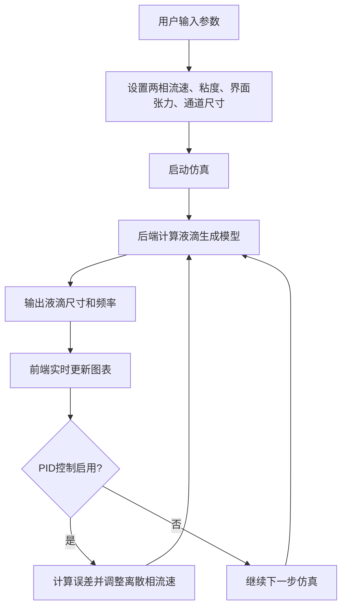

## 1. 产品概述

本项目是一个两相流液滴生成仿真系统，用于模拟油和水在微通道中的液滴生成过程。系统采用经验模型进行数值仿真，提供参数化输入、实时仿真控制、PID反馈控制、批量优化和扰动分析功能，为微流控芯片设计和液滴生成工艺优化提供辅助决策工具。

### 目标用户
- 微流控研究人员和工程师
- 液滴微流控工艺开发人员
- 相关领域的学生和教育工作者

---

## 2. 核心功能

### 2.1 功能模块
1. **仿真控制面板**：输入物理参数和几何参数，启动/停止仿真
2. **实时结果展示**：显示液滴生成频率、尺寸和实时趋势图
3. **PID反馈控制**：设置目标液滴尺寸，自动调节离散相流速
4. **批量优化**：搜索最优流速组合以达到目标液滴尺寸
5. **扰动分析**：添加流速波动，观察液滴尺寸的稳定性

### 2.2 页面详情
| 页面名称 | 模块名称 | 功能描述 |
|---------|---------|----------|
| 主页面 | 参数输入区 | 两相流速、粘度、界面张力、通道几何尺寸输入 |
| 主页面 | 仿真控制区 | 启动、暂停、重置仿真，仿真进度显示 |
| 主页面 | 结果展示区 | 液滴尺寸、频率的数值显示和实时曲线图 |
| 主页面 | PID控制区 | 目标尺寸设定、PID参数调节、控制状态显示 |
| 主页面 | 批量优化区 | 优化范围设定、优化进度、最优结果展示 |
| 主页面 | 扰动分析区 | 扰动参数设置、扰动前后对比分析 |

---

## 3. 核心流程

### 3.1 仿真流程

### 3.2 用户操作流程
1. 用户在参数输入区设置流体物性和通道几何参数
2. 设置连续相和离散相的初始流速
3. 点击"启动仿真"按钮开始仿真
4. 观察实时结果展示区的液滴尺寸和频率变化
5. 如需自动控制，启用PID控制并设置目标液滴尺寸
6. 如需参数优化，使用批量优化功能搜索最优参数组合
7. 如需分析鲁棒性，添加扰动并观察系统响应

---

## 4. 用户界面设计

### 4.1 设计风格
- **主色调**：科技蓝 (#165DFF) 作为主色，深灰 (#1D2129) 作为背景，营造专业科研感
- **辅助色**：绿色 (#00B42A) 表示正常状态，橙色 (#FF7D00) 表示警告，红色 (#F53F3F) 表示错误
- **字体**：使用 "JetBrains Mono" 作为数字显示字体，"Inter" 作为界面字体
- **布局**：左侧参数控制面板 + 右侧结果展示区的双栏布局
- **卡片风格**：深色背景 + 细微边框 + 柔和阴影，突出数据可视化区域
- **图标**：使用简洁的线性图标，避免过度装饰

### 4.2 页面设计概述
| 页面名称 | 模块名称 | UI元素 |
|---------|---------|--------|
| 主页面 | 参数输入区 | 带单位标签的数字输入框，分组折叠面板 |
| 主页面 | 仿真控制区 | 大型状态按钮（启动/暂停/重置），进度条，运行时间显示 |
| 主页面 | 结果展示区 | 大号数字显示卡片，实时折线图（液滴尺寸、频率双轴），液滴分布直方图 |
| 主页面 | PID控制区 | 开关控件，目标值输入，Kp/Ki/Kd参数滑块，控制输出指示器 |
| 主页面 | 批量优化区 | 参数范围输入，优化进度条，结果表格，3D散点图 |
| 主页面 | 扰动分析区 | 扰动类型选择，幅值/频率设置，扰动前后对比图 |

### 4.3 响应式设计
- 桌面端：左右双栏布局，左侧35%宽度控制面板，右侧65%结果展示
- 平板端：上下堆叠布局，控制面板在上，结果展示在下
- 移动端：单列布局，各模块按顺序垂直排列，图表自适应宽度
- 所有可交互元素支持触摸操作，最小点击区域48x48px

### 4.4 动画与交互
- 仿真启动时结果卡片有淡入动画
- 数据更新时有平滑过渡效果（数值滚动、曲线平滑延伸）
- 按钮悬停有轻微放大和光晕效果
- 参数变更时实时预览预期结果
- 图表支持缩放、平移、数据点悬停提示
