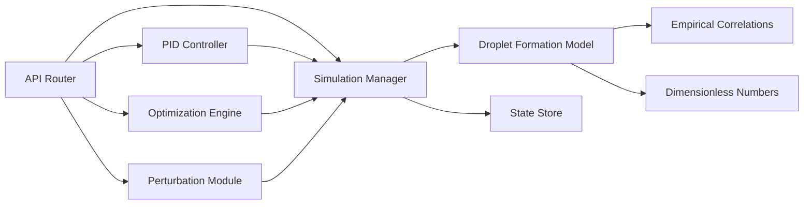

## 1. 架构设计


---

## 2. 技术描述

### 2.1 技术栈
- **前端**：React 18 + TypeScript + Vite + TailwindCSS 3 + Chart.js
- **后端**：FastAPI + Uvicorn + Pydantic + NumPy + SciPy
- **数据交换**：WebSocket（实时数据推送）+ REST API
- **状态管理**：React useState/useReducer（轻量级）

### 2.2 物理模型
采用经验模型模拟微通道液滴生成（T型交叉通道）：

**液滴尺寸预测**（基于毛细管数和流量比）：
```
D_d / W = f(Ca_c, Q_d/Q_c, λ, Oh)
其中：
- Ca_c = μ_c * U_c / σ  (连续相毛细管数)
- Q_d/Q_c = 流量比
- λ = μ_d/μ_c (粘度比)
- Oh = μ_d / sqrt(ρ_d * σ * D_d) (Ohnesorge数)
```

**生成频率预测**：
```
f = (Q_c + Q_d) / (π * (D_d/2)^2 * L_d)
```

---

## 3. 接口定义

### 3.1 REST API 端点

| 方法 | 路由 | 用途 |
|-----|------|------|
| POST | `/api/simulation/start` | 启动仿真 |
| POST | `/api/simulation/pause` | 暂停仿真 |
| POST | `/api/simulation/reset` | 重置仿真 |
| GET | `/api/simulation/status` | 获取仿真状态 |
| POST | `/api/simulation/parameters` | 更新仿真参数 |
| POST | `/api/pid/enable` | 启用/禁用PID控制 |
| POST | `/api/pid/parameters` | 更新PID参数 |
| POST | `/api/optimization/start` | 启动批量优化 |
| GET | `/api/optimization/status` | 获取优化状态 |
| POST | `/api/perturbation/apply` | 应用扰动 |

### 3.2 WebSocket 端点

| 路由 | 用途 |
|------|------|
| `/ws/simulation` | 实时推送仿真数据 |
| `/ws/optimization` | 实时推送优化进度 |

### 3.3 数据类型定义

```typescript
interface SimulationParameters {
  continuousPhase: {
    flowRate: number;      // μL/min
    viscosity: number;     // mPa·s
    density: number;       // kg/m³
  };
  dispersedPhase: {
    flowRate: number;      // μL/min
    viscosity: number;     // mPa·s
    density: number;       // kg/m³
  };
  interfacialTension: number;  // mN/m
  channel: {
    width: number;         // μm
    height: number;        // μm
    length: number;        // μm
    junctionType: 'T' | 'flow-focusing' | 'co-flow';
  };
}

interface SimulationResult {
  timestamp: number;
  dropletSize: number;     // μm
  generationFrequency: number;  // Hz
  flowRateRatio: number;
  capillaryNumber: number;
}

interface PIDParameters {
  enabled: boolean;
  targetDropletSize: number;  // μm
  Kp: number;
  Ki: number;
  Kd: number;
  outputMin: number;       // μL/min
  outputMax: number;       // μL/min
}

interface OptimizationConfig {
  targetSize: number;      // μm
  continuousFlowRateRange: [number, number];
  dispersedFlowRateRange: [number, number];
  resolution: number;      // 每维采样点数
  objective: 'minimize_error' | 'maximize_frequency' | 'minimize_polydispersity';
}

interface PerturbationConfig {
  enabled: boolean;
  type: 'sinusoidal' | 'step' | 'random';
  phase: 'continuous' | 'dispersed' | 'both';
  amplitude: number;       // %
  frequency: number;       // Hz
}
```

---

## 4. 后端架构



### 4.1 核心模块
1. **仿真管理器**：协调整个仿真流程，维护仿真状态
2. **液滴生成模型**：基于经验关联式计算液滴尺寸和频率
3. **PID控制器**：闭环控制离散相流速以跟踪目标尺寸
4. **优化引擎**：网格搜索/遗传算法寻找最优参数组合
5. **扰动模块**：生成流速扰动信号用于鲁棒性分析

---

## 5. 前端组件结构

```
src/
├── components/
│   ├── ParameterPanel/       # 参数输入面板
│   │   ├── FluidProperties.tsx
│   │   ├── ChannelGeometry.tsx
│   │   └── InitialConditions.tsx
│   ├── SimulationControl/    # 仿真控制
│   │   └── ControlButtons.tsx
│   ├── ResultsDisplay/       # 结果展示
│   │   ├── MetricsCards.tsx
│   │   ├── RealTimeChart.tsx
│   │   └── DropletHistogram.tsx
│   ├── PIDControl/           # PID控制
│   │   └── PIDPanel.tsx
│   ├── Optimization/         # 批量优化
│   │   ├── OptimizationConfig.tsx
│   │   └── OptimizationResults.tsx
│   └── Perturbation/         # 扰动分析
│       └── PerturbationPanel.tsx
├── hooks/
│   ├── useSimulation.ts      # 仿真逻辑Hook
│   ├── usePID.ts             # PID控制Hook
│   └── useWebSocket.ts       # WebSocket连接Hook
├── types/
│   └── index.ts              # TypeScript类型定义
├── services/
│   ├── api.ts                # API调用
│   └── websocket.ts          # WebSocket管理
└── App.tsx
```

---

## 6. 关键算法

### 6.1 PID控制算法
```python
class PIDController:
    def __init__(self, Kp, Ki, Kd, setpoint):
        self.Kp = Kp
        self.Ki = Ki
        self.Kd = Kd
        self.setpoint = setpoint
        self.integral = 0
        self.prev_error = 0

    def compute(self, measurement, dt):
        error = self.setpoint - measurement
        self.integral += error * dt
        derivative = (error - self.prev_error) / dt
        output = self.Kp * error + self.Ki * self.integral + self.Kd * derivative
        self.prev_error = error
        return output
```

### 6.2 液滴生成经验模型
```python
def predict_droplet_size(Qc, Qd, muc, mud, sigma, W, H):
    Q_ratio = Qd / Qc
    Ca_c = muc * (Qc / (W * H)) / sigma
    lambda_ = mud / muc

    # Garstecki et al. (2006) 修正模型
    alpha = 1.0
    beta = 0.4
    D = W * (alpha * Q_ratio + beta * Ca_c**(1/3)) / (1 + Q_ratio)

    return D
```

### 6.3 批量优化算法
```python
def grid_search_optimization(param_ranges, target, resolution):
    results = []
    Qc_range = np.linspace(*param_ranges['Qc'], resolution)
    Qd_range = np.linspace(*param_ranges['Qd'], resolution)

    for Qc in Qc_range:
        for Qd in Qd_range:
            size = predict_droplet_size(Qc, Qd, ...)
            error = abs(size - target)
            results.append({'Qc': Qc, 'Qd': Qd, 'size': size, 'error': error})

    return sorted(results, key=lambda x: x['error'])
```
