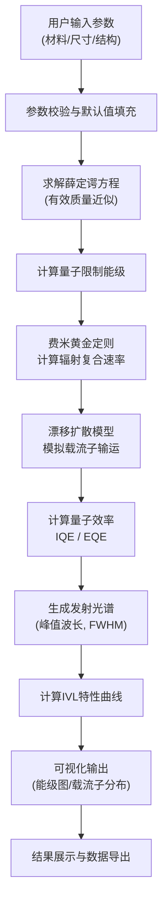

## 1. 产品概述

量子点器件模拟器是一款基于Web的科学计算工具，用于模拟和分析量子点发光二极管（QD-LED）的光电特性。用户可自定义量子点材料、核壳尺寸、器件结构等参数，系统通过求解薛定谔方程、费米黄金定则和漂移扩散模型，输出量子效率、发射光谱、电流-电压-亮度曲线等关键性能指标，并提供能级图和载流子浓度分布的可视化展示。

**核心价值**：
- 为科研人员和工程师提供快速的量子点器件性能预测
- 减少实验试错成本，加速新型量子点材料和器件结构的研发
- 直观的可视化帮助理解载流子输运和复合物理机制

## 2. 核心特性

### 2.1 功能模块

1. **参数输入页**：材料选择、尺寸配置、器件结构设计、计算参数设置
2. **计算结果页**：能级结构、量子效率、发射光谱、IVL曲线、载流子分布
3. **可视化中心**：交互式能带图、载流子浓度分布图、光谱对比图

### 2.2 页面详情

| 页面名称 | 模块名称 | 功能描述 |
|-----------|-------------|---------------------|
| 参数输入页 | 材料选择模块 | 量子点材料下拉选择（CdSe、InP、钙钛矿），显示材料固有参数（带隙、有效质量、介电常数） |
| 参数输入页 | 尺寸配置模块 | 核/壳厚度输入（滑块+数值框），核壳结构示意图实时更新 |
| 参数输入页 | 器件结构模块 | 电子传输层、空穴传输层、电极材料选择，层厚配置 |
| 参数输入页 | 计算控制模块 | 偏置电压范围、网格精度、计算模式选择，开始/重置按钮 |
| 计算结果页 | 能级结构卡片 | 导带/价带能级、量子限制能级、费米能级数值展示 |
| 计算结果页 | 量子效率卡片 | 内量子效率（IQE）、外量子效率（EQE）、辐射复合速率 |
| 计算结果页 | 发射光谱卡片 | 峰值波长、半高宽（FWHM）、光谱曲线图表 |
| 计算结果页 | IVL曲线卡片 | 电流密度-电压（J-V）、亮度-电压（L-V）曲线 |
| 可视化中心 | 能带图模块 | 交互式能带对齐图，显示各层能带结构和载流子注入势垒 |
| 可视化中心 | 载流子分布模块 | 电子/空穴浓度沿器件深度分布曲线，复合区域高亮显示 |

## 3. 核心流程

## 4. 用户界面设计

### 4.1 设计风格

- **主色调**：深空蓝 (#0A192F) 作为背景主色，代表科研的严谨和专业
- **辅助色**：量子蓝 (#64FFDA) 用于高亮和交互元素，能量橙 (#FF6B35) 用于光谱和能量相关数据
- **中性色**：深灰 (#112240)、中灰 (#8892B0)、浅灰 (#CCD6F6) 用于文本和层级区分
- **字体**：JetBrains Mono 作为代码和数值显示字体，Noto Sans SC 作为中文界面字体
- **布局风格**：左侧参数面板 + 右侧可视化区域的双栏布局，卡片式模块分组
- **图标风格**：线性简约风格图标，配合微妙的发光效果体现科技感

### 4.2 页面设计概述

| 页面名称 | 模块名称 | UI元素 |
|-----------|-------------|-------------|
| 参数输入页 | 顶部导航 | 品牌Logo、页面切换标签（参数设置 / 结果分析 / 可视化）、主题切换按钮 |
| 参数输入页 | 左侧参数面板 | 分组折叠面板，每个分组包含相关输入控件，实时参数验证提示 |
| 参数输入页 | 右侧预览区 | 器件结构示意图，随参数输入实时更新，悬浮显示各层详细信息 |
| 计算结果页 | 数据卡片网格 | 4x2 卡片布局，关键指标数值+迷你趋势图，悬停显示计算详情 |
| 计算结果页 | 图表区域 | 交互式ECharts图表，支持缩放、数据点查看、数据导出 |
| 可视化中心 | 能带图 | SVG矢量图，鼠标悬停显示能级数值，可切换显示/隐藏特定能级 |
| 可视化中心 | 载流子分布图 | 双Y轴图表，电子/空穴浓度对数坐标显示，复合区域热力叠加 |

### 4.3 响应式设计

- **桌面端**（≥1280px）：双栏布局，左侧参数面板固定宽度360px，右侧自适应
- **平板端**（768px-1279px）：参数面板可折叠，图表区域堆叠显示
- **移动端**（<768px）：单栏垂直布局，参数分组折叠，图表简化显示

### 4.4 交互与动画

- 页面加载：组件淡入动画，参数面板滑入，图表渐进式渲染
- 数值输入：实时验证反馈，输入框焦点发光效果
- 计算过程：进度条 + 物理方程动画展示
- 图表交互：悬停数据点放大高亮，点击区域放大查看
- 卡片悬浮：微妙的上浮和阴影增强效果
