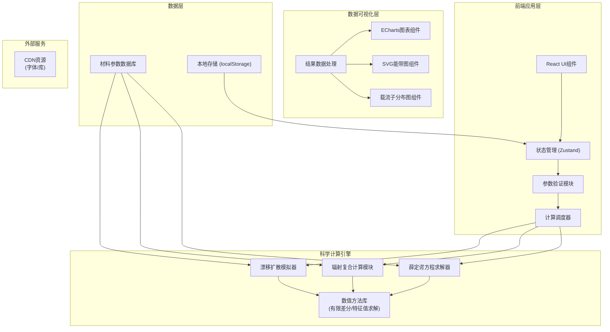

## 1. 架构设计



## 2. 技术描述

### 2.1 核心技术栈
- **前端框架**：React 18 + TypeScript
- **构建工具**：Vite 5
- **样式方案**：Tailwind CSS 3
- **状态管理**：Zustand 4
- **图表可视化**：ECharts 5
- **数值计算**：mathjs + 自定义数值求解器
- **路由**：React Router 6

### 2.2 物理计算模型

**1. 薛定谔方程求解（有效质量近似）**
- 求解器：有限差分法离散化，广义特征值问题求解
- 势能函数：核壳结构的导带/价带阶跃势能
- 边界条件：无限深势阱近似 / 有限深势阱

**2. 费米黄金定则 - 辐射复合速率**
- 跃迁矩阵元计算：电子-空穴波函数重叠积分
- 态密度：三维/二维/零维态密度计算
- 自发辐射速率：Einstein A系数

**3. 漂移扩散模型**
- 基本方程：电流连续性方程 + 泊松方程
- 载流子迁移率：电场依赖迁移率模型
- 复合机制：辐射复合 + 非辐射复合（SRH复合 + 俄歇复合）

### 2.3 项目目录结构
```
src/
├── components/          # UI组件
│   ├── layout/         # 布局组件
│   ├── forms/          # 表单输入组件
│   ├── charts/         # 图表组件
│   └── visualization/  # 可视化组件
├── store/              # 状态管理
├── engine/             # 科学计算引擎
│   ├── schrodinger.ts  # 薛定谔方程求解器
│   ├── recombination.ts # 辐射复合计算
│   ├── driftDiffusion.ts # 漂移扩散模拟
│   └── math/           # 数值方法库
├── data/               # 材料参数数据库
├── types/              # TypeScript类型定义
├── utils/              # 工具函数
├── pages/              # 页面组件
└── App.tsx
```

## 3. 路由定义

| 路由 | 页面名称 | 核心功能 |
|-------|---------|---------|
| / | 参数输入页 | 材料选择、尺寸配置、器件结构设计 |
| /results | 计算结果页 | 能级结构、量子效率、发射光谱、IVL曲线 |
| /visualization | 可视化中心 | 能带图、载流子浓度分布 |

## 4. 数据模型

### 4.1 输入参数模型

```typescript
interface InputParams {
  qdMaterial: 'CdSe' | 'InP' | 'Perovskite';
  coreSize: number;        // nm
  shellThickness: number;  // nm
  shellMaterial: string;
  deviceStructure: {
    anode: string;
    anodeThickness: number;  // nm
    htl: string;            // 空穴传输层
    htlThickness: number;   // nm
    qdLayerThickness: number; // nm
    etl: string;            // 电子传输层
    etlThickness: number;   // nm
    cathode: string;
    cathodeThickness: number; // nm
  };
  calculationParams: {
    voltageStart: number;   // V
    voltageEnd: number;     // V
    voltageStep: number;    // V
    gridPoints: number;
    temperature: number;    // K
  };
}
```

### 4.2 计算结果模型

```typescript
interface CalculationResults {
  energyLevels: {
    conductionBand: number;      // eV
    valenceBand: number;         // eV
    electronLevels: number[];    // eV
    holeLevels: number[];        // eV
    fermiLevel: number;          // eV
    bandGap: number;             // eV
  };
  recombination: {
    radiativeRate: number;       // s^-1
    nonRadiativeRate: number;    // s^-1
    iqe: number;                 // 内量子效率
    eqe: number;                 // 外量子效率
  };
  emissionSpectrum: {
    peakWavelength: number;      // nm
    fwhm: number;                // nm
    spectrumData: {wavelength: number; intensity: number}[];
  };
  ivlCharacteristics: {
    jvData: {voltage: number; currentDensity: number}[];
    lvData: {voltage: number; brightness: number}[];
    turnOnVoltage: number;       // V
    maxEQE: number;              // %
  };
  carrierDistribution: {
    depth: number[];             // nm
    electronDensity: number[];   // cm^-3
    holeDensity: number[];       // cm^-3
    recombinationRate: number[]; // cm^-3 s^-1
    electricField: number[];     // V/cm
  };
  bandDiagram: {
    depth: number[];
    conductionBand: number[];
    valenceBand: number[];
    fermiLevel: number[];
  };
}
```

### 4.3 材料参数数据库

```typescript
interface MaterialParams {
  name: string;
  bandGap: number;           // eV
  electronAffinity: number;  // eV
  electronMass: number;      // m0
  holeMass: number;          // m0
  permittivity: number;      // εr
  refractiveIndex: number;
  electronMobility: number;  // cm²/Vs
  holeMobility: number;      // cm²/Vs
  excitonBindingEnergy: number; // meV
}
```

## 5. 核心算法设计

### 5.1 薛定谔方程求解（有限差分法）

```
Hamiltonian矩阵构造：
H[i,i] = -2/(m*Δx²) + V[i]
H[i,i+1] = H[i+1,i] = 1/(m*Δx²)

特征值问题：H · ψ = E · ψ
使用QR算法求解前N个特征值和特征向量
```

### 5.2 辐射复合速率计算

```
自发辐射速率：
A = (4e²ω|p|²)/(3ε₀ħc³m²) * |⟨ψ_e|ψ_h⟩|² * ρ(E)

其中：
|⟨ψ_e|ψ_h⟩|² 为电子空穴波函数重叠积分
ρ(E) 为联合态密度
```

### 5.3 漂移扩散模型求解

```
电子电流：J_n = qμ_n n E + q D_n ∇n
空穴电流：J_p = qμ_p p E - q D_p ∇p
连续性方程：∂n/∂t = (1/q)∇J_n + G - R
泊松方程：∇²V = -ρ/ε = -q(p - n + N_d - N_a)/ε

使用Gummel迭代法自洽求解
```

## 6. 性能优化策略

- **Web Worker**：将密集计算移至Web Worker，避免UI阻塞
- **计算缓存**：相同参数的计算结果缓存复用
- **渐进式计算**：先显示低精度结果，后台计算高精度结果
- **惰性加载**：图表组件按需加载，ECharts按需引入
- **数值优化**：使用Float64Array存储大型数组，向量化计算
